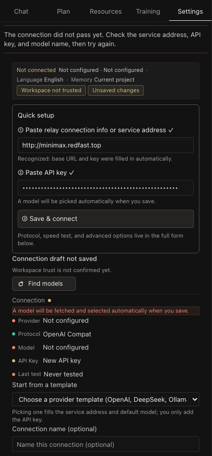

<div align="center">


**一个住在你 VS Code 侧边栏里的长期编程教练。**
它做计划、出题、验收、记住你的一切——但绝不替你写代码。

**A long-term coding coach that lives in your VS Code sidebar.**
It plans, drills, verifies, and remembers everything about you — but never writes your code.

[](https://github.com/AI-yyf/trainer/releases/tag/v1.0.3)
[](LICENSE)
[](#安装--install)

[安装 Install](#安装--install) · [功能 Features](#五个视图--five-views) · [三步配置 Setup](#三步配置没有第四步--three-steps-no-fourth) · [设计理念 Design](#为什么看起来不一样--why-it-feels-different) · [架构 Architecture](#架构--architecture)

</div>

---

## 背景 · Why Trainer Exists

开发者卡住,从来不是因为缺教程。是因为没有东西把学习闭环关上:和 LLM 聊完天,内容就蒸发了;视频看完了,是被动的;周二那个"差一点就懂了"的概念,周五就不见了。收藏夹越来越厚,产出却停在原地。

Developers don't stall for lack of tutorials. They stall because nothing closes the learning loop: a chat with an LLM evaporates the moment it ends; videos are passive; the concept you almost understood on Tuesday is gone by Friday. Bookmarks pile up while output stays flat.

Trainer 从编辑器内部解决这个问题。它不是一个聊天壳子,而是一个有记忆、有课程、有考试政策的教练:

Trainer solves this from inside the editor. It's not a chat shell — it's a coach with memory, a curriculum, and an exam policy:

- 它把你的学习**规划**成阶段,并追踪你实际走到哪,而不是你"觉得"走到哪
- 它用闪卡、理论演练、场景实验**训练**你
- 它对照你的**真实代码验收**掌握度——聊明白 FastAPI 不算数,当前文件证明才算数
- 它跨会话、跨项目、跨周地**记住**你,并按 FSRS 遗忘曲线安排复习
- 它**绝不替你写生产代码**。你写,它教

- It **plans** your learning into stages and tracks where you actually are — not where you feel you are
- It **trains** you with flash cards, theory drills, and scenario experiments
- It **verifies** mastery against your real code — talking about FastAPI counts for nothing until the current file proves it
- It **remembers** you across sessions, projects, and weeks, scheduling reviews on the FSRS forgetting curve
- It **never writes production code for you.** You write; it teaches

## 三步配置,没有第四步 · Three Steps, No Fourth

1. 打开 Trainer 侧边栏 → 设置
2. 粘贴中转站连接信息(国内中转站复制的整段 JSON 直接识别,自动拆出地址和密钥)→ 粘贴 API 密钥
3. 点**保存并连接**

1. Open the Trainer sidebar → Settings
2. Paste your relay connection info (the full JSON block copied from a relay dashboard is parsed automatically — endpoint and key are split out for you) → paste your API key
3. Hit **Save & Connect**

Trainer 自动拉取在线模型列表、自动选择默认模型、自动验证流式链路。密钥错了会明确告诉你 `invalid_key_or_permission`,而不是一个含糊的转圈。

Trainer pulls the live model list, picks a default model, and verifies the streaming path in one pass. A bad key reports `invalid_key_or_permission` — not a vague spinner.

<p align="center">
  
</p>

## 核心机制 · Core Mechanics

### ① 验收门禁 —— 你写代码,代码替你证明 · Verification Gates

训练卡推进到"已实现"必须先对当前文件跑验收;手动"标记完成"是被有意禁止的。伪造学习最快的方式是全标完成,Trainer 拒绝这样做。

A training card cannot advance to "implemented" until verification runs against your actual file; a manual "mark done" button is deliberately absent. The fastest way to fake learning is checking every box — Trainer refuses.

<p align="center"></p>

### ② 长期记忆 —— FSRS 遗忘曲线调度 · Long-Term Memory

掌握度、易错点、复习到期全部进 SQLite + Qdrant 语义检索。复习按 FSRS 遗忘曲线出现,而不是按待办清单——快忘的时候才见,记得牢的不烦你。

Mastery, weak spots, and due reviews live in SQLite with Qdrant semantic retrieval. Reviews surface on the FSRS forgetting curve — they show up right before you'd forget, and stay quiet while you still remember.

<p align="center"></p>

### ③ 训练闭环 —— 到期才出现,验收才推进 · The Training Loop

闪卡、理论演练、场景实验都在训练视图排队:复习到期出现,验收通过推进,对话里的知识缺口可以一键转成训练卡片。

Flash cards, theory drills, and scenario experiments queue in the Training view: reviews appear when due, cards advance when verified, and any knowledge gap in a conversation converts into a training card with one click.

<p align="center"></p>

### ④ 绝不代写 —— 你写,它教 · You Write, Coach Guides

教练可以读你的文件、看诊断、搜工作区,但生产代码永远出自你的手。`direct` 模式直接给答案;`coach-first` 模式先让你想——认知负荷是你的,不是它的。

The coach reads your files, checks diagnostics, and searches the workspace — but production code always comes from your hands. `direct` mode answers immediately; `coach-first` mode makes you think first. The cognitive load is yours, not its.

<p align="center"></p>

## 五个视图 · Five Views

| 视图 View | 中文 | English |
|-----------|------|---------|
| **对话 Coach** | 流式教练对话:工具访问(读文件/诊断/搜索)、`$` 技能面板、图片附件、答案模式、上下文用量环、会话历史与分享;每条教练回复下可**分享**、**存入资料库**、**转训练卡片** | Streaming coach chat: tool access (read files / diagnostics / search), `$` skill palette, image attachments, answer modes, context-usage ring, session history & share; every coach reply has **Share / Save to Resources / Create training card** quick actions |
| **计划 Plan** | 从你的目标生成分阶段课程、进度仪表盘、计划冻结/解冻、按阶段生成学习材料 | Stage-based curriculum generated from your goals, progress dashboard, plan freeze/unfreeze, per-stage study materials |
| **资料 Resources** | 你的资料库:markdown/PDF/DOCX/CSV/notebook/媒体上传、全文搜索(FTS5)、分级沙箱预览、回收站 | Your library: markdown / PDF / DOCX / CSV / notebook / media uploads, full-text search (FTS5), tiered sandbox preview, recycle bin |
| **训练 Training** | FSRS 调度的闪卡、带验收标准的理论演练、场景实验、验证门禁的卡片推进、可延后/完成的复习队列 | FSRS-scheduled flash cards, theory drills with acceptance criteria, scenario lab, verification-gated progression, snoozable review queue |
| **设置 Settings** | 供应商档案(粘贴即用)、模型切换、端点测速、思考强度、教学风格、记忆作用域、工作区准入、59 条命令 | Provider profiles (paste-and-go), model switching, endpoint speed test, thinking intensity, coaching style, memory scope, workspace admission, 59 commands |

<div align="center">
  <table><tr>
    <td></td>
    <td></td>
    <td></td>
  </tr></table>
</div>

### 每条回复都是可操作的学习材料 · Every Reply Is Actionable

教练回复下方自带三个快捷操作:复制该条回复为 Markdown、整段存入资料库(可全文检索、可预览)、转成待验收的训练卡片——不是会话级,是消息级。

Every coach reply carries three quick actions underneath: copy that reply as Markdown, save it into the searchable/previewable resource library, or convert it into a verifiable training card — per message, not per session.

<p align="center"></p>

### 自定义 `$` 技能 —— 可创建、可分享、可安装 · Custom `$` Skills

输入 `$` 呼出技能面板:内置技能之外,你可以把自己的 prompt 封装成技能,设置触发词和关键词,分享给别人,或安装别人分享的技能——全走纯数据通道,不执行代码。

Type `$` to open the skill palette: beyond built-ins, you can wrap your own prompts into skills with trigger words and keywords, share them with others, or install skills others share — all through a pure data channel, no code execution.

<p align="center">
  
  
</p>

<p align="center"></p>

## 为什么"看起来不一样" · Why It Feels Different

**诚实的失败。** 密钥错了会明确告诉你 `invalid_key_or_permission`;连不上会告诉你 `network`;模型回复损坏时会明确说"这条回复没有读清,请重发"——绝不把损坏的输出当作答案。未知网关不会被默认当成 OpenAI 兼容。

**Honest failure.** A bad key says `invalid_key_or_permission`; unreachable says `network`; a corrupted model reply tells you "this reply wasn't read clearly, resend" — broken output is never dressed up as an answer. Unknown gateways aren't silently assumed OpenAI-compatible.

**端点测速。** 多个服务商端点并行竞速(先热身消除首包惩罚,再计时)。500ms 内绿色,1 秒内黄色。点一下就采用最快端点。

**Endpoint speed test.** Provider endpoints race in parallel (warm-up first to cancel cold-start penalty, then timed). Green under 500 ms, yellow under 1 s. One click adopts the fastest.

<p align="center"></p>

**上下文用量环与思考强度。** 对话视图顶部有实时上下文用量环,压缩发生前你就看得到;思考强度可按模型证据开启——声明了能力或实测通过才发 thinking 参数,绝不盲目透传。

**Context ring & thinking intensity.** A live context-usage ring sits atop the conversation — you see compression coming before it happens; thinking intensity is gated on per-model evidence (declared capability or verified probe), never blindly forwarded.

**资料库全权。** 上传即索引、全文检索、沙箱分级预览、删除进回收站可恢复;教练回复也能一键入库,搜得回来才算学到。

**Full-power library.** Uploads are indexed on arrival, full-text searchable, sandbox-previewable by tier, and deletions go to a restorable recycle bin; coach replies drop in with one click — if you can search it back, you actually learned it.

**长程状态。** 计划可冻结/解冻;会话跨重启存活;卡片进度存进 SQLite;复习按 FSRS 遗忘曲线到期,而不是按待办清单。

**Long-horizon state.** Plans freeze and unfreeze; sessions survive restarts; card progress lives in SQLite; reviews come due on the FSRS curve, not on a to-do list.

<p align="center">
  
</p>

## 安全模型 · Safety Model

- API 密钥存放在 **VS Code SecretStorage**(系统级加密),不进配置文件、不进 git
- 工作区遵循 **VS Code 原生信任机制**,未信任时写操作全部拒绝
- 六级权限模型:默认只读(INSPECT),写/删/改需要逐级验证背书
- 沙箱预览有严格的路径治理:越界路径直接 422 拒绝
- 技能分享是**纯数据导入**:字段限长、内置技能优先、只展开成普通对话消息,没有任何代码执行路径

- API keys live in **VS Code SecretStorage** (OS-level encryption) — never in config files, never in git
- Workspace follows **native VS Code trust** — all writes are refused while untrusted
- Six-tier permission model: read-only (INSPECT) by default; write / delete / modify require escalating attestation
- Sandbox previews enforce strict path governance — out-of-bounds paths get a flat 422
- Skill sharing is a **pure-data import**: capped field lengths, built-ins win collisions, skills only expand into normal chat messages — no code path exists

## 安装 · Install

**从 VSIX(预构建,三平台):** 去 [v1.0.3 Release](https://github.com/AI-yyf/trainer/releases/tag/v1.0.3) 下载对应平台的 `.vsix`(`darwin-arm64` / `linux-x64` / `win32-x64`),VS Code 扩展面板 → `···` → *从 VSIX 安装* → 重载窗口。

**From VSIX (prebuilt, three platforms):** grab the `.vsix` for your platform (`darwin-arm64` / `linux-x64` / `win32-x64`) from the [v1.0.3 release](https://github.com/AI-yyf/trainer/releases/tag/v1.0.3), then VS Code Extensions panel → `···` → *Install from VSIX* → reload window.

**从源码 · From source:**

```bash
git clone https://github.com/AI-yyf/trainer.git
cd trainer && npm install
cd server && python3 -m venv .venv && source .venv/bin/activate
pip install -e ".[dev]"
cd .. && npm run build
```

在 VS Code 中打开本仓库按 F5(扩展开发宿主),或安装打包好的 VSIX。

Open this repo in VS Code and press F5 (Extension Development Host), or install the packaged VSIX.

## 质量门禁 · Quality Gates

这个仓库把自己的验证体系当作产品:

This repo treats its own verification stack as a product:

| 门禁 Gate | 数量 Coverage |
|-----------|---------------|
| 扩展测试文件(extension/tests,node --test) | 220 files / 1,650 cases |
| 服务端测试文件(server/tests,pytest) | 159 files / 2,825 cases |
| 真实 VS Code 端到端 | 33 步,接入真实模型 · 33 steps against a live model |
| 体验矩阵(Playwright) | 200 个场景 · 200 scenarios |
| 静态分析 | ruff + pyright + tsc,零告警 · zero warnings |

端到端套件在真实 VS Code 实例中接入真实模型运行:激活打包后的扩展、启动内置 sidecar、保存供应商、流式完成教练回合、生成并验收训练卡、断言 webview 实际渲染的内容。

The E2E suite runs in a real VS Code instance against a real model: it activates the packaged extension, boots the bundled sidecar, saves a provider, streams a full coach turn, generates and verifies a training card, and asserts what the webview actually rendered.

## 架构 · Architecture

```
VS Code 窗口 Window
└── Trainer 侧边栏 (React 19 + Zustand, 8 语言 languages)
    └── postMessage 桥 ── CommandRegistry ── 59 命令 commands
                                     │
                     FastAPI sidecar (127.0.0.1, PyInstaller 打包)
                     ├── ReAct agent loop (读文件/诊断/搜索工具 file/diagnostics/search tools)
                     ├── 规划器 · 教学引擎 · FSRS 调度器 (planner · pedagogy · FSRS)
                     ├── 记忆 (SQLite + Qdrant 语义检索 semantic memory)
                     ├── 资料库 (全文检索 FTS + 分级沙箱预览 tiered sandbox preview)
                     └── 技能与训练卡 (skills + training-card generator)
```

- `shared/` — 双端共用的协议类型(唯一事实来源) · protocol types shared by both ends (single source of truth)
- `extension/` — 宿主:命令、工作区信任/准入、密钥存储、sidecar 生命周期 · host: commands, workspace trust/admission, secret storage, sidecar lifecycle
- `server/` — 教练大脑:agent 循环、规划器、教学引擎、FSRS、记忆、资源库 · the coach brain: agent loop, planner, pedagogy, FSRS, memory, resources
- `extension/bundled/` — 打包进 VSIX 的 sidecar(PyInstaller) · the sidecar frozen into the VSIX (PyInstaller)

## 致谢 · Acknowledgements

Trainer 站在以下开源项目的肩膀上,感谢这些优秀的社区作品:

Trainer stands on the shoulders of these open-source projects — thank you:

| 项目 Project | 用途 Purpose |
|--------------|--------------|
| [FastAPI](https://github.com/fastapi/fastapi) · [Uvicorn](https://github.com/encode/uvicorn) | 本地 sidecar 服务框架 · local sidecar framework |
| [React](https://github.com/facebook/react) · [Zustand](https://github.com/pmndrs/zustand) · [Vite](https://github.com/vitejs/vite) | 侧边栏工作台 · sidebar workbench |
| [py-fsrs](https://github.com/open-spaced-repetition/py-fsrs) | FSRS 遗忘曲线复习调度 · forgetting-curve review scheduling |
| [Qdrant](https://github.com/qdrant/qdrant) 客户端 | 语义记忆检索 · semantic memory retrieval |
| [Playwright](https://github.com/microsoft/playwright) | 端到端体验矩阵 · E2E experience matrix |
| [PyInstaller](https://github.com/pyinstaller/pyinstaller) | sidecar 单二进制分发 · single-binary sidecar distribution |

产品形态上深受 [CC Switch](https://github.com/farion1231/cc-switch) 的"一键切换、粘贴即用"理念启发——好的工具应该把配置成本压到接近零。

The product shape is inspired by [CC Switch](https://github.com/farion1231/cc-switch)'s "paste-and-go" philosophy — a good tool pushes configuration cost toward zero.

视觉素材由 dora-image 工作流生成(gpt-image-2,角色一致性参考链)。

Visual assets were generated with the dora-image workflow (gpt-image-2, identity-reference chain for character consistency).

## 许可 · License

[MIT](LICENSE)
