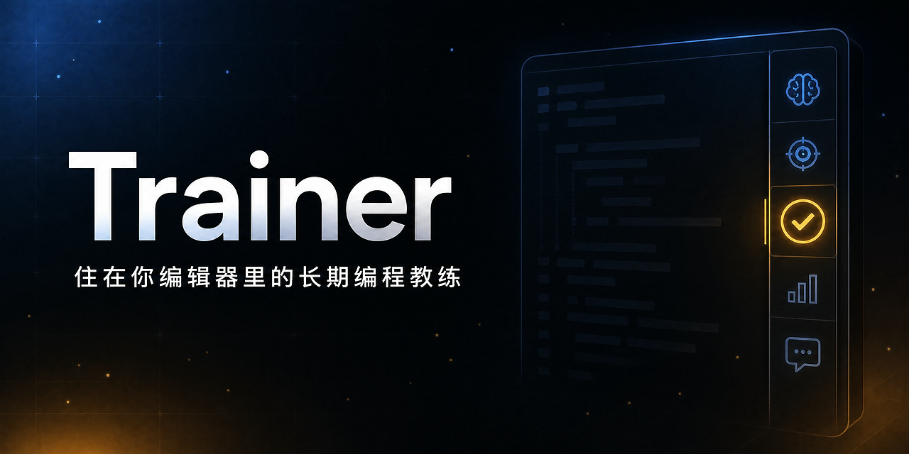
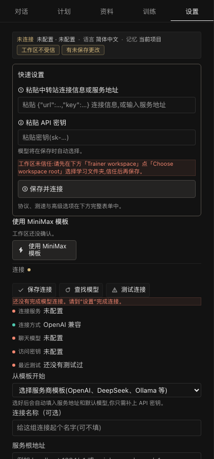
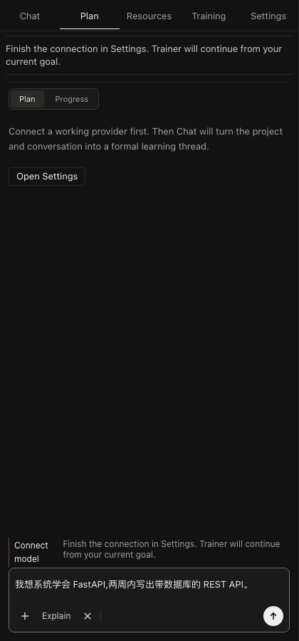
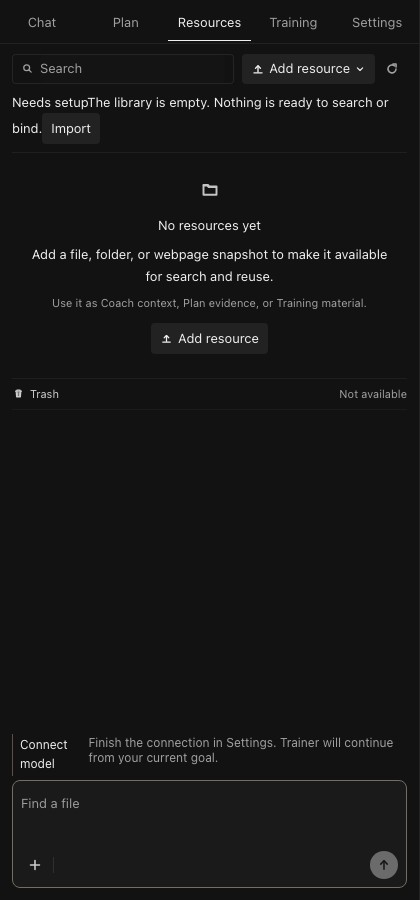
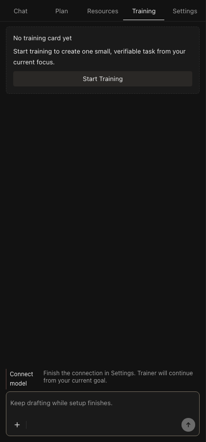
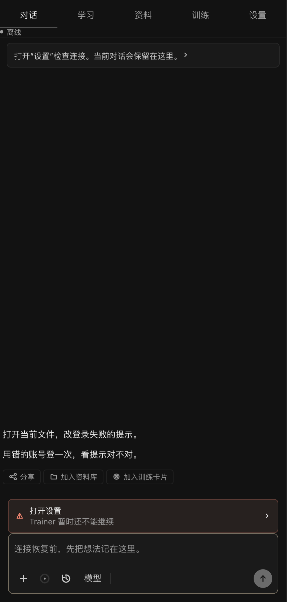
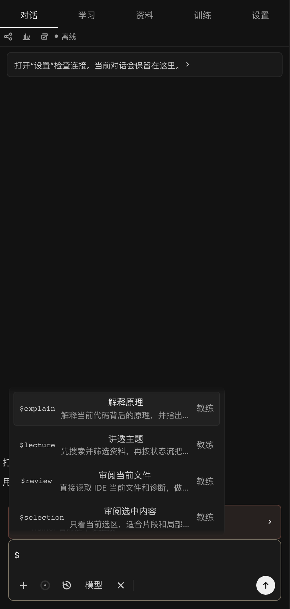
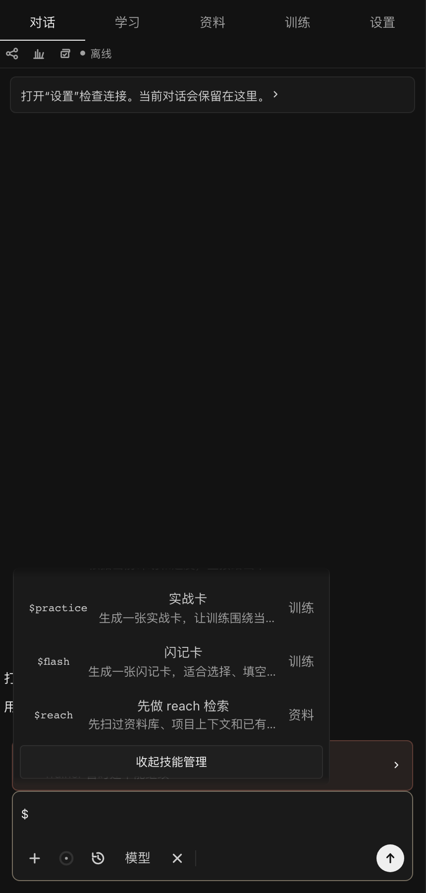

# Trainer

<div align="center">



**Le coach de code longue durée qui vit dans ta barre latérale VS Code.**

**Il planifie, fait réviser, vérifie et se souvient de tout ce qui te concerne — mais il n'écrit jamais ton code.**

**// Produire ≠ Grandir // Vérifier + Réviser = Grandir**

[English](README.md) · [简体中文](README_zh-CN.md) · [Español](README_es-ES.md) · Français · [Deutsch](README_de-DE.md) · [日本語](README_ja-JP.md) · [한국어](README_ko-KR.md) · [Português](README_pt-BR.md)

[](https://github.com/AI-yyf/trainer/releases/tag/v1.0.3)
[](LICENSE)
[](#installation)
[](#garanties-de-qualité)
[](#i18n--huit-langues)

[Pourquoi](#pourquoi-trainer-existe) ·
[Installation](#installation) ·
[Configuration](#trois-étapes-pas-de-quatrième) ·
[Mécanismes](#mécanismes-clés) ·
[Cinq vues](#cinq-vues) ·
[Comparaison](#comparaison) ·
[Démo 5 min](#démo-de-cinq-minutes) ·
[Conception](#pourquoi-cest-différent) ·
[Architecture](#architecture) ·
[Sécurité](#modèle-de-sécurité) ·
[Qualité](#garanties-de-qualité) ·
[Remerciements](#remerciements) ·
[🎭 La troupe](docs/CAST.md)

</div>

---

## Pourquoi Trainer existe

> Les devs ne bloquent pas faute de tutoriels.
> Ils bloquent parce que rien ne vient boucler la boucle de l'apprentissage.

Une conversation avec un LLM s'évapore dès qu'elle s'arrête ; les vidéos sont passives ; le concept que tu avais presque compris mardi a disparu vendredi.

Pire : le **vibe coding** — trois mois à laisser l'IA écrire ton code sans que tu n'en comprennes rien.

Les favoris s'accumulent pendant que la production reste plate. Les dépôts grossissent pendant que ta tête se vide.

**Trainer règle ça depuis l'intérieur de l'éditeur.**

Ce n'est pas un simple habillage de chat — c'est un coach avec de la mémoire, un programme et une politique d'examen :

- Il **planifie** ton apprentissage en étapes et suit où tu en es vraiment — pas où tu crois en être
- Il t'**entraîne** avec des flash cards, des exercices de théorie et des expériences scénarisées
- Il **vérifie** la maîtrise sur ton vrai code — parler de FastAPI ne vaut rien tant que le fichier courant ne le prouve pas
- Il se **souvient** de toi entre les sessions, les projets et les semaines, et planifie les révisions sur la courbe d'oubli FSRS
- Il **n'écrit jamais ton code de production à ta place** — tu écris, il enseigne, **vous grandissez ensemble**

<div align="center">

| vibe coding · la norme actuelle | Trainer · comment ça devrait être |
|:---:|:---:|
| `def ship(code):` <br> `    ai.write(code)` <br> `# tu l'as compris ?` <br> `    return forget(code)` | `def ship(code):` <br> `    you.write(code)` <br> `    ai.verify(code)` <br> `    you.recall(code)` <br> `    return grown(code)` |
| produire = oublier | produire + mémoire + révision = grandir |

</div>

---

## Installation

**Via VSIX (prêt à l'emploi, trois plateformes) :**

Récupère le `.vsix` de ta plateforme (`darwin-arm64` / `linux-x64` / `win32-x64`) depuis la [v1.0.3 release](https://github.com/AI-yyf/trainer/releases/tag/v1.0.3).

Panneau Extensions de VS Code → `···` → *Install from VSIX* → recharge la fenêtre.

**Depuis les sources :**

```bash
git clone https://github.com/AI-yyf/trainer.git
cd trainer && npm install
cd server && python3 -m venv .venv && source .venv/bin/activate
pip install -e ".[dev]"
cd .. && npm run build
```

Ouvre ce dépôt dans VS Code et appuie sur F5 (Extension Development Host), ou installe le VSIX packagé.

**Prérequis :** VS Code ≥ 1.96 · Python ≥ 3.12 (build depuis les sources) · macOS / Linux / Windows

---

## Trois étapes, pas de quatrième

1. Ouvre la barre latérale Trainer → Settings
2. Colle tes infos de connexion du relais (le bloc JSON complet copié depuis le tableau de bord d'un relais est parsé automatiquement — endpoint et clé sont extraits pour toi) → colle ta clé API
3. Clique sur **Save & Connect**

Trainer récupère la liste des modèles en direct, choisit un modèle par défaut et vérifie le chemin de streaming en une seule passe.

Une clé invalide renvoie `invalid_key_or_permission` — pas un spinner vague.

<p align="center">
  
</p>

---

## Mécanismes clés

### ① Portes de vérification — tu écris le code, le code le prouve

Une carte d'entraînement ne peut pas passer à « implémentée » tant que la vérification n'a pas tourné sur ton vrai fichier ; le bouton « marquer comme fait » est volontairement absent.

La façon la plus rapide de simuler un apprentissage, c'est de cocher toutes les cases. Trainer refuse.

<p align="center"></p>

**Comment :**
- Le service `EvaluatorService` **copie** le fichier courant dans un `tempfile.TemporaryDirectory`, y lance ruff + pyright + pytest, puis supprime le répertoire temporaire
- Les outils ne tournent **jamais** dans le projet de l'apprenant — zéro pollution `.pytest_cache`
- Chaque vérification rapporte le détail Matched/Missing critère par critère, face à une liste explicite `acceptance_criteria` + `expected_symbols`
- Code : `server/app/evaluator/service.py:198-312`

### ② Mémoire long terme — planification sur la courbe d'oubli FSRS

Maîtrise, points faibles et révisions dues vivent dans SQLite, avec la recherche sémantique de Qdrant.

Les révisions remontent selon la courbe d'oubli FSRS — elles apparaissent juste avant que tu oublies, et restent silencieuses tant que tu t'en souviens encore.

<p align="center"></p>

**Comment :**
- Mémoire à deux étages : structurée (`StructuredMemoryService`, ~480 enregistrements) + sémantique (Qdrant + repli hors-ligne sentence-transformer)
- **`_should_delay_live_thread_reviews()`** — les révisions sont activement mises en pause tant qu'un flux d'implémentation d'idée est en cours, pour ne jamais casser le fil de la pensée
- **Les compétences transférables échouent par défaut entre workspaces** : un succès dans un projet ne devient jamais une maîtrise globale ; la promotion exige de valider dans ≥ 2 workspaces
- Code clé : `server/app/memory/service.py:1357-1597` · `transfer_skills.py:81-113` · `review_scheduler.py:522-544`

### ③ La boucle d'entraînement — apparaît à échéance, avance quand c'est vérifié

Flash cards, exercices de théorie et expériences scénarisées font la queue dans la vue Training : les révisions apparaissent à échéance, les cartes avancent quand c'est vérifié, et tout trou dans tes connaissances repéré en conversation devient une carte d'entraînement en un clic.

<p align="center"></p>

**Comment :**
- **Machine à états en 5 phases** `LEARN → TRY → VERIFY → REFLECT → RETURN`, chaque transition est journalisée dans `phase_history`
- **Whitelist des sources de vérification de confiance** : `automated_test` / `evaluator` / `ide_current_file` / `server_evaluator` / `test_runner` / `verification_service` — une « déclaration manuelle » ne peut jamais faire avancer une carte
- Les handlers `onSkip` / `onRate` de l'UI des cartes sont **`@deprecated Unused`** — le seul chemin de progression passe par `onCardStatusTransition`
- Code clé : `server/app/training/handoff.py:40-47` · `extension/webview/src/components/training/TrainingCardPanel.tsx:78-85`

### ④ Tu écris, le coach guide

Le coach lit tes fichiers, consulte les diagnostics et fouille le workspace — mais le code de production sort toujours de tes mains.

`direct` répond tout de suite ; `coach-first` te fait réfléchir d'abord. **La charge cognitive est pour toi, pas pour lui.**

<p align="center"></p>

**Comment :**
- `PedagogyService` émet un `ImplementationGuide` à 12 champs à chaque tour — chaque champ est une contrainte sur ce que le coach a le droit de demander ensuite
- `ImplementationCoach._current_step` s'ancre sur « le premier chemin en échec » ou « le premier point d'entrée connu » — jamais sur « explore la base de code »
- Ton piloté par l'affect : `AffectService` bascule en mode `concise_rescue` après deux échecs consécutifs
- Code clé : `server/app/pedagogy/implementation_coach.py:140-186` · `affect/service.py:142-152`

---

## Cinq vues

> Cinq vues fixes au premier niveau. Chacune a une frontière de responsabilité stricte.

| Vue | Rôle | En une ligne |
|-----------|------|--------|
| **Coach** | Chat en streaming | **Porte d'entrée** : accès outils + palette de skills `$` + images en pièce jointe + modes de réponse |
| **Plan** | Plan d'apprentissage | **Carte** : étapes, progression, preuves, gel/dégel du plan |
| **Resources** | Bibliothèque | **Étagère** : recherche FTS5 + aperçu sandbox à 3 niveaux + corbeille restaurable |
| **Training** | Entraînement | **Aire de jeu** : flash cards FSRS + exercices de théorie + expériences scénarisées + portes de vérification |
| **Settings** | Réglages | **Console** : 59 commandes + test de vitesse des endpoints + intensité de réflexion + admission du workspace |

<p align="center">
  
  
  
</p>

### Vue Coach (entrée)

Chat de coach en streaming avec accès aux outils, palette de skills `$`, images en pièce jointe, modes de réponse, anneau d'utilisation du contexte, historique de sessions et partage.

**Chaque réponse du coach embarque trois actions rapides en dessous :**

- **Copier la réponse en Markdown**
- **Enregistrer dans la bibliothèque** (recherchable + avec aperçu)
- **Convertir en carte d'entraînement vérifiable** — par message, pas par session

<p align="center"></p>

### Skills `$` personnalisés — créer, partager, installer

Tape `$` pour ouvrir la palette de skills : au-delà des skills intégrés, tu peux empaqueter tes propres prompts en skills avec mots déclencheurs et mots-clés, les partager avec d'autres, ou installer ceux que d'autres partagent — **le tout via un pur canal de données, sans exécution de code**.

<p align="center">
  
  
</p>

<p align="center"></p>

**Comment :**
- Les skills personnalisés sont des imports 100 % JSON — `{ _type, version, trigger, title, prompt, keywords }` ; pas de `eval`, pas de `Function()`, aucun chemin de code
- Limites strictes : prompt ≤ 4000 caractères, titre ≤ 160, mots-clés ≤ 16, skills utilisateur ≤ 24
- En cas de collision, les déclencheurs intégrés gagnent — un `$explain` importé ne peut pas masquer celui d'origine
- Code clé : `shared/src/skillCatalog.ts:614-764`

---

## Comparaison

> Trainer n'est pas là pour remplacer qui que ce soit — il comble un vide que personne d'autre n'occupe.

| Critère | outils vibe | IDEs à chat | apps de flash cards | **Trainer** |
|---|---|---|---|---|
| Écrit le code à ta place | ✅ | ✅ | ❌ | ❌ |
| Vérifie ton code | ❌ | ❌ | ❌ | ✅ contre le fichier courant |
| Se souvient entre les sessions | ⚠️ fenêtre de contexte | ⚠️ résumés | ✅ | ✅ SQLite + Qdrant |
| Répétition espacée sur FSRS | ❌ | ❌ | ✅ | ✅ + pause pendant les flux actifs |
| Paliers de permission du workspace | ❌ | ⚠️ dialogue de confiance | ❌ | ✅ 6 paliers + verrou dur à distance |
| Progression des cartes verrouillée | ❌ | ❌ | ⚠️ cases à cocher manuelles | ✅ vérification imposée |
| Promotion des compétences transférables | ❌ | ❌ | ❌ | ✅ échec par défaut entre workspaces |
| i18n | ⚠️ | ⚠️ | ⚠️ | ✅ 600+ clés × 8 |
| Suite de tests | source fermée | source fermée | source fermée | ✅ **3 328 cas** (ouverte) |
| Refuse d'écrire à ta place | ❌ | ❌ | n/a | ✅ une limite philosophique non négociable |

> En une phrase : les autres outils te font écrire plus vite ; Trainer s'assure que tu écris vraiment.

---

## Démo de cinq minutes

> Voici à quoi ressemblent vraiment tes cinq premières minutes.

### T+0:00 — Ouvre la barre latérale

Clique sur l'icône Trainer dans la barre d'activité. La barre latérale s'ouvre, par défaut sur la **vue Coach**.

<p align="center">
  
</p>

### T+0:30 — Configure le provider (première fois uniquement)

Settings → colle ton JSON de relais + ta clé API → Save & Connect.

Trainer récupère la liste des modèles en direct, choisit un défaut, vérifie le streaming. Clé invalide → il te dit `invalid_key_or_permission`.

### T+1:30 — Première conversation

Passe sur Coach, tape : `@current_file explain what this async/await is doing?`

Trainer répond en streaming. **Il ne réécrit pas ton code.** Il pointe la ligne 17 : « c'est du fan-out » ; ligne 23 : « c'est la barrière. Pour vraiment apprendre ça, écris une version qui annule une tâche en plein vol — je lancerai la vérification avec toi. »

### T+2:30 — Carte d'entraînement en un clic

Survole la réponse. Trois boutons : `Copy` / `Save to library` / **`Create training card`**.

Clique sur `Create training card` → carte générée → elle arrive dans la vue Training → FSRS la programme pour dans 3 jours.

### T+4:00 — Écris toi-même, fais-toi vérifier

Tu écris le code. Trainer **ne l'écrit pas à ta place**.

Ouvre Training → retourne la carte → regarde les critères de réussite → écris → clique `Request verification` → Trainer lance ruff + pyright + pytest dans un sandbox → annonce le succès ou signale le critère manquant.

### T+5:00 — Le lendemain

Rouvre VS Code demain : Trainer restaure tout automatiquement — dernière session, plan, progression des cartes, tout est là.

La carte pulse sur le disque de rythme FSRS — échéance aujourd'hui.

**Tu n'es plus un dev en mode vibe coding.**

---

## Pourquoi c'est différent

### Échec honnête

Une clé invalide dit `invalid_key_or_permission` ; un endpoint injoignable dit `network` ; une réponse corrompue dit « cette réponse n'a pas été lue clairement, renvoie-la » — **une sortie cassée n'est jamais maquillée en réponse**.

Les passerelles inconnues ne sont pas silencieusement supposées compatibles OpenAI.

**Comment :** classifieur d'erreurs (`provider_service.py:2823-2874`) + nettoyage des identifiants (`provider_protocols.py:640-681`) + sondage des empreintes inconnues (`provider_gateway.py:39-70`).

### Test de vitesse des endpoints

Les endpoints des providers courent en parallèle (**échauffement d'abord pour annuler la pénalité de démarrage à froid, puis chronométrage**).

Vert sous 500 ms, jaune sous 1 s. Un clic adopte le plus rapide.

<p align="center"></p>

**Comment :** `Promise.all` + une requête d'échauffement jetée pour chaque URL avant la chronométrée (`providerWebviewCommands.ts:2275-2352`).

### Anneau d'utilisation du contexte

Un anneau d'utilisation du contexte en temps réel surplombe la conversation — **tu vois la compression arriver avant qu'elle n'arrive**.

### Intensité de réflexion

Conditionnée par des preuves modèle par modèle — capacité déclarée **ou** sonde vérifiée. Jamais transmise à l'aveugle.

### Bibliothèque à pleine puissance

<p align="center"></p>

Uploads indexés dès l'arrivée, recherche plein texte FTS5, **aperçu sandbox à 3 niveaux** (A riche / B converti / C métadonnées + repli éditeur natif), les suppressions vont dans une corbeille restaurable.

**Séparation physique en 3 zones** : workspace / sandbox / corbeille. Jamais mélangées.

Les réponses du coach atterrissent ici en un clic — **si tu peux retrouver une réponse par la recherche, c'est que tu l'as vraiment apprise**.

### État sur le long terme

Les plans se gèlent et se dégèlent ; les sessions survivent aux redémarrages ; la progression des cartes vit dans SQLite ; les révisions arrivent à échéance sur la courbe FSRS — **pas sur une to-do list**.

---

## Architecture

### Topologie du système

```
┌─────────────────────────────────────────────────────────────┐
│                    VS Code Window                            │
│  ┌───────────────────────────────────────────────────────┐  │
│  │   Trainer Sidebar                                     │  │
│  │   (React 19 + Zustand, 8-language i18n, 24 governance)│  │
│  │                                                       │  │
│  │   ─── postMessage ─── CommandRegistry ── 59 commands  │  │
│  │                                       │               │  │
│  └───────────────────────────────────────┼───────────────┘  │
│                                          │                   │
│                          ┌───────────────▼──────────────┐    │
│                          │  FastAPI sidecar (127.0.0.1)│    │
│                          │  PyInstaller --onedir frozen│    │
│                          │  (250 MB / 6 platform arch) │    │
│                          │                              │    │
│                          │  ├── ReAct agent loop        │    │
│                          │  │   (dual-channel stream)   │    │
│                          │  ├── Pedagogy (12-field guide)│   │
│                          │  ├── Affect (failures→rescue)│    │
│                          │  ├── Memory                  │    │
│                          │  │   SQLite + Qdrant semantic│    │
│                          │  ├── FSRS scheduler          │    │
│                          │  ├── Authority (6 tiers)     │    │
│                          │  ├── Provider (5 protocols)  │    │
│                          │  ├── Training handoff (5 ph.)│    │
│                          │  └── Resources (3 zones+FTS5)│    │
│                          │                              │    │
│                          │  ─── 24 shared pure fns ────│    │
│                          │      (host + webview + test)  │    │
│                          └──────────────────────────────┘    │
└─────────────────────────────────────────────────────────────┘
```

### Organisation des dossiers

| Dossier | Contenu | Taille |
|---|---|---|
| `extension/src/` | Hôte : commandes, workspace trust, stockage des secrets, cycle de vie du sidecar | ~30k lignes TS |
| `extension/webview/` | Atelier React : 5 vues + Zustand + 8 langues | ~50k lignes TSX |
| `extension/tests/` | Suite node:test (220 fichiers / 1 679 cas) | 73 744 lignes |
| `server/app/` | Cerveau FastAPI : agent / pédagogie / mémoire / FSRS / entraînement | ~120k lignes Python |
| `server/tests/` | Suite pytest (159 fichiers / 1 649 cas) | 106 422 lignes |
| `shared/src/` | **Fonctions pures partagées + 24 modules de gouvernance** (hôte + webview + test) | ~3k lignes TS |
| `extension/bundled/` | Sidecar embarqué dans le VSIX (PyInstaller onedir) | ~250 MB |

### Une seule enveloppe canonique

> Toutes les réponses HTTP de Trainer (sauf `/health`) renvoient la **même** `WorkbenchSnapshot` (31 champs).

| Catégorie | Exemples de champs | Producteur |
|---|---|---|
| Session | `messages`, `coaching_state`, `learner_state` | `pedagogy/service.py` |
| Plan | `plan`, `global_plan`, `project_plan_link`, `current_task` | `planner/service.py` |
| Mémoire | `memory`, `selected_teaching_assets`, `next_review_due` | `memory/service.py` |
| Enseignement | `teaching_decision`, `implementation_guide`, `project_ideas` | `pedagogy/*` |
| Affect | `affect_state`, `tone_decision` | `affect/service.py` |
| Entraînement | `evaluation`, `review_queue_summary` | `training/*` |
| Méta | `context_id`, `sidecar_status`, `snapshot_revision`, `active_panel` | `api/runtime.py` |

**Pourquoi une seule enveloppe :**
- La webview fait son rendu **entièrement depuis ce seul objet** — 12 sous-systèmes y écrivent leurs champs, hydratation en une fois
- **Synchro incrémentale légère façon CRDT** : chaque snapshot a un `snapshot_revision` ; `GET /snapshot?since_revision=N` n'expédie le blob complet que si N est périmé, sinon `{unchanged: true}`
- Code clé : `server/app/core/models.py:2304-2336` · `server/app/api/routers.py:11648-11710`

### Modules de gouvernance partagés

> L'épine dorsale de l'architecture de Trainer, ce sont **24 modules de gouvernance à fonctions pures** — hôte, webview et tests exécutent la même logique déterministe.

| Module | Rôle |
|---|---|
| `planGovernance` · `masterPlanGovernance` | Édition du plan, plan maître multi-projets |
| `trainingHandoffGovernance` · `trainingRecoveryGovernance` · `trainingReliabilityGovernance` | Routage des cartes, récupération, fiabilité |
| `reviewQueueGovernance` · `reviewArtifactGovernance` | Ordre de la file FSRS, revue des preuves |
| `workspaceAuthority` · `workspaceRecoveryGovernance` | Permissions à 6 paliers, récupération |
| `suggestedActionGovernance` · `conversationCandidateGovernance` | Actions suggérées, arbitrage de conversation |
| `transferEvidenceGovernance` · `transferSkillGovernance` | Preuves multi-projets, promotion des skills |
| `coachOrientationGovernance` · `resourcesOrientationGovernance` | Orientation des vues Coach/Resources |
| `settingsCapabilityGovernance` · `operationReliabilityGovernance` | Gating des capacités des Settings, fiabilité des opérations |
| `hostLastTestGovernance` · `providerModelPolicy` | Dernier test du provider, politique de modèles |
| `sandboxNetworkCapabilityNarrative` · `projectLaneGovernance` | Narratif des capacités du sandbox, lanes de projets |
| `previewAssets` · `materialRecommendationGovernance` | Niveaux des assets d'aperçu, recommandations de matériaux |

**Pourquoi :** le même `resolveSuggestedActionGovernance` tourne dans l'hôte, la webview et les tests — **cohérence à trois, zéro aller-retour**.

---

## Modèle de sécurité

- Les clés API vivent dans le **SecretStorage de VS Code** (chiffrement au niveau de l'OS) — jamais dans les fichiers de config, jamais dans git
- Le workspace suit la **confiance native de VS Code** — toute écriture est refusée tant que le workspace n'est pas approuvé
- **Échelle de permissions à 6 paliers** : INSPECT < ANNOTATE < REORGANIZE < GENERATE < APPLY < DESTRUCTIVE — lecture seule par défaut ; écrire/supprimer/modifier exige une attestation de niveau croissant
- **Les workspaces distants sont verrouillés en dur sous REORGANIZE** — même un accord explicite de l'utilisateur ne peut pas élever le niveau
- **La suppression passe par la corbeille** : pas d'opération `delete`, seulement `move to <root>/.trash/<timestamp-uuid>/`
- Les aperçus sandbox imposent une **gouvernance stricte des chemins** — un chemin hors limites prend un 422 sec
- Le partage de skills est un **import de pures données** — longueurs de champs plafonnées, les intégrés gagnent, **aucun chemin de code n'existe**

**Code clé :** `server/app/workspace/authority.py:33-962` · `extension/src/provider/providerConfigStore.ts` · `shared/src/skillCatalog.ts:614-764`

---

## Garanties de qualité

> Trainer traite sa propre stack de vérification comme un produit.

| Contrôle | Couverture | Notes |
|---|---|---|
| **Tests serveur** (pytest) | **159 fichiers / 1 649 cas / 106 422 lignes** | dont 6 suites de propriétés Hypothesis |
| **Tests extension** (node:test) | **220 fichiers / 1 679 cas / 73 744 lignes** | 109 fichiers de garde de source + 111 tests comportementaux |
| **E2E** | **11 specs / 4 335 lignes** | instance VS Code réelle contre un vrai modèle |
| **Matrice d'expérience** | **200 scénarios × 2 couches** | fixture de prévisualisation + sidecar réel |
| **Pilote hôte VSIX** | **33 étapes** | install → activate → stream → verify → assertion du rendu réel de la webview |
| **Analyse statique** | ruff + pyright + tsc | zéro warning |
| **Matrice de protocoles** | **5 protocoles** | OpenAI Chat / Responses / Anthropic / Gemini / OpenAI-Compatible |
| **i18n** | **8 langues × 600+ clés** | zh-CN / en-US / es-ES / fr-FR / de-DE / ja-JP / ko-KR / pt-BR |
| **sidecar embarqué** | **6 binaires de plateforme** | win32-x64 / win32-arm64 / darwin-x64 / darwin-arm64 / linux-x64 / linux-arm64 |

**La suite E2E tourne dans une vraie instance VS Code contre un vrai modèle :**

> Active l'extension packagée → démarre le sidecar embarqué → enregistre le provider → streame un tour complet du coach → génère et vérifie une carte d'entraînement → assertion de ce que la webview **a réellement rendu** → captures d'écran → rouvre entre plusieurs workspaces et récupère l'historique.

**Les tests attestent eux-mêmes de leurs limites :**
Chaque scénario E2E porte `evidence: { realSidecar, limitation }` — **le test déclare ce qu'il ne prouve pas.**

---

## i18n · Huit langues

| Langue | Code | Principale |
|---|---|---|
| 简体中文 | `zh-CN` | ✅ |
| English | `en-US` | ✅ |
| Español | `es-ES` | ✅ |
| Français | `fr-FR` | ✅ |
| Deutsch | `de-DE` | ✅ |
| 日本語 | `ja-JP` | ✅ |
| 한국어 | `ko-KR` | ✅ |
| Português | `pt-BR` | ✅ |

**Chaîne de repli :** préférence utilisateur > `env.language` de VS Code > `zh-CN` (défaut)

**6 surcharges par surface :** `resourceView` / `contextRail` / `trainingUi` / `orientationRail` / `composerAccessibility` / `leftoverHonesty` — les traducteurs ne remplissent que les surfaces qu'ils possèdent, **pas la table complète des 600+ clés**.

Code clé : `extension/webview/src/lib/i18n/copy.ts` (5 283 lignes)

---

## Remerciements

> Trainer se tient sur les épaules de géants.

### 🏃 Cœur d'exécution

| Projet | Rôle | Pourquoi irremplaçable |
|---|---|---|
| [FastAPI](https://github.com/fastapi/fastapi) | Framework du sidecar local | async + Pydantic + docs OpenAPI auto |
| [Uvicorn](https://github.com/encode/uvicorn) | Serveur ASGI | HTTP/1.1 + WebSocket + forte concurrence |
| [Pydantic](https://github.com/pydantic/pydantic) | Validation & sérialisation des données | la `WorkbenchSnapshot` à 31 champs tourne dessus |
| [httpx](https://github.com/encode/httpx) | Client HTTP asynchrone | tout le routage de protocoles sidecar ↔ passerelle LLM |

### 🤖 Protocoles LLM

| Projet | Rôle |
|---|---|
| [openai-python](https://github.com/openai/openai-python) | Client compatible OpenAI / Anthropic / Gemini (routage 5 protocoles) |

### 🧠 Entraînement & mémoire

| Projet | Rôle |
|---|---|
| [py-fsrs](https://github.com/open-spaced-repetition/py-fsrs) | Planification des révisions sur la courbe d'oubli FSRS · moteur de `TrainingCardState` |
| [qdrant-client](https://github.com/qdrant/qdrant-client) | Récupération vectorielle de la mémoire sémantique (avec repli sentence-transformer) |
| [PyMuPDF](https://github.com/pymupdf/PyMuPDF) | Analyse PDF (aperçu Tier A de la bibliothèque) |
| [trafilatura](https://github.com/adbar/trafilatura) | Extraction de contenu web (ingestion des ressources) |
| [markitdown](https://github.com/microsoft/markitdown) | Conversion Document → Markdown (aperçu Tier B de la bibliothèque) |

### ⚛️ Cœur frontend

| Projet | Rôle |
|---|---|
| [React](https://github.com/facebook/react) | UI de l'atelier latéral |
| [Vite](https://github.com/vitejs/vite) | Outil de build + serveur de dev |
| [Zustand](https://github.com/pmndrs/zustand) | Gestion d'état de l'atelier |
| [Zod](https://github.com/colinhacks/zod) | Validation de types à l'exécution |

### 🎨 Rendu

| Projet | Rôle |
|---|---|
| [react-markdown](https://github.com/remarkjs/react-markdown) | Rendu Markdown |
| [remark-gfm](https://github.com/remarkjs/remark-gfm) | Extensions GFM (tableaux, listes de tâches) |
| [remark-math](https://github.com/remarkjs/remark-math) · [rehype-katex](https://github.com/remarkjs/rehype-katex) · [KaTeX](https://github.com/KaTeX/KaTeX) | Rendu mathématique |
| [Shiki](https://github.com/shikijs/shiki) | Coloration syntaxique (grammaires TextMate de VS Code) |
| [Mermaid](https://github.com/mermaid-js/mermaid) | Diagrammes et flowcharts |
| [@tanstack/react-table](https://github.com/TanStack/table) | Tableaux de la bibliothèque / de la file d'entraînement |

### 📄 Aperçu

| Projet | Rôle |
|---|---|
| [mammoth](https://github.com/mwilliamson/mammoth.js) · [docx-preview](https://github.com/VolodymyrBaydalka/docx-preview) | Rendu riche DOCX (Tier A) |
| PDF.js (embarqué) | Rendu riche PDF (Tier A) |

### 🧪 Tests & qualité

| Projet | Rôle |
|---|---|
| [pytest](https://github.com/pytest-dev/pytest) · [pytest-asyncio](https://github.com/pytest-dev/pytest-asyncio) | Serveur : 159 fichiers / 1 649 cas |
| [Hypothesis](https://github.com/HypothesisWorks/hypothesis) | Tests de propriétés (planner / evaluator / scheduler) |
| [ruff](https://github.com/astral-sh/ruff) | Lint + format Python (E/F/I/B, py312, 100 colonnes) |
| [pyright](https://github.com/microsoft/pyright) | Vérification statique de types Python |
| [TypeScript](https://github.com/microsoft/TypeScript) | mode strict, zéro warning |
| [Playwright](https://github.com/microsoft/playwright) | E2E + matrice d'expérience à 200 scénarios |

### 📦 Packaging & distribution

| Projet | Rôle |
|---|---|
| [PyInstaller](https://github.com/pyinstaller/pyinstaller) | Gel du sidecar en binaire unique (6 plateformes, manifest sha256) |

### 💡 Inspiration méthodologique

| Projet | Inspiration |
|---|---|
| [open-spaced-repetition/fsrs4anki](https://github.com/open-spaced-repetition/fsrs4anki) | Le papier FSRS original et son implémentation de référence |
| [obra/superpowers](https://github.com/obra/superpowers) | La discipline de coaching « des workflows obligatoires, pas des suggestions » |
| [HKUDS/CLI-Anything](https://github.com/HKUDS/CLI-Anything) | L'ambition « rendre tous les logiciels agent-native » |

### 🎨 Visuels

| Projet | Rôle |
|---|---|
| [dora-image](https://github.com/AI-yyf/trainer/tree/main/assets) | Toutes les images de ce README (voir `assets/MASCOT.md` / `BANNER_PROMPT.md` / `FEATURE_PROMPTS.md`) |
| Moe girl officielle de DeepSeek | référence de proportions chibi / tendance cel-shading |
| Pieter Bruegel, *La Tour de Babel* | référence de composition d'ensemble en deux camps gauche-droite |
| Rembrandt, *La Ronde de nuit* | référence de contraste clair-obscur 7:1 |
| Design de personnages Studio Ghibli | grands yeux à reflets en trois points, expressions retenues |

---

## Licence

[MIT](LICENSE)

---

## Citer Trainer

Si Trainer a amélioré ton flux de travail, cite-le librement dans ton blog / papier / talk :

```bibtex
@software{trainer2026,
  title  = {Trainer: A Long-Term Coding Coach Living in Your Editor},
  author = {AI-yyf and contributors},
  year   = {2026},
  url    = {https://github.com/AI-yyf/trainer},
  note   = {v1.0.3}
}
```

---

<div align="center">

**// Entraîne ton IA · Grandis avec ton IA**

`v1.0.3` · Fait avec du café, FSRS, 24 fonctions pures, 3 328 tests, et un cœur qui refuse d'écrire le code à ta place.

</div>
