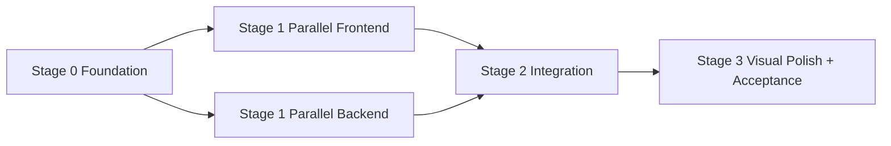

# Trainer Coach-First Execution Shards Implementation Plan

> Historical snapshot from the superseded three-view phase.
> Current Trainer IA lives in [docs/ui-contract.md](../ui-contract.md): `Coach / Plan / Resources / Training / Settings`.

> **For Claude:** REQUIRED SUB-SKILL: Use superpowers:executing-plans to implement this plan task-by-task.

**Goal:** 把 Trainer 的理想蓝图拆成一组可以被 AI 或工程师独立执行的任务包，确保每个任务都与产品目标直接对齐、写入范围清晰、依赖关系明确、验收标准可验证，最终把 `Coach-first` 代码教练做成真正高级、极简、强大、长期可用的产品。

**Architecture:** 先解决当前代码结构中妨碍并行推进的问题，再把任务拆成 `Foundation -> Parallel Feature Shards -> Integration -> Final Polish` 四个阶段。前端通过组件化与样式分层获得并行能力，后端通过纯服务文件分治实现 pedagogy、review、idea、adaptation、principle、source 等能力，最终由 router/provider/webview bridge 完成收束。

**Tech Stack:** VS Code Extension Host (TypeScript), React + Zustand webview, FastAPI + Pydantic sidecar, SQLite repository, existing planner/memory/research/resource/provider services.

---

## 1. 这份文档解决什么问题

现有蓝图已经很清晰，但离“AI 读完就能放心开工”还差一层真正的执行切分。

当前最大问题不是方向不明确，而是：

- 前端壳层还过于集中在 [App.tsx](/Users/Apple/Desktop/trainer/extension/webview/src/app/App.tsx)
- shared / server / webview 的协议扩展还没有拆成明确 ownership
- 后端多个新能力之间虽然方向清楚，但谁先做、谁后做、谁能并行、谁负责接线，还需要再压实
- 视觉设计要求虽然明确，但还没有变成每个子任务都必须遵守的交付约束

这份文档的目标就是把这些问题全部压平。

---

## 2. 蓝图完成后的目标状态

如果这份文档里的任务全部完成，Trainer 应该达到以下状态：

1. 前台只有 `对话 / 计划 / 设置` 三个一级视图。
2. 用户和教练消息层级一眼可辨，研究不再是前台模式，而是“深入分析结果”。
3. 用户说一个 idea，教练能拆 MVP、拆步骤、拆验证，持续带着做代码。
4. 用户没有 idea 时，教练能基于当前项目提炼值得做的训练机会。
5. 用户拿一个已有项目来，教练能顺着用户意图指导渐进式改造。
6. 用户问“为什么这样改”，教练能讲原理、权衡和最佳实践。
7. 计划视图能承接阶段、任务、复习、弱点、近期进展、idea/改造轨迹。
8. 设置页是完整的系统面板，只要求大模型配置，不强迫 embedding 配置。
9. 教练有长期记忆、复习调度、教学策略和语气调节，但这些都沉到底层。
10. 整体体验必须安静、克制、成熟，像 Codex 一样高级，而不是 AI dashboard。

---

## 3. 总体执行原则

### 3.1 一级产品原则

- 任何任务都不能重新引入 `research` 作为一级主入口。
- 任何任务都不能把强能力重新做成一排显式功能开关。
- 任何任务都不能偏离 `Coach-first` 心智。
- 任何任务都不能让 `Plan` 退化成附属卡片。
- 任何任务都不能要求 embedding 模型作为前台必要配置。

### 3.2 前端设计原则

所有前端任务都必须延续之前确认的设计要求：

- 极简、克制、工具感强，不做 AI 味浓的大面板。
- 真图标，不用字母缩写假装图标。
- 字体整体偏小，消息流比普通聊天产品更紧凑。
- 用户消息和教练消息必须一眼分清。
- 结果块是消息流的二级层，不是到处堆卡片。
- 输入区必须窄、紧、低干扰，发送按钮左侧高频图标最多 3 个。
- 计划页更结构化，但不能比聊天更花哨。
- 设置页更系统化，但不能像冗长表单堆叠。
- 颜色、边框、密度和图标基线必须统一。
- 只能使用设计 token，不允许在组件里硬编码颜色。

### 3.3 并行执行原则

为了让多个 AI 或多个回合同时推进而不互相踩文件，必须遵守以下规则：

1. `Foundation` 阶段负责先把共享风险点拆开。
2. 之后的任务包都尽量拥有`独立写入范围`。
3. 真正会修改 shared contract、router、provider、bridge 这些“总线文件”的任务，统一收敛到 Integration 阶段。
4. 若某任务需要改动超出自己 write scope 的文件，应停止并把需求回收到 Integration 任务，而不是自行扩张边界。

---

## 4. 当前代码现实与切分策略

### 4.1 当前最影响并行推进的现实

1. [App.tsx](/Users/Apple/Desktop/trainer/extension/webview/src/app/App.tsx) 仍然承载了：
- coach view
- research view
- focus panel
- settings sheet
- composer
- message bubble
- icons
- localize helpers

这意味着如果不先拆壳，多个前端任务会必然冲突。

2. [types.ts](/Users/Apple/Desktop/trainer/extension/webview/src/lib/types.ts)、[shared/src/models.ts](/Users/Apple/Desktop/trainer/shared/src/models.ts)、[shared/src/protocol.ts](/Users/Apple/Desktop/trainer/shared/src/protocol.ts) 还没有完整映射 coach-first 需要的新字段。

3. [routers.py](/Users/Apple/Desktop/trainer/server/app/api/routers.py) 的 `execute_turn()` 还是比较轻量的 turn flow，尚未成为真正的教练 orchestrator。

4. [provider_service.py](/Users/Apple/Desktop/trainer/server/app/llm/provider_service.py) 和 [prompts.py](/Users/Apple/Desktop/trainer/server/app/llm/prompts.py) 还只认识 profile/current_file 级别上下文。

### 4.2 解决策略

因此任务拆分遵循：

- `Stage 0` 先做“拆壳”和“协议稳定”。
- `Stage 1` 让前端子视图和后端纯服务文件并行开发。
- `Stage 2` 由少量集成任务负责总线文件接线。
- `Stage 3` 做视觉统一、产品收束和最终验收。

---

## 5. 任务阶段总览



### Stage 0

- S0-1 Webview 壳层拆解
- S0-2 Shared / Snapshot / Domain contract 稳定
- S0-3 Review persistence 基础落库

### Stage 1 Frontend

- S1-F1 Coach 消息流系统
- S1-F2 Composer 压缩与上下文控制
- S1-F3 Plan 视图重构
- S1-F4 Settings 系统面板

### Stage 1 Backend

- S1-B1 Pedagogy decision engine
- S1-B2 Implementation coach
- S1-B3 Project idea miner
- S1-B4 Project adaptation + principle explanation
- S1-B5 Review scheduler
- S1-B6 Project source scout

### Stage 2 Integration

- S2-I1 Provider / Prompt 教练上下文升级
- S2-I2 Router turn orchestrator 接线
- S2-I3 Extension bridge / bootstrap / mock data 对齐

### Stage 3 Finish

- S3-P1 Visual system 终抛光
- S3-P2 全链路测试与验收

---

## 6. 全局 Definition of Done

只有满足以下全部条件，才算理想蓝图真正落地：

- `Coach-first` 心智成立。
- 用户无需理解 research / memory / evaluation 的内部术语。
- 教练能实现 `idea implementation / project idea mining / project adaptation / principle explanation` 四个核心场景。
- Plan 能承接长期训练与复习闭环。
- Settings 足够完整，且只要求大模型配置。
- 视觉风格安静、凝练、成熟，不再出现“大块 AI 味模块”。
- `npm run check --prefix extension/webview`
- `npm run check --prefix extension`
- `cd server && python -m pytest tests/ -v`
- 手工体验验证通过。

---

## 7. Stage 0 Foundation

这些任务不是产品功能本身，而是为并行推进扫清障碍。它们应优先完成。

### S0-1 Webview 壳层拆解与前端并行基础

**目标：**
把目前过于集中的 [App.tsx](/Users/Apple/Desktop/trainer/extension/webview/src/app/App.tsx) 拆成一个稳定 shell，让后续前端任务可以独立改不同目录而不冲突。

**为什么它关键：**
如果这步不做，后面的 coach/plan/settings/composer 任务几乎都会抢同一个文件，难以并行。

**Depends on：**
- 无

**Unblocks：**
- S1-F1
- S1-F2
- S1-F3
- S1-F4
- S2-I3

**Write Scope：**
- Modify: `/Users/Apple/Desktop/trainer/extension/webview/src/app/App.tsx`
- Modify: `/Users/Apple/Desktop/trainer/extension/webview/src/styles.css`
- Create: `/Users/Apple/Desktop/trainer/extension/webview/src/components/coach/`
- Create: `/Users/Apple/Desktop/trainer/extension/webview/src/components/composer/`
- Create: `/Users/Apple/Desktop/trainer/extension/webview/src/components/plan/`
- Create: `/Users/Apple/Desktop/trainer/extension/webview/src/components/settings/`
- Create: `/Users/Apple/Desktop/trainer/extension/webview/src/components/icons/`

**Deliverables：**
- `App.tsx` 只保留 shell、view switch、message dispatch、top-level hooks。
- coach / composer / plan / settings / icons 被抽到独立组件文件。
- `research view` 不再作为默认主渲染分支。

**Detailed Steps：**
1. 盘点 `App.tsx` 中的职责边界，列出 coach/plan/settings/composer/icons/helpers。
2. 先抽出纯展示型 icon 组件到 `components/icons/`。
3. 再抽出 message bubble、artifact card、toolbar button 这类通用组件。
4. 抽出 `CoachViewShell`，只保留消息流和 composer 挂位。
5. 抽出 `PlanViewShell`。
6. 抽出 `SettingsViewShell`。
7. 让 `App.tsx` 只做：
   - state binding
   - host subscription
   - active view selection
   - top-level keyboard shortcuts
8. 所有新组件命名按 coach-first 语义，不要再叫 research shell。
9. 编译并清理导入。

**Acceptance：**
- `App.tsx` 行数明显下降。
- 后续前端任务能主要在新增目录里工作，而不是不断回写 `App.tsx`。
- `npm run check --prefix /Users/Apple/Desktop/trainer/extension/webview`
- `npm run build --prefix /Users/Apple/Desktop/trainer/extension/webview`

**AI Handoff Output：**
- Changed files
- Remaining cross-file risks
- Which later task packs are now safe to parallelize

---

### S0-2 Shared / Snapshot / Domain Contract 稳定

**目标：**
把 coach-first 产品真正需要的共享字段一次性定下来，避免后面 UI 和后端各自长出不同口径。

**为什么它关键：**
没有稳定 contract，后端服务和前端视图就只能用临时字段互相猜。

**Depends on：**
- 无

**Unblocks：**
- S1-F1
- S1-F3
- S1-F4
- S1-B1
- S1-B2
- S1-B3
- S1-B4
- S1-B5
- S2-I1
- S2-I2
- S2-I3

**Write Scope：**
- Modify: `/Users/Apple/Desktop/trainer/server/app/core/models.py`
- Modify: `/Users/Apple/Desktop/trainer/shared/src/models.ts`
- Modify: `/Users/Apple/Desktop/trainer/shared/src/protocol.ts`
- Modify: `/Users/Apple/Desktop/trainer/extension/webview/src/lib/types.ts`

**Deliverables：**
- 明确新增：
  - `TeachingMode`
  - `TeachingDecision`
  - `LearnerState`
  - `AffectState`
  - `ToneDecision`
  - `ImplementationGuide`
  - `ProjectIdea`
  - `ProjectAdaptationGuide`
  - `ReviewItem`
  - `CoachingStateView`
- `WorkbenchSnapshot` 和 webview types 能承接：
  - due reviews
  - coaching state
  - teaching observations
  - idea progress
  - adaptation progress

**Detailed Steps：**
1. 先从产品文档抽象出所有必须在 UI/Router/Provider 间共享的概念。
2. 在 server `core/models.py` 定义后端 canonical model。
3. 在 shared models/protocol 定义前端可见投影。
4. 保持命名稳定，不要同义词重复，例如 `adaptationGuide` 与 `projectAdaptationGuide` 只能留一种。
5. 保持现有兼容字段，不一次性拆掉旧 plan 兼容逻辑。
6. 为未实现字段允许空值，但字段名必须稳定。

**Acceptance：**
- 前后端 types 不再依赖“猜测字段名”。
- 后续服务和 UI 任务能直接引用这些模型。
- `npm run check --prefix /Users/Apple/Desktop/trainer/extension`
- `npm run check --prefix /Users/Apple/Desktop/trainer/extension/webview`

**AI Handoff Output：**
- Final contract summary
- Fields intentionally left optional
- Any legacy compatibility traps

---

### S0-3 Review Persistence 基础落库

**目标：**
给长期记忆和复习闭环打底，让 review item 不再只是内存推断。

**为什么它关键：**
没有 review persistence，就没有真正的 spaced review，也没有长期教练闭环。

**Depends on：**
- S0-2

**Unblocks：**
- S1-B5
- S2-I2
- S1-F3

**Write Scope：**
- Modify: `/Users/Apple/Desktop/trainer/server/app/memory/models.py`
- Modify: `/Users/Apple/Desktop/trainer/server/app/db/repository.py`
- Modify: `/Users/Apple/Desktop/trainer/server/tests/test_repositories.py`

**Deliverables：**
- `review_items` 表
- repository CRUD for review items
- review item dataclass/model

**Detailed Steps：**
1. 定义 `ReviewItem` 结构。
2. 增加 SQLite schema 初始化。
3. 增加保存、列出、筛选 due items 的 repository API。
4. 为 repository 写真实数据库测试。
5. 明确 workspace_id 维度，不要让 review item 跨 workspace 污染。

**Acceptance：**
- `cd /Users/Apple/Desktop/trainer/server && python -m pytest tests/test_repositories.py -v`

**AI Handoff Output：**
- New DB schema
- New repository API surface
- Backward compatibility notes

---

## 8. Stage 1 Parallel Frontend Shards

这些任务在 S0-1 与 S0-2 完成后可以并行推进。

### S1-F1 Coach 消息流系统

**目标：**
把对话视图做成真正的 coach message system，而不是普通聊天框加杂乱卡片。

**产品对齐：**
它直接承接：
- 教练主入口
- 用户/教练一眼区分
- 内联结果块
- 深入分析回流
- idea / adaptation / principle 的核心承载

**Depends on：**
- S0-1
- S0-2

**Write Scope：**
- Modify/Create: `/Users/Apple/Desktop/trainer/extension/webview/src/components/coach/`
- Optional style section only in coach namespace

**Files Suggested：**
- Create: `components/coach/CoachMessageStream.tsx`
- Create: `components/coach/CoachMessageBubble.tsx`
- Create: `components/coach/ArtifactBlock.tsx`
- Create: `components/coach/DeepAnalysisBlock.tsx`
- Create: `components/coach/ProjectIdeaBlock.tsx`
- Create: `components/coach/ProjectAdaptationBlock.tsx`
- Create: `components/coach/PrincipleBlock.tsx`

**Deliverables：**
- 用户消息与教练消息视觉分层稳定
- 结果块体系稳定
- research 语义被 `deep_analysis` 替代

**Detailed Steps：**
1. 定义 coach view 所需的 artifact kinds 与渲染映射。
2. 把 message bubble 的 role 视觉对比做稳：
   - 用户更轻
   - 教练更稳
   - 结果块更结构化
3. 为 `idea_implementation` 结果块提供固定信息结构。
4. 为 `project_idea` 结果块提供固定信息结构。
5. 为 `project_adaptation` 结果块提供固定信息结构。
6. 为 `principle` 结果块提供固定信息结构。
7. 深入分析块默认收起细节，只先给结论。
8. 保证消息流整体密度偏小，避免厚重卡片感。

**Acceptance：**
- 用户和 Trainer 消息 1 秒内可区分。
- 没有独立 research 页也能表达深入分析。
- 消息流视觉比当前更轻、更紧、更成熟。
- `npm run build --prefix /Users/Apple/Desktop/trainer/extension/webview`

---

### S1-F2 Composer 压缩与上下文控制

**目标：**
把输入区做成高级、凝练、低理解成本的工作输入器。

**产品对齐：**
它直接承接：
- “每次发送都很强”
- 但“前台看起来不复杂”

**Depends on：**
- S0-1
- S0-2

**Write Scope：**
- Modify/Create: `/Users/Apple/Desktop/trainer/extension/webview/src/components/composer/`

**Files Suggested：**
- Create: `components/composer/CoachComposer.tsx`
- Create: `components/composer/ContextToolbar.tsx`
- Create: `components/composer/ComposerStatusline.tsx`
- Create: `components/composer/ComposerMenuPanel.tsx`

**Deliverables：**
- 文本区更窄、更稳、更紧凑
- 发送左侧最多保留 3 个高频图标
- 其余能力收进 menu/summary，而非常驻

**Detailed Steps：**
1. 固定输入区主动作只有发送。
2. 保留三类高频上下文：
   - 上下文
   - 当前文件
   - 当前选区
3. 诊断、相关文件、detail level 等进入更多菜单。
4. 状态线只用极小字号表达：
   - 当前上下文
   - 当前风格
   - 当前是否深入分析
5. 图标必须是真 icon，不用字母占位。
6. 输入区高度收紧，保持与信息流统一的小字号体系。
7. 确保 hover/click 命中区足够，不因极简变难用。

**Acceptance：**
- 输入区不再像功能面板。
- 3 个高频图标足以覆盖主路径。
- 文本和提示字号层级一致、克制。
- `npm run build --prefix /Users/Apple/Desktop/trainer/extension/webview`

---

### S1-F3 Plan 视图重构

**目标：**
让 Plan 真正成为训练中枢，而不是 plan 摘要卡。

**产品对齐：**
它直接承接：
- 长期结构
- 复习闭环
- idea / adaptation 轨迹
- 教练观察

**Depends on：**
- S0-1
- S0-2
- S0-3

**Write Scope：**
- Modify/Create: `/Users/Apple/Desktop/trainer/extension/webview/src/components/plan/`

**Files Suggested：**
- Create: `components/plan/PlanOverviewPanel.tsx`
- Create: `components/plan/StageProgressPanel.tsx`
- Create: `components/plan/ReviewQueuePanel.tsx`
- Create: `components/plan/CoachObservationsPanel.tsx`
- Create: `components/plan/IdeaProgressPanel.tsx`
- Create: `components/plan/AdaptationProgressPanel.tsx`

**Deliverables：**
- 目标摘要
- 当前阶段
- 任务队列
- 该复习
- 教练观察
- 最近进展
- idea / adaptation progress

**Detailed Steps：**
1. 把 plan 页面拆成多个 panel，但视觉上保持一体感。
2. 阶段与任务要有主次关系，不要堆成等权卡片。
3. 复习区必须能接 due review 数据。
4. 观察区只显示高价值观察，不刷屏。
5. 如当前有 idea/adaptation 轨迹，就优先可见。
6. 整体风格要比 coach view 稍结构化，但不能更吵。

**Acceptance：**
- 用户打开计划页，能回答“我现在练什么、下一步是什么、该复习什么”。
- `npm run build --prefix /Users/Apple/Desktop/trainer/extension/webview`

---

### S1-F4 Settings 系统面板

**目标：**
把设置做成真正完整的侧栏系统面板，而不是小弹层或临时配置区。

**产品对齐：**
它直接承接：
- 模型配置
- 语言切换
- 训练偏好
- 记忆控制
- 工作区配置

**Depends on：**
- S0-1
- S0-2

**Write Scope：**
- Modify/Create: `/Users/Apple/Desktop/trainer/extension/webview/src/components/settings/`

**Files Suggested：**
- Create: `components/settings/SettingsPanel.tsx`
- Create: `components/settings/ProviderSettingsGroup.tsx`
- Create: `components/settings/InterfaceSettingsGroup.tsx`
- Create: `components/settings/MemorySettingsGroup.tsx`
- Create: `components/settings/ProfileSettingsGroup.tsx`

**Deliverables：**
- 大模型 provider 配置完整
- embedding 不作为前台必要配置
- 语言、风格、follow、记忆、复习提醒、配置文件入口齐全

**Detailed Steps：**
1. 把设置按组分层，而不是长表单。
2. provider 区只强调：
   - provider name
   - base URL
   - chat model
   - API key
   - test
   - clear
   - open config
3. 训练偏好区放：
   - 语言
   - 回答风格
   - 是否 follow 当前文件
   - 是否启用长期记忆
   - 是否启用复习提醒
4. 学习档案区保留：
   - 目标
   - 背景
   - 每周时间
   - 偏好方向
5. 字号比消息流更系统、更小，但不能过难读。

**Acceptance：**
- 用户不必去命令面板才能完成核心配置。
- 设置页看起来像专业系统面板，而不是 AI 配置表。
- `npm run build --prefix /Users/Apple/Desktop/trainer/extension/webview`

---

## 9. Stage 1 Parallel Backend Shards

这些任务在 S0-2 完成后大多可以并行，因为它们主要写入新服务文件。

### S1-B1 Pedagogy Decision Engine

**目标：**
让 Trainer 先判断“这次怎么教”，再决定如何回答。

**Depends on：**
- S0-2

**Write Scope：**
- Create: `/Users/Apple/Desktop/trainer/server/app/pedagogy/service.py`
- Create: `/Users/Apple/Desktop/trainer/server/tests/test_pedagogy.py`

**Deliverables：**
- 基于 message + profile + memory snapshot 的 `TeachingDecision`

**Detailed Steps：**
1. 定义意图判断优先级：
   - idea implementation
   - project idea mining
   - project adaptation
   - principle explanation
   - planning
   - review/reflection
2. 先做规则型判断，不追求复杂模型。
3. 把判断理由写入 `reason` 字段，便于调试和 UI 摘要。
4. 增加测试覆盖典型中文/英文输入。

**Acceptance：**
- `cd /Users/Apple/Desktop/trainer/server && python -m pytest tests/test_pedagogy.py -v`

---

### S1-B2 Implementation Coach

**目标：**
把“告诉我一个 idea”变成“持续带我实现”的结构化能力。

**Depends on：**
- S0-2
- S1-B1

**Write Scope：**
- Create: `/Users/Apple/Desktop/trainer/server/app/pedagogy/implementation_coach.py`
- Optional test file extension in `test_pedagogy.py` or dedicated test

**Deliverables：**
- `ImplementationGuide`

**Detailed Steps：**
1. 输入 current_file / related_files / diagnostics / plan / weaknesses。
2. 输出：
   - idea summary
   - scope boundary
   - MVP
   - current step
   - next steps
   - validation strategy
3. 优先给“小步 + 验证”而不是完整方案。
4. 如果代码上下文不足，要明确 open questions，而不是硬编。

**Acceptance：**
- idea 输入能稳定转成 stepwise implementation guidance。

---

### S1-B3 Project Idea Miner

**目标：**
让教练在用户没有 idea 时，也能从真实项目中发现训练机会。

**Depends on：**
- S0-2
- S1-B1

**Write Scope：**
- Create: `/Users/Apple/Desktop/trainer/server/app/pedagogy/project_idea_miner.py`
- Extend/create tests for idea mining

**Deliverables：**
- 1 到 3 个高质量 `ProjectIdea`

**Detailed Steps：**
1. 从 recent files / edited files / related files / diagnostics / plan stage / weaknesses 中提炼 signal。
2. signal 至少覆盖：
   - missing test
   - repetition
   - coupling hotspot
   - rough edge
   - feature gap
3. 输出不要泛泛 brainstorm，要可实现。
4. 每个 idea 必须包含：
   - why now
   - learning value
   - suggested scope
   - first step

**Acceptance：**
- 输出数量少但质量高。
- 不会给出脱离当前项目的空洞建议。

---

### S1-B4 Project Adaptation + Principle Explanation

**目标：**
让教练既能指导改造已有项目，也能解释背后的原理和取舍。

**Depends on：**
- S0-2
- S1-B1

**Write Scope：**
- Create: `/Users/Apple/Desktop/trainer/server/app/pedagogy/project_adaptation_coach.py`
- Create: `/Users/Apple/Desktop/trainer/server/app/pedagogy/principle_explainer.py`
- Create: `/Users/Apple/Desktop/trainer/server/tests/test_project_adaptation.py`

**Deliverables：**
- `ProjectAdaptationGuide`
- `principle notes`

**Detailed Steps：**
1. adaptation coach 先判断用户真正想变更的目标。
2. 识别 affected areas 与 preserve areas。
3. 输出 first migration step 与 validation checkpoints。
4. principle explainer 解释：
   - 当前建议背后的原理
   - 不优先其他方案的原因
   - 可迁移经验
5. 两个能力可以分别实现，但输出契约需兼容。

**Acceptance：**
- 用户说“按我的意图改这个项目”，系统能给出渐进路线而不是重写建议。
- 用户问“为什么这样改”，系统能给出有教学价值的解释。

---

### S1-B5 Review Scheduler

**目标：**
把复习从“想起来再说”变成明确调度能力。

**Depends on：**
- S0-3

**Write Scope：**
- Create: `/Users/Apple/Desktop/trainer/server/app/memory/review_scheduler.py`
- Create: `/Users/Apple/Desktop/trainer/server/tests/test_review_scheduler.py`
- Optional planner test updates only if isolated

**Deliverables：**
- 简化 spaced review 策略
- due review API

**Detailed Steps：**
1. 定义 1 / 3 / 7 / 14 天节奏。
2. 成功复习向后推，失败则回退。
3. 输出 due items 时按 urgency + mastery 排序。
4. 不追求学术完美，追求稳定可解释。

**Acceptance：**
- `cd /Users/Apple/Desktop/trainer/server && python -m pytest tests/test_review_scheduler.py -v`

---

### S1-B6 Project Source Scout

**目标：**
在当前项目不适合某个训练主题时，教练也能找到更适合的外部练习项目来源。

**Depends on：**
- S0-2
- S1-B1

**Write Scope：**
- Create: `/Users/Apple/Desktop/trainer/server/app/pedagogy/project_source_scout.py`
- Dedicated tests or extension of pedagogy tests

**Deliverables：**
- source candidates selection result

**Detailed Steps：**
1. 输入训练目标、技术栈偏好、复杂度要求。
2. 输出 source candidate 结构，不直接下载代码。
3. 第一版可以只做“筛选建议结构”，不做真实联网下载。
4. 后续再接 research/resource 脚手架。

**Acceptance：**
- 输出内容是“适合训练的项目建议”，而不是空泛资源列表。

---

## 10. Stage 2 Integration Shards

这些任务负责改“总线文件”，不建议并行。

### S2-I1 Provider / Prompt 教练上下文升级

**目标：**
让 provider 和 prompt 真正吃到 pedagogy、review、adaptation、principle 等上下文。

**Depends on：**
- S0-2
- S1-B1
- S1-B2
- S1-B3
- S1-B4
- S1-B5
- S1-B6

**Write Scope：**
- Modify: `/Users/Apple/Desktop/trainer/server/app/llm/provider_service.py`
- Modify: `/Users/Apple/Desktop/trainer/server/app/llm/prompts.py`
- Modify: `/Users/Apple/Desktop/trainer/server/tests/test_provider_service.py`

**Deliverables：**
- 扩展 provider 入参
- 新 system prompt 结构
- scaffold 模式也能体现 coach-first

**Detailed Steps：**
1. 扩展 `coaching_reply()` / `coaching_reply_stream()` 签名。
2. prompt 增加：
   - teaching mode
   - tone decision
   - due review items
   - implementation guide
   - project ideas
   - adaptation guide
   - principle notes
3. 保持无 API key 时也能返回高质量 scaffold reply。
4. 测试 prompt 至少覆盖：
   - language
   - answer policy
   - current file
   - new coach context fields

**Acceptance：**
- `cd /Users/Apple/Desktop/trainer/server && python -m pytest tests/test_provider_service.py -v`

---

### S2-I2 Router Turn Orchestrator 接线

**目标：**
把 `execute_turn()` 升级成真正的教练编排管线。

**Depends on：**
- S0-2
- S0-3
- S1-B1
- S1-B2
- S1-B3
- S1-B4
- S1-B5
- S1-B6
- S2-I1

**Write Scope：**
- Modify: `/Users/Apple/Desktop/trainer/server/app/api/routers.py`
- Modify: `/Users/Apple/Desktop/trainer/server/tests/test_api.py`
- Modify: `/Users/Apple/Desktop/trainer/server/tests/test_training_flow_integration.py`

**Deliverables：**
- 新 turn pipeline
- memory writeback
- due review integration
- artifact injection

**Detailed Steps：**
1. 在 turn 前半段读取 memory snapshot。
2. 计算 learner state / teaching decision / tone decision。
3. 拉取 due reviews。
4. 按 decision 条件触发：
   - implementation coach
   - idea miner
   - adaptation coach
   - principle explainer
   - source scout
5. 把结果注入 provider。
6. 回写 memory / review / plan progress。
7. 通过 snapshot patch 暴露前台需要的最小摘要。

**Acceptance：**
- `cd /Users/Apple/Desktop/trainer/server && python -m pytest tests/test_api.py tests/test_training_flow_integration.py -v`

---

### S2-I3 Extension Bridge / Bootstrap / Mock Data 对齐

**目标：**
让 extension host、webview、mock data 都理解 coach-first 新字段，确保前端开发和真实后端不脱节。

**Depends on：**
- S0-1
- S0-2
- S1-F1
- S1-F2
- S1-F3
- S1-F4
- S2-I2

**Write Scope：**
- Modify: `/Users/Apple/Desktop/trainer/extension/src/core/webviewBridge.ts`
- Modify: `/Users/Apple/Desktop/trainer/extension/src/core/workbenchData.ts`
- Modify: `/Users/Apple/Desktop/trainer/extension/webview/src/lib/mockData.ts`
- Modify: `/Users/Apple/Desktop/trainer/extension/webview/src/app/useWorkbenchState.ts`
- Modify: `/Users/Apple/Desktop/trainer/extension/webview/src/lib/types.ts`

**Deliverables：**
- bootstrap / patch / session merge 支持新 coach fields
- mock data 支持 coach-first 场景

**Detailed Steps：**
1. 扩展 bootstrap data。
2. 扩展 merge session result / memory summary result。
3. mock data 至少覆盖：
   - idea implementation
   - project idea
   - adaptation
   - principle explanation
   - due reviews
4. 去掉 research 作为默认 view 的依赖。

**Acceptance：**
- `npm run check --prefix /Users/Apple/Desktop/trainer/extension`
- `npm run check --prefix /Users/Apple/Desktop/trainer/extension/webview`

---

## 11. Stage 3 Finish Shards

### S3-P1 Visual System 终抛光

**目标：**
在功能接通后，做最后一轮统一的视觉收束，让产品看起来真正高级。

**为什么必须单独有这一轮：**
如果一边做功能一边做终极视觉，容易反复返工；应该在主要 UI 完成后统一抛光。

**Depends on：**
- S1-F1
- S1-F2
- S1-F3
- S1-F4
- S2-I3

**Write Scope：**
- Modify: `/Users/Apple/Desktop/trainer/extension/webview/src/styles.css`
- Small surgical fixes in component files

**Deliverables：**
- 全局字体层级统一
- icon baseline 统一
- spacing 统一
- border/background 对比统一
- coach/plan/settings 三视图密度与语气统一

**Detailed Steps：**
1. 审核所有字号等级。
2. 审核所有间距和 padding。
3. 审核所有图标尺寸、stroke、基线。
4. 审核所有卡片是否过大、过厚、过 AI 味。
5. 审核输入区高度与消息流字体关系。
6. 审核 Plan 是否过花。
7. 审核 Settings 是否过像表单后台。
8. 清理所有视觉噪音。

**Acceptance：**
- 视觉观感统一且成熟。
- 没有明显“拼起来的 AI 产品”味道。

---

### S3-P2 全链路测试与验收

**目标：**
验证所有产品路径真的闭环，而不是只在局部看起来成立。

**Depends on：**
- 所有前述任务

**Write Scope：**
- Modify: `/Users/Apple/Desktop/trainer/server/tests/`
- Optional tiny fixes across product if bugs found

**Deliverables：**
- 自动化测试补齐
- 手工验收 checklist 完成

**Detailed Steps：**
1. 跑后端全量测试。
2. 跑 extension/webview 类型检查和构建。
3. 手工验证以下四条黄金路径：
   - 我告诉教练一个 idea，它带我拆 MVP 并实现。
   - 我没有 idea，它从项目里给我 1 到 3 个值得做的机会。
   - 我给一个现有项目改造目标，它给我渐进路线。
   - 我问为什么这样改，它给我原理解释。
4. 验证计划页能看到阶段、复习、进展、轨迹。
5. 验证设置页能完整配置大模型与偏好。
6. 验证没有 research 一级导航。

**Acceptance：**
- `cd /Users/Apple/Desktop/trainer/server && python -m pytest tests/ -v`
- `npm run check --prefix /Users/Apple/Desktop/trainer/extension/webview`
- `npm run check --prefix /Users/Apple/Desktop/trainer/extension`
- `cd /Users/Apple/Desktop/trainer && npm run build`

---

## 12. 推荐执行顺序

### Wave A: 建立并行基础

1. S0-1 Webview 壳层拆解
2. S0-2 Shared / Snapshot / Domain Contract 稳定
3. S0-3 Review Persistence 基础落库

### Wave B: 前后端平行生长

前端并行：
- S1-F1 Coach 消息流系统
- S1-F2 Composer 压缩与上下文控制
- S1-F3 Plan 视图重构
- S1-F4 Settings 系统面板

后端并行：
- S1-B1 Pedagogy Decision Engine
- S1-B2 Implementation Coach
- S1-B3 Project Idea Miner
- S1-B4 Project Adaptation + Principle Explanation
- S1-B5 Review Scheduler
- S1-B6 Project Source Scout

### Wave C: 集成收束

1. S2-I1 Provider / Prompt 教练上下文升级
2. S2-I2 Router Turn Orchestrator 接线
3. S2-I3 Extension Bridge / Bootstrap / Mock Data 对齐

### Wave D: 成品打磨

1. S3-P1 Visual System 终抛光
2. S3-P2 全链路测试与验收

---

## 13. 每个任务包完成后必须回传的结果格式

为了让多个 AI / 工程回合之间切换省心，每个任务完成后都必须用同一种摘要格式回传：

```md
## Task Result

Task: Sx-xx
Status: done / partial / blocked

Files changed:
- /absolute/path/one
- /absolute/path/two

What was completed:
- ...

Tests run:
- command
- result

Open risks:
- ...

Needs integration from:
- task id
```

---

## 14. 最终产品的振奋人心版本

如果这套任务全部完成，Trainer 不会只是“能聊几句的侧边栏”，而会变成一个真正值得长期使用的代码教练：

- 它懂你的目标
- 懂你当前项目
- 懂你哪种地方容易卡住
- 懂你什么时候该被引导，什么时候该被救火
- 懂怎么让你把 idea 做成代码
- 懂怎么从项目里挖出值得练的题
- 懂怎么带你改造一个已经存在的项目
- 懂原理、懂训练、懂节奏、懂长期陪练

而最重要的是：

`它的强，不会靠吵闹的界面来证明；它会靠每一次发送背后的理解、编排和推进能力来证明。`

这就是 Trainer 最应该成为的样子。
