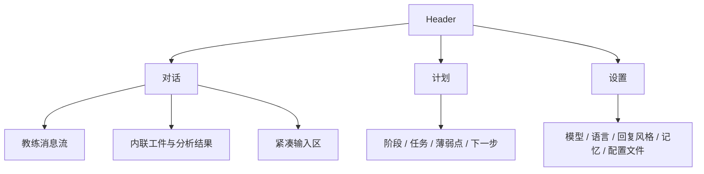
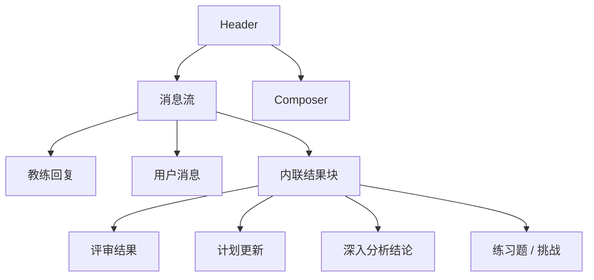
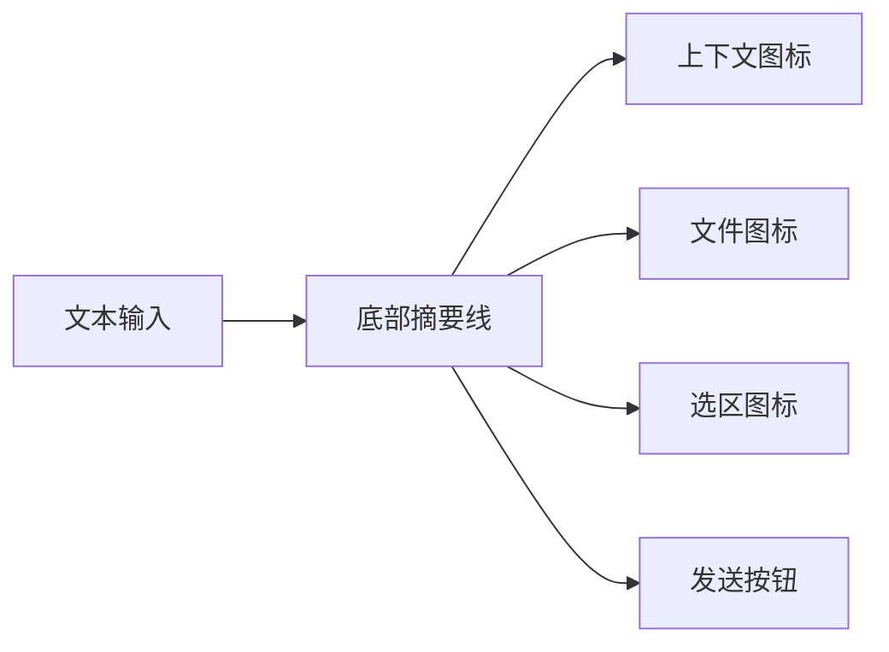

# Trainer Coach-First 界面与功能设计文档

> 历史阶段说明：本文属于早期三视图设计阶段，不再代表当前顶层 IA。
> 当前 Trainer 顶层契约请以 [docs/ui-contract.md](../ui-contract.md) 为准：`Coach / Plan / Resources / Training / Settings`。

> 关联文档：[Trainer Coach-First 产品定义总纲](/Users/Apple/Desktop/trainer/docs/plans/2026-04-30-trainer-coach-first-product-definition.md)  
> 状态：界面与功能设计文档  
> 日期：2026-04-30  
> 目标：把理想 Trainer 的产品定义具体化为可落地的界面结构、消息流设计、功能编排和实现改造方向。

---

## 1. 设计总目标

本设计文档要解决四个问题：

1. 怎么让 Trainer 一眼就像“代码教练”，而不是“AI 后台系统”。
2. 怎么让计划成为独立且有价值的结构化视图。
3. 怎么让研究、记忆、检索、评估这些强能力保留，但不显得复杂。
4. 怎么在 VS Code 侧边栏里做到高级、凝练、理解成本低。

---

## 2. 顶层信息架构

Trainer 的顶层 IA 应收敛为三个视图：

### 2.1 一级视图

- `对话`
- `计划`
- `设置`

### 2.2 不再作为一级视图的能力

以下内容不应再作为并列的大导航：

- research
- memory
- task
- review
- resources
- approvals

它们应被重新安置为：

- 消息流中的结果块
- 计划视图的子模块
- 设置中的控制项
- 或教练后台能力

---

## 3. 对话视图设计

对话视图是 Trainer 的绝对主界面。

### 3.1 目标

对话界面要做到：

- 一眼知道你和谁在对话
- 一眼看懂最近发生了什么
- 一眼知道本次发送会带哪些上下文
- 强能力通过消息流自然表达，而不是靠大量固定卡片

### 3.2 结构

### 3.3 Header

Header 只保留：

- `对话`
- `计划`
- `设置`
- 一个紧凑的设置图标或连接状态

不再承担复杂操作入口。

### 3.4 消息流层级

消息流必须明显区分：

- `用户消息`
- `教练消息`
- `教练的分析/结果块`

#### 用户消息

- 右侧或轻微右移
- 更轻的背景
- 标题层级弱
- 表达“这是我的输入”

#### 教练消息

- 左侧
- 更稳定的主体感
- 标题层级更强
- 表达“这是系统对当前问题的正式回应”

#### 结果块

结果块是内联于对话流中的“结构化产物”，例如：

- 评审摘要
- 计划更新
- 练习题
- 深入分析
- 待确认决策

它们不是独立页面，而是消息流里的二级信息层。

---

## 4. 对话中应该出现哪些结果块

理想 Trainer 在消息流中应支持以下类型：

### 4.1 Next Step Block

用于明确告诉用户：

- 现在先做什么
- 为什么先做这个
- 做完后回来继续

### 4.2 Review Block

用于代码评审结果展示：

- 结论
- 阻塞问题
- 次要建议
- 下一步修复方向

### 4.3 Plan Update Block

用于教练告诉用户：

- 已更新计划
- 当前阶段变动
- 新增任务
- 下一个训练动作

### 4.4 Deep Analysis Block

这是“研究能力”在用户界面的正确表现形式，不叫 research，不暴露 thread/theme。

它只展示：

- 我查了什么
- 我比了什么
- 我得出什么结论
- 哪个点还需要你确认

可折叠信息包括：

- 资料来源
- 对比维度
- 详细推理

### 4.5 Challenge Block

当用户想练习时，教练可以直接在消息流里给：

- 小练习
- 限制条件
- 验收标准
- 预期思路

### 4.6 Idea Implementation Block

这是 Trainer 最该做强的结果块之一。

当用户提出一个 idea 时，教练应在消息流中给出一个轻量但结构化的实现引导块，包含：

- 这个 idea 的最小可实现版本
- 当前建议先做哪一步
- 为什么先做这一步
- 这一小步做完如何验证
- 下一个实现动作

它的目标不是替用户一次性写完，而是持续带着用户把 idea 落地。

### 4.7 Project Idea Block

这是另一个非常关键的结果块。

当用户没有明确 idea，或者明确要求“基于当前项目给我找值得做的东西”时，教练应能从当前项目中提炼实现机会，并在消息流中给出结构化建议：

- 这个 idea 的名字
- 它为什么适合当前项目
- 它能训练你哪种能力
- 它的实现范围应该控制在哪
- 第一刀代码建议从哪里开始

这让 Trainer 不只是“回答问题”，还成为“从真实项目中发现训练机会的教练”。

### 4.8 Project Adaptation Block

这是面向“已有项目按用户意图改造”的关键结果块。

当用户说“我想把这个现成项目改成这样”时，教练应给出一个结构化改造块，包含：

- 用户目标变化是什么
- 当前项目里受影响的模块边界
- 建议先改哪一层
- 哪些部分应暂时不要动
- 第一轮最小改造动作
- 做完后如何验证没有把原项目改坏

它的目标不是直接重构整站，而是把“改现有项目”变成连续可验证的小步。

### 4.9 Principle Block

当用户需要“为什么要这样做”时，教练应在消息流中给出原理解释块，包含：

- 当前方案的核心原理
- 常见错误直觉
- 为什么这个实现更稳
- 未来可迁移到哪些相似问题

这样 Trainer 才是“代码教练”，而不只是“代码修改建议器”。

---

## 5. 输入区设计

输入区必须像一个完成度很高的“工作输入器”，而不是大块功能面板。

### 5.1 输入区原则

- 单一主动作：发送
- 上下文控制尽量图标化
- 说明信息必须轻量
- 不重复解释过多系统细节

### 5.2 输入区结构

### 5.3 可见控件

发送按钮左侧只保留三个高频图标：

- `上下文`
- `当前文件`
- `当前选区`

更多复杂控制不再常驻可见。

### 5.4 摘要线

摘要线用极小字号显示：

- 当前会发送什么上下文
- 当前回答风格
- 当前是否进入深入分析态

但摘要线必须轻量，不占垂直高度，不抢消息流。

### 5.5 Slash 命令

Slash 命令应保留，但定位要明确：

- 它是高级快捷入口
- 不是普通用户必须依赖的主交互

---

## 6. 计划视图设计

计划视图是理想 Trainer 的第二主视图，而且必须是强视图，不是附属块。

### 6.1 计划视图的职责

计划视图负责回答：

- 我现在在练什么
- 我在整个训练路径的哪个阶段
- 我接下来几次应该怎么练
- 我最近的薄弱点是什么
- 我最近有没有进步

### 6.2 计划视图的内容结构

计划视图应由五个区域构成：

1. `目标摘要`
- 长期目标
- 当前训练主题
- 每周投入

2. `阶段进度`
- 当前阶段
- 阶段目标
- 阶段完成度

3. `任务队列`
- 当前任务
- 后续任务
- 任务优先级

4. `教练观察`
- 近期薄弱点
- 最近进步
- 推荐训练策略

5. `下一次训练动作`
- 下一题
- 下一次 review
- 下一步实践建议

### 6.3 计划视图的视觉原则

- 更结构化
- 更像教练面板
- 但仍然克制、紧凑
- 不做大型仪表盘

计划视图要比聊天更“结构化”，但不能更“花”。

---

## 7. 设置视图设计

设置不是一个小弹层，而应是完整侧栏系统面板。

### 7.1 设置应包含的分组

#### 界面与回复

- 语言
- 主题
- 回答风格
- 是否实时跟随当前文件

#### 模型与连接

- Provider 名称
- Base URL
- Chat Model
- API Key
- 测试连接
- 清空配置
- 打开配置文件

这里明确只支持`大模型配置`，不把 embedding 模型暴露为必填前台设置项。

#### 记忆与工作区

- 是否启用长期记忆
- 清空当前工作区训练记忆
- 导出 / 导入用户档案
- 打开工作区配置

### 7.2 设置视图的体验要求

- 信息分组清晰
- 不像表单堆叠页
- 字体更小、更系统化
- 保留高级感和克制感

---

## 8. “研究 / 深入分析”功能设计

理想 Trainer 不是没有研究能力，而是把它做成`教练底层能力`。

### 8.1 触发方式

以下情况，教练可以自动进入深入分析态：

- 用户明确要求查资料、比较方案、找实践
- 问题跨多个文件或多轮推理
- 当前问题更像技术选型或架构判断
- 教练判断普通即时回复不够可靠

### 8.2 用户界面的表现

默认不跳出独立研究页。

而是在教练回复中显示轻量状态，例如：

- 已检索 3 个相关来源
- 已分析当前代码库中的 4 个相关文件
- 已比较 2 种方案
- 已形成建议结论
- 有 1 个关键点待你确认

### 8.3 需要时的展开层

如果要保留研究详细查看能力，建议未来做成：

- 消息内展开详情
- 或次级抽屉
- 或“分析记录”子面板

但不再作为一级导航。

---

## 9. 长期记忆功能设计

长期记忆应完全服务教练，而不是成为主界面上的高频操作区。

### 9.1 写入时机

系统应在以下时机自动写入长期记忆：

- 用户更新目标或背景
- 一次计划生成或阶段调整完成后
- 一次评审完成后
- 一次练习结束后的反思总结
- 发现重复错误模式时
- 用户明确说“记住这个偏好”时

### 9.2 检索时机

系统应在以下时机自动召回长期记忆：

- 用户问“下一步”
- 用户请求新任务
- 用户请求 review
- 用户要求解释某概念
- 用户进入新一轮计划生成

### 9.3 UI 呈现方式

默认不展示“记忆数据库”。

只展示：

- 近期教练判断摘要
- 当前薄弱点
- 最近进步
- 少量可控的记忆设置入口

---

## 10. 教学法功能设计

Trainer 的教练能力必须包含正式的教学策略层，而不是只靠 prompt 语气变化。

### 10.1 教学策略层的目标

每次回复前，系统都应判断：

- 当前更适合`直接讲解`
- `引导提问`
- `逐层提示`
- `出练习题`
- `要求用户先表达自己的思路`
- `先救火再教学`
- `把一个 idea 拆成实现路径并持续推进`
- `从现有项目里提炼值得实现的 idea`

### 10.2 建议的教学模式

这些模式不一定暴露成显式按钮，但系统内部应具备：

1. `Coach`
- 少给答案，多引导
- 优先帮助用户自己推出结论

2. `Idea Implementation`
- 面向用户提出的 idea
- 重点是拆 MVP、拆步骤、拆验证方式

3. `Project Idea Mining`
- 面向当前代码库和当前项目状态
- 主动发现值得实现的小功能、重构点、工程性提升点

4. `Project Adaptation Guidance`
- 面向已有项目、已有实现、已有产品原型
- 帮用户按自己的目标渐进式改造，而不是推倒重来

5. `Principle Explanation`
- 面向“我想理解为什么”的场景
- 把当前代码修改和背后的原理、取舍绑定起来

6. `Scaffold`
- 给最小可执行提示
- 一层层加深

7. `Direct Rescue`
- 用户明显着急或卡住时，先快速解围

8. `Challenge`
- 把知识点转成训练题

### 10.3 UI 表现

教学策略不应做成很多显式 tab。

更合理的做法是：

- 设置里保留默认回答风格
- 消息流中用轻量语义体现：
  - 基于当前项目给我找几个 idea
  - 这个项目下一步值得做什么
  - 带我实现这个 idea
  - 先拆 MVP
  - 下一步先改哪里
  - 更小提示
  - 换个讲法
  - 给我练一题
  - 直接告诉我

---

## 11. 基于遗忘曲线的复习机制设计

Trainer 应具备复习调度系统，而不是只会不断往前推进。

### 11.1 复习对象

应进入复习池的内容包括：

- 关键知识点
- 典型错误模式
- 最近做过的重要训练题
- 近期评审中暴露出的薄弱点

### 11.2 调度机制

建议系统内部为每个知识点维护：

- 首次学习时间
- 最近一次成功应用时间
- 最近一次失败时间
- 下次推荐复习时间
- 当前掌握置信度

### 11.3 UI 落点

复习机制主要落在计划视图，而不是对话主界面。

计划视图中应新增：

- `该复习`
- `本周巩固`
- `最近快遗忘`

对话中只在必要时轻量提示：

- 这个点你前几天学过，今天适合回顾一次
- 我建议先用一道巩固题复习这个概念

---

## 12. 情绪支持功能设计

Trainer 的情绪支持不是增加一个“鼓励模式”，而是让整体交互更有人感、更稳定。

### 12.1 情绪支持的目标

- 降低用户开口成本
- 在挫败时给出稳定感
- 在做对时给予可信的认可
- 避免冷冰冰的系统感

### 12.2 情绪识别的触发信号

系统可通过以下信号判断当前语气策略：

- 用户措辞明显烦躁、焦虑、失望
- 连续多轮失败或评审未过
- 用户说“我没懂”“我还是不会”“我快烦死了”

### 12.3 情绪支持的输出方式

不要做成大片安慰文案，而要落为：

- 更短的回复
- 更明确的下一步
- 更少指责感
- 更清楚地承认用户已经做对了哪部分

---

## 13. 功能编排设计

Trainer 的强，不应体现在前端显式按钮数量，而应体现在后台 orchestration。

### 13.1 单次发送编排

每次发送，系统应按以下顺序判断：

1. 用户意图识别
2. 当前视图与当前任务状态判断
3. 代码上下文读取
4. 历史记忆召回
5. 用户理解层级与情绪状态判断
6. 是否需要评估/规划/深入分析
7. 是否触发复习机制
8. 是否需要资料检索或代码库搜索
9. 是否需要项目机会提炼 / 已完成项目改造指导 / 原理解释
10. 形成最终教练回复
11. 更新记忆、复习节奏与计划

### 13.2 可复用的现有脚手架

当前项目已有不少可复用能力，后续不应重复造轮子：

- `PlannerService`
- `MemoryService`
- `EvaluatorService`
- `ResearchOrchestratorService`
- `ResourceService`
- `SemanticMemory / Qdrant`

正确方向不是再造一个新的研究 UI，而是：

- 重组这些后端能力的触发关系
- 让它们服务教练消息流
- 只把必要结果投射到前台

后续新增的能力层应优先以现有服务扩展为主：

- 教学策略层：挂在教练回复生成前
- 复习调度层：挂在 memory/plan 之间
- 情绪调节层：挂在回复风格与消息组织层
- 项目来源与资料检索：尽量复用现有 research/resource 脚手架，不重新发明前台研究 UI

---

## 14. 当前实现应如何改

下面是当前项目最关键的结构调整项。

### 11.1 导航改造

当前：

- 对话
- 研究
- 设置

目标：

- 对话
- 计划
- 设置

研究从一级导航移除或降级。

### 11.2 对话流改造

当前问题：

- 研究语义显式化过强
- 功能块与消息块层级混杂
- 用户与教练消息区分还不够稳定

目标改造：

- 明确用户消息与教练消息的层级差
- 把评审、计划、分析结果都做成内联结果块
- 减少主界面的模块化割裂感

### 11.3 计划视图增强

当前问题：

- 计划虽然存在，但还不够像真正的训练中枢

目标改造：

- 强化阶段结构
- 强化任务队列
- 强化薄弱点与进展
- 强化下一步训练动作

### 11.4 设置视图增强

当前问题：

- 有基础配置，但还不够完整

目标改造：

- 补齐长期记忆相关控制
- 保留模型配置完整度
- 增加工作区配置入口
- 为未来 profile 导入导出留接口

### 11.5 研究能力降级重构

当前问题：

- “研究”被产品化得过于显式

目标改造：

- 研究变成“深入分析”能力层
- 默认只展示结果，不展示底层 thread/theme 编排
- 需要时再提供展开详情

### 11.6 增加项目改造指导层

目标改造：

- 当用户面对已有项目时，教练能输出“按你意图改造”的路线
- 把大改造拆成低风险的连续小改动
- 在消息流与计划视图里持续跟踪改造进度

### 11.7 增加原理解释层

目标改造：

- 教练在给修改建议时，同时能解释设计原理与权衡
- 把“知道怎么改”升级为“知道为什么这样改”

### 14.8 增加教学策略层

目标改造：

- 教练回复前先判断教学策略
- 把“更小提示 / 直接讲 / 出题 / 让用户先想”变成系统级行为

### 14.9 增加复习调度层

目标改造：

- 长期记忆不只记“学过什么”
- 还记“什么时候该复习”
- 计划视图能直接展示复习任务

### 14.10 增加情绪支持层

目标改造：

- 在高压、挫败、焦虑语境下切换更稳定的教练语气
- 降低冷系统感
- 让用户更愿意长期使用

---

## 15. 视觉设计原则

Trainer 的视觉必须尽量贴近 Codex 的底层气质，而不是照搬配色。

### 12.1 气质关键词

- 克制
- 安静
- 紧凑
- 专业
- 工具感
- 低装饰

### 12.2 字体与密度

- 消息流字号整体偏小
- 设置与研究相关说明文字更小
- 输入框正文略大于提示文字
- 所有辅助信息采用统一小字号层级

### 12.3 边框与背景

- 少量边框
- 低对比背景层
- 不堆重卡片
- 优先利用间距和层级，而非装饰

### 12.4 图标

- 真正的图标，不用字母缩写
- 图标基线统一
- 高频按钮图标数量严格控制

---

## 16. 建议的实现阶段

### Phase 1: 产品结构纠偏

- 顶层导航改为 `对话 / 计划 / 设置`
- 研究退出一级导航
- 明确计划为独立视图

### Phase 2: 消息流重构

- 重做用户/教练消息层级
- 引入统一的结果块体系
- 深入分析结果进入消息流

### Phase 3: 计划视图做强

- 阶段
- 任务队列
- 薄弱点
- 最近进展
- 下一步动作

### Phase 4: 设置视图做完整

- 模型配置
- 语言与回答风格
- 长期记忆控制
- 配置文件入口

### Phase 5: 后端能力收束

- 研究能力改为教练后台管线
- 长期记忆写入与召回时机标准化
- 评估、规划、分析统一进入单次发送编排
- 项目机会提炼、现有项目改造指导、原理解释接入教练主链路

### Phase 6: 教学、复习与情绪支持

- 加入教学策略判断层
- 加入艾宾浩斯式复习调度层
- 加入情绪支持语气策略
- 让计划视图承担复习提醒与巩固结构

### Phase 7: 可选实验能力

- 如未来要做专注控制模式，只作为实验项验证
- 不影响主导航、不绑定退出限制、不阻塞 coach-first 主线

---

## 17. 最终设计结论

理想 Trainer 的界面与功能设计，不应再围绕“展示多少模块”展开，而应围绕以下结构成立：

- `对话`负责当前教练交互
- `计划`负责长期训练结构
- `设置`负责完整系统配置
- `深入分析 / 检索 / 记忆 / 评估 / 诊断 / 教学策略 / 复习调度 / 情绪支持`都作为教练底层能力工作

最终要实现的不是“看起来很多功能”，而是：

`界面非常安静，但每一次发送都非常强，而且真的会教、会陪你练、会帮你记住、会带你改项目。`
