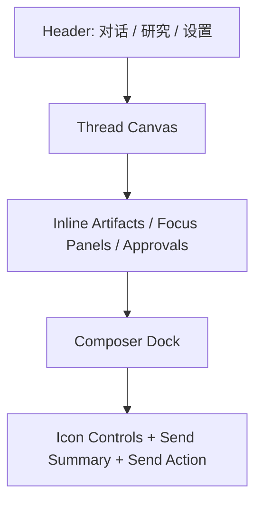

# Trainer 下一代侧边栏体验总纲计划

> 本文档用于统领 Trainer 后续的产品、交互、视觉、功能和技术改造。
> 它不是单一前端样式说明，而是面向产品定位、信息架构、消息流、设置体系、provider/protocol 能力、研究模式和实现路线的完整总方案。
> 本文档在范围上高于 [Trainer Sidebar Minimalist Redesign Implementation Plan](/Users/Apple/Desktop/trainer/docs/plans/2026-04-30-trainer-sidebar-minimalist-redesign.md)，后者可视为本总纲下的一次局部落地计划。

**目标**
把 Trainer 从“功能丰富但表达分散的训练工作台”升级为“单侧栏、线程优先、极简但强大、理解成本低、像 Codex 一样高级克制”的代码训练与研究插件。

**一句话定位**
Trainer 不是普通聊天助手，也不是纯代码生成器，而是一个面向真实代码工作流的训练教练、评审助手和深度研究代理工作台。

**核心原则**
- 外观极简，不等于能力简化。
- 所有重要能力都尽量在“每一次发送”里被表达和控制。
- 线程优先，消息流优先，工件和设置都服务于消息流。
- 高级感来自结构清晰、状态明确、默认克制，而不是堆叠卡片和装饰。
- Trainer 必须保留训练、评审、计划、记忆、研究、provider 配置、实时上下文读取这些核心能力。

**现状基础**
- VS Code extension host + FastAPI sidecar 架构已经成立。
- webview 已经向单侧栏、Codex-like shell 收敛。
- Research 模块已经具备多主题、多角色、审批与调度基础。
- provider 配置和测试已存在，但主要在命令层，不是完整的用户可视设置体验。

---

## 1. 背景与问题定义

### 1.1 Trainer 的理想目标

Trainer 的理想形态不是一个“问答框”，而是一个在真实编码过程中持续陪伴用户的训练系统：

- 在你写代码时理解当前上下文。
- 在你发送问题时自动打包最有价值的上下文。
- 在你需要时切换成评审、计划、研究、记忆等工作模式。
- 用极少的界面元素承载极强的能力。
- 像 Codex 一样让人觉得“这是一个工程工作台”，而不是“一个 AI 页面”。

### 1.2 当前项目的优势

- 架构清晰：`extension/`、`server/`、`shared/`、`webview/` 职责明确。
- 训练闭环已具备基础：session、plan、task、evaluation、memory、research 都已有数据结构和路由。
- 发送时上下文打包能力已经存在：当前文件、选区、诊断、相关文件、context detail、answer mode。
- provider 抽象已经存在：OpenAI-compatible base URL、model、embedding model、capabilities、API key。
- 已有研究编排：Researcher / Editor / Critic / Synthesizer。

### 1.3 当前主要问题

当前的问题已经不再是“功能缺少”，而是“功能表达方式过重、过散、过像 AI dashboard”。

具体问题如下：

| 问题 | 表现 | 本质 |
|---|---|---|
| 入口重复 | 发送包、附带上下文、快捷动作、分析卡片在多个区域重复解释 | 信息架构没有彻底线程优先 |
| 视觉不够克制 | 卡片、胶囊、说明块较多，像一个微型独立网页应用 | 没有完全对齐 VS Code/Codex 的低装饰工作台气质 |
| 发送区过大 | 发送分析、配置菜单、说明块占用过多垂直空间 | 高频交互没有图标化和状态化 |
| 研究流仍偏“面板化” | 研究线程虽然已变轻，但仍不够像自然的研究消息流 | 研究结构与线程表达还没彻底合一 |
| 设置能力不够可见 | provider/API/config 能力更多在命令里，不在主要 UX 中 | 高价值能力没有被产品化 |
| 协议支持模型较浅 | 只有基础 OpenAI-compatible 字段 | 无法支撑“相当完善”的 provider/protocol 配置诉求 |
| 实时读取能力不够清晰 | 实际已可读取活动文件与选区等上下文，但用户感知不明确 | “能读什么、何时读、这次发送带了什么”表达不足 |

### 1.4 必须坚持的结论

- 不能为了“简洁”砍掉 trainer 的训练能力。
- 不能把 plan、review、research 做成隐藏得找不到的功能。
- 不能把 settings 做成一个装饰性按钮。
- 不能把上下文读取做成“黑箱魔法”，必须让用户理解并控制。
- 不能用更多大卡片去解释更复杂的事情，必须用更好的结构表达。

---

## 2. 产品定位与用户心智

### 2.1 产品定位

Trainer 的正确定位是：

**一个嵌入 VS Code 的代码训练与研究工作台。**

它服务的不是“随便问问 AI”，而是以下场景：

- 我在写代码，想知道下一步该做什么。
- 我想让系统按训练目标推进，而不是随意回答。
- 我想 review 当前实现。
- 我想把一个目标拆成计划并持续跟踪。
- 我想对某个技术主题展开多轮研究。
- 我想精细配置模型、协议、上下文策略。

### 2.2 用户心智模型

用户不应该被迫理解一堆内部模块名。

用户真正的心智应该是：

1. 我在和 Trainer 对话。
2. 每次发送都可以附带我当前代码上下文。
3. Trainer 可以回答、评审、规划、研究。
4. 如果需要更高级的能力，我点开配置或设置即可。
5. 研究不是另一套系统，而是同一个工作台里的深度模式。

### 2.3 用户应感受到的体验

- 像在用一个专业工具，而不是营销化 AI 产品。
- 看一眼就知道“现在在哪里、这次会发什么、接下来能做什么”。
- 即使功能强，也不让人觉得乱。
- 默认简单，但越用越深。

---

## 3. 总体验原则

### 3.1 设计哲学

对标 Codex 的关键，不是复制颜色和边框，而是复制以下底层哲学：

- 工作台式信息架构
- 线程优先
- 命令式交互
- 低装饰密度
- 让高级能力折叠，而不是堆叠
- 默认状态高度克制

### 3.2 Trainer 的体验原则

1. 一个主入口
用户进入 Trainer 后，视觉上只应感受到一个主要工作流：查看线程，输入消息，发送。

2. 一个主动作
发送永远是最高优先级动作。计划、评审、研究、上下文、设置都围绕发送组织。

3. 一个主视图切换
顶层只保留极少数视图。建议长期稳定为：
- `对话`
- `研究`

4. 其他能力都是上下文能力
`task / review / plan / memory / resources / approvals` 不再作为同级大导航存在，而是作为线程中的工件、焦点面板、设置项或研究流的一部分出现。

5. 信息流第一，卡片第二
所有内容优先以“时间与语义清晰的流”呈现，而不是一堆功能卡片。

6. 高级感来自克制
少颜色、少大块、少重复说明、少抢焦点 UI。

---

## 4. 目标信息架构

### 4.1 顶层结构

Trainer 最终采用统一单侧栏结构：

### 4.2 顶层可见区

| 区域 | 目标 | 可见性 |
|---|---|---|
| Header | 只负责顶层模式切换与少量全局入口 | 常驻 |
| Thread Canvas | 承载主消息流与工件流 | 常驻 |
| Focus Surface | 临时展示 task/review/plan/memory 等聚焦内容 | 按需出现 |
| Composer Dock | 唯一输入区和发送区 | 常驻 |
| Settings Sheet | provider/API/config/behavior 全设置中心 | 按需打开 |

### 4.3 顶层模式

#### 对话模式

用于：
- 普通训练对话
- 让 Trainer 给下一步
- 请求 review
- 请求 plan
- 快速问答
- 通过 slash command 或意图切换触发不同训练动作

#### 研究模式

用于：
- 多主题研究
- theme/thread 切换
- 角色轮转消息流
- findings 和 approvals
- 深度推进研究进度

### 4.4 被收拢的二级能力

| 能力 | 过去的问题 | 目标表达 |
|---|---|---|
| Task | 像单独页面 | 作为工件打开，或焦点面板展开 |
| Review | 像独立模块 | 作为 review turn + inline result + focused detail |
| Plan | 独立页面感过强 | 作为计划工件和可展开的 plan focus |
| Memory | 概念偏后台 | 作为 Trainer 对用户状态的摘要层 |
| Resources | 容易成为后台列表 | 作为消息附件、研究引用、设置中的资源入口 |

---

## 5. 消息流与内容布局总方案

### 5.1 对话流原则

对话流必须让用户一眼看懂“发生了什么”，因此每个 turn 需要具备稳定结构：

1. 谁说的
2. 这条消息的主要意图
3. 伴随了哪些上下文
4. 产出了哪些工件
5. 下一步建议是什么

### 5.2 对话消息的标准语义

| 消息类型 | 含义 | UI 表达 |
|---|---|---|
| User turn | 用户输入 | 简洁气泡，必要时显示附带上下文 |
| Trainer answer | 教练回应 | 主回复内容 |
| Review result | 代码评审结论 | 回答中带 evaluation artifact |
| Plan update | 计划生成或更新 | 回答中带 plan artifact |
| Task proposal | 下一题或任务说明 | 回答中带 task artifact |
| Research gate turn | 研究代理消息 | 角色标签 + 研究语气 |
| Approval required | 需要用户决策 | inline approval block |

### 5.3 工件表达原则

工件不是主角，但必须好理解。

建议规则：
- 工件永远嵌在相关消息下面。
- 工件默认简短。
- 点击工件后打开对应焦点面板或跳到相关视图。
- 不再使用厚重卡片。
- 用更像引用块、简报块的风格承载工件。

### 5.4 Suggested Actions 原则

Suggested Actions 不是单独的“操作中心”。

它们应该：
- 出现在相关回复之后
- 数量少
- 语义明确
- 与当前 turn 强相关

例如：
- 继续下一题
- 运行评审
- 展开计划
- 深入研究

### 5.5 内容布局原则

线程区必须做到：

- 垂直滚动自然
- 语义层级明显
- 留白克制但不拥挤
- 边界弱化但结构清晰
- 不出现“每条消息都是一张大卡片”的感觉

---

## 6. 研究模式总方案

### 6.1 Research 的正确定位

Research 不是“另一个页面”，而是 Trainer 的深度模式。

它的目标不是展示一堆研究面板，而是让用户感受到：

- 我在看一个持续推进的研究线程
- 当前有哪些 theme
- 当前轮到哪个 agent role
- 哪些地方需要我批准
- 当前最重要的发现是什么

### 6.2 Research 的理想 UI 结构

1. 顶部极轻 theme switch
2. 中央主线程
3. inline findings / inline approvals
4. 默认隐藏大部分元信息
5. 需要时可展开 meta

### 6.3 Research 消息流原则

研究流应该尽量像“研究团队内部协作线程”，而不是“研究报告面板”。

因此：
- 角色消息按时间顺序进入线程
- findings 不做厚重 summary dashboard
- approval 不跳走，不开新页，直接 inline 决策
- theme 的状态、checkpoint、findings count 默认弱化
- 只有在 `展开信息` 时才显示更多调度细节

### 6.4 多主题研究的表达

多 theme 存在时：
- 顶部用极轻 pill / text tab 选择 theme
- 当前 active theme 的 thread 置于主线程中心
- 不让左侧再出现大型研究树
- 不把 theme metadata 压在用户第一眼看到的位置

### 6.5 Research 中必须保留的高级能力

- 多 theme 并行
- 角色轮转
- 调度节奏
- 审批队列
- findings 聚合
- artifacts 输出
- 后续可扩展持久化与导出

---

## 7. Composer Dock 与发送体验总方案

### 7.1 核心判断

Trainer 的“强大”必须尽可能集中在发送区，而不是集中在许多分散入口。

因此，发送区必须同时满足：

- 极简
- 可控
- 可理解
- 可扩展

### 7.2 发送区最终结构

发送区由四层构成：

1. 一行状态摘要
2. 一组图标控制
3. 输入框
4. 发送按钮

### 7.3 图标化原则

高频能力全部图标化，避免长文字菜单常驻。

建议常驻图标：

| 图标功能 | 含义 |
|---|---|
| Intent | 本次发送倾向：coach / task / review / plan / research |
| Current file | 是否附带当前文件 |
| Selection | 是否附带选区 |
| Diagnostics | 是否附带诊断 |
| Related files | 是否附带相关文件 |
| Context detail | focused / balanced / full |
| More | answer mode / language / live follow / extra actions |
| Settings | 打开完整设置面板 |

### 7.4 发送摘要原则

发送摘要只保留一行，不再做大块“发送分析”。

示例：

- `Review · handler.ts · Selection · Full`
- `Coach · file + diagnostics + 2 related`
- `Research · Theme A`
- `Local command · Open plan`

### 7.5 发送分析的正确处理

发送分析不是被删除，而是被降级为：

- 一行摘要
- 只在有风险时出现 inline warning
- 必要时给一个快速修正按钮

例如：
- `Review needs current file`
- `Selection exists but is not attached`
- `Review usually works better with full context`

这些 warning 的 UI 应该是轻量 inline corrective hints，而不是大分析卡片。

### 7.6 输入框原则

- 更低高度
- 更少边框存在感
- 默认 2 到 3 行
- 支持 `Cmd/Ctrl + Enter` 发送
- 支持 slash commands
- 在 `research` 模式与 `coach` 模式复用同一套 shell

### 7.7 Slash Commands 的地位

slash commands 继续保留，但只在输入 `/` 时显现，不做常驻入口。

保留价值：
- 专家用户效率高
- 可以替代部分深层设置
- 是“能力不删但不吵”的理想表达

---

## 8. 设置体系与 Provider / API / Protocol 总方案

### 8.1 设置必须成为一等能力

这是当前产品最大的缺口之一。

最终 Trainer 必须提供一个高级但克制的 `Settings Sheet`，而不是只依赖 VS Code command。

### 8.2 Settings Sheet 结构

建议分为以下 section：

| Section | 内容 |
|---|---|
| Provider | provider profile、base URL、models、API key 状态 |
| Protocol | Responses / Chat Completions / compatibility mode / streaming / tools |
| Capability | vision、embeddings、tools、json schema、streaming、reasoning 等 |
| Context | live follow、默认附带策略、context detail 默认值 |
| Behavior | answer mode、language、research defaults |
| Files | 打开配置文件、Reveal 路径、导入/导出 profile |
| Health | provider test、sidecar 状态、最近错误 |

### 8.3 Provider Profile 模型升级

当前 `ProviderConfig` 过于简单，只够基础 OpenAI-compatible 调用。

建议升级为更完整的 `ProviderProfile` 概念：

| 字段 | 说明 |
|---|---|
| `id` | profile 唯一标识 |
| `label` | 用户可读名称 |
| `providerKind` | openai / azure-openai / openai-compatible / local-compatible / custom |
| `baseUrl` | 基础地址 |
| `apiKeyRef` | SecretStorage 引用 |
| `model` | chat / reasoning model |
| `embeddingModel` | embedding model |
| `protocolMode` | responses / chat-completions / compatibility |
| `streamingMode` | auto / on / off |
| `toolMode` | disabled / auto / required |
| `jsonSchemaMode` | disabled / supported / strict |
| `visionMode` | off / on |
| `headers` | 自定义 headers |
| `queryParams` | 自定义 query params |
| `organization` | 可选 org |
| `project` | 可选 project |
| `timeoutMs` | 请求超时 |
| `retryPolicy` | 重试策略 |
| `notes` | profile 备注 |

### 8.4 Protocol 支持策略

为了“相当完善”，但又不脱离当前代码现实，建议采用分层策略：

#### Phase A: 完整 OpenAI-compatible 家族

优先支持：
- OpenAI
- OpenRouter 的 OpenAI-compatible 模式
- LM Studio
- Ollama OpenAI-compatible mode
- vLLM OpenAI-compatible endpoints
- SiliconFlow / DeepSeek / DashScope 等兼容 OAI 的接入方式

#### Phase B: Native Adapters

后续扩展：
- Anthropic native
- Gemini native
- 其他非 OAI 协议

这能兼顾当前 `ProviderService` 架构与未来扩展性。

### 8.5 配置文件支持

用户明确要求“支持调整配置文件”，因此必须设计配置文件层。

建议引入双层配置：

1. 用户级配置
- 适合保存通用 provider profiles
- 存在 VS Code `globalState` / SecretStorage 配合的 UI 层

2. 工作区级配置
- 适合项目特定 provider 或行为策略
- 建议支持：
  - `.trainer/config.json`
  - 或 `.vscode/trainer.json`

### 8.6 配置优先级

建议优先级：

1. 当前会话临时覆盖
2. 工作区配置文件
3. 已选择的用户 profile
4. 默认 profile

### 8.7 Settings 中必须提供的动作

- `Configure provider`
- `Test provider`
- `Clear provider`
- `Open config file`
- `Reveal config path`
- `Import profile`
- `Export profile`
- `Reset defaults`
- `Manage API key`

### 8.8 为什么这是必要的

没有完整 settings，Trainer 就会始终给人“只是一个前端壳子”的感觉。

而完整 settings 的存在，会让它真正像一个成熟插件：

- 可部署
- 可迁移
- 可调试
- 可共享
- 可长期使用

---

## 9. 实时读取代码与上下文控制总方案

### 9.1 必须明确回答的问题

用户关心的是：`它可以实时读取我在写的代码吗？`

答案应该被产品化为：

**可以读取，但必须可见、可控、可解释。**

### 9.2 当前可用能力

基于当前 extension host 状态同步，Trainer 已具备读取以下 live context 的能力：

- active file
- active language id
- selection range
- selection preview
- diagnostics summary
- recent files
- recent edited files
- related files

### 9.3 目标行为模型

Trainer 不应默认“静默读取整个项目”。

正确模型应是：

- 默认实时跟随当前文件
- 发送时按开关附带当前文件、选区、诊断、相关文件
- 状态摘要明确显示本次发送携带了哪些上下文
- 用户可关闭 live follow
- 用户可切换 context detail

### 9.4 用户心智表达

用户应清楚知道：

- 实时看到我当前写的是哪个文件
- 这次发送是否真的带上了它
- 当前是否附带选区
- 是否附带诊断
- 是否附带了相关文件

### 9.5 未来增强方向

- 手动加入额外文件
- 发送前预览 context package
- review 模式自动建议 full context
- resource 与 workspace context 的统一打包策略

---

## 10. 语言切换与术语体系

### 10.1 中英双语必须是一等能力

Trainer 不是只要“翻译按钮”即可。

必须保证：
- 顶层 UI 可切换中英
- 消息辅助术语一致
- settings 字段有清晰双语表达
- provider/protocol 专业词汇不混乱

### 10.2 术语策略

建议：

- 面向用户的主导航和交互用自然中文/英文
- 面向技术配置的字段保留英文原词并给出中文说明

例如：
- `Context detail`
- `Responses API`
- `Chat Completions`
- `Embedding model`
- `Streaming`

### 10.3 术语统一要求

需要统一以下概念在全产品中的称呼：

- Coach
- Research
- Review
- Plan
- Memory
- Theme
- Thread
- Approval
- Artifact
- Context
- Provider
- Profile
- Protocol

---

## 11. 视觉与交互语言总方案

### 11.1 视觉方向

目标不是“好看的 AI 页面”，而是“专业、克制、耐用的 VS Code 工作台部件”。

关键词：

- 低装饰
- 轻边界
- 中性色表面
- 极少强调色
- 小而准的图标
- 字重和留白建立层级

### 11.2 必须避免的风格

- 大面积发光
- 过多胶囊
- 过多说明卡片
- 首页式 dashboard
- “AI 味”过强的渐变和营销化表述

### 11.3 图标原则

图标必须做到：

- 单色或低彩
- 含义稳定
- 高频功能优先图标化
- 搭配 tooltip
- 激活态通过填充、描边或文本强调表示

### 11.4 排版原则

- Header 小而稳
- 线程文字优先可读
- 说明文案尽量短
- 时间、角色、状态作为弱信息
- 工件标题比说明更突出

### 11.5 留白与密度

整体应该比当前再紧一些，但不能压缩到难读。

建议：
- 线程间距稳定
- 输入区高度降低
- 上下文开关做成小图标
- warning 使用 inline note，不使用大盒子

### 11.6 高级感的来源

高级感来自：

- 不重复
- 不解释过度
- 不抢焦点
- 每个元素都像“有必要在这里”

---

## 12. 与当前代码架构的映射

### 12.1 extension host 继续负责

- VS Code API
- SecretStorage
- provider config store
- workspace trust
- live context capture
- commands
- webview bridge

### 12.2 webview 继续负责

- shell
- thread rendering
- composer interaction
- settings sheet
- icon controls
- focus panels

### 12.3 server sidecar 继续负责

- provider 调用
- plan generation
- task generation
- evaluation
- research orchestration
- provider test

### 12.4 shared 层应扩展的核心模型

未来重点模型：

- `SendIntelligence`
- `ProviderProfile`
- `ProviderProtocolMode`
- `SettingsSnapshot`
- `ContextPackagePreview`
- `ResearchGateMessage`
- `ArtifactViewModel`

### 12.5 关键代码落点

| 方向 | 主要文件 |
|---|---|
| 主 UI shell | `extension/webview/src/app/App.tsx` |
| 样式系统 | `extension/webview/src/styles.css` |
| webview state | `extension/webview/src/app/useWorkbenchState.ts` |
| webview types | `extension/webview/src/lib/types.ts` |
| shared protocol | `shared/src/protocol.ts`, `shared/src/models.ts` |
| send intelligence | `shared/src/sendIntelligence.ts` |
| provider store | `extension/src/provider/providerConfigStore.ts` |
| provider commands | `extension/src/commands/providerCommands.ts` |
| bridge | `extension/src/core/webviewBridge.ts` |
| sidecar provider route | `server/app/api/routers.py` |
| provider service | `server/app/llm/provider_service.py` |

---

## 13. 分阶段落地路线

### Phase 1: 完成真正的单侧栏体验收口

目标：
- 只保留 `对话 / 研究`
- 让 task/review/plan/memory 成为 contextual surfaces
- 压缩 composer
- 图标化发送控制
- 把发送分析压成一行摘要 + inline warnings

验收：
- 首屏理解成本明显下降
- 发送区高度减少
- 功能没有退化

### Phase 2: 建立完整 Settings Sheet

目标：
- 添加 settings 按钮
- 完整 provider/profile/config UI
- provider test / clear / open config file / reveal path
- 行为设置、语言设置、context 默认设置

验收：
- 不依赖 command palette 也能完成常规配置
- 用户能看懂当前 provider 状态

### Phase 3: 升级 Provider / Protocol 模型

目标：
- 扩展 provider schema
- 支持 profile
- 支持 protocolMode
- 支持更多 capability 与 vendor compatibility

验收：
- 本地 compatible provider 与云端 provider 都能通过同一设置体系配置
- 用户能清晰区分协议模式和能力开关

### Phase 4: 深化 Research 消息流

目标：
- 研究流完全 thread-first
- findings / approvals / checkpoints 更自然
- 研究模式理解成本进一步降低

验收：
- 用户不需要理解内部调度也能使用研究功能
- 研究线程比当前更像真正的协作研究流

### Phase 5: 配置文件与工作区行为体系

目标：
- 引入工作区级 config file
- 支持 profile import/export
- 明确优先级合并策略

验收：
- 团队或多项目场景可复用配置
- 用户级与项目级设置不冲突

### Phase 6: 体验打磨与可访问性收口

目标：
- tooltips
- keyboard navigation
- focus ring
- density tuning
- bilingual polishing

验收：
- 符合 VS Code 插件应有的专业完成度

---

## 14. 产品验收标准

### 14.1 可理解性

- 用户第一次打开后，10 到 20 秒内能理解主要结构。
- 用户能一眼知道当前模式是“对话”还是“研究”。
- 用户能一眼知道本次发送附带了哪些上下文。

### 14.2 简约性

- 不出现三个以上并列的高噪音功能区。
- 默认状态下不出现大面积说明卡片。
- 高价值能力保留，但不常驻展开。

### 14.3 功能完整性

- 训练对话、下一题、评审、计划、研究、记忆、provider 设置都可达。
- 实时上下文读取与发送控制可见可控。
- API 配置支持完整 provider/profile 级设置。

### 14.4 美观与气质

- 整体像 VS Code/Codex 工作台的一部分。
- 没有明显“AI 页面味道”。
- 色彩、边框、卡片、胶囊都高度克制。

### 14.5 工程可实施性

- 尽量复用现有 extension host、sidecar、shared contract。
- 优先在当前架构上演进，而不是推翻重做。

---

## 15. 风险与取舍

### 15.1 过度极简的风险

如果只追求“更少”，会导致：
- 功能难发现
- 新用户找不到研究和配置
- 训练能力被误解成普通聊天

解决：
- 高级能力折叠，不删除
- 用 tooltips、工件、slash commands、settings sheet 保持能力深度

### 15.2 provider 协议扩展的复杂度

如果一次性支持过多 native protocol，会拖慢体验迭代。

解决：
- 先把 OpenAI-compatible 家族做完整
- 再做 native adapters

### 15.3 线程与面板之间的平衡

如果把所有东西都塞回线程，复杂信息会失真。

解决：
- 线程优先
- 复杂细节用 focus surface 打开
- settings 和 config 用 sheet 承载

---

## 16. 最终结论

Trainer 的正确未来，不是“再做更多页面”，也不是“把功能做得越来越像 dashboard”。

它应该成为一个：

- 单侧栏
- 线程优先
- 发送驱动
- 设置完整
- 研究自然
- 实时上下文可见可控
- 高级但不吵
- 简约但不弱

的代码训练与研究插件。

对标 Codex 的真正方向是：

**用最少的界面噪音，承载最多的真实工作能力。**

而 Trainer 的独特价值则是：

**把这种工作台体验，专门用于“训练、评审、规划、研究”这条持续成长链路。**

---

## 17. 后续执行建议

基于当前代码现实，建议后续实施严格按照以下顺序进行：

1. 先收口单侧栏 shell 和发送区图标化
2. 再补齐 settings / provider / config file
3. 再升级 provider profile / protocol schema
4. 最后深化 research message flow 和整体 polish

这样可以保证：

- 先快速提升主体验
- 再补核心能力入口
- 最后做深层能力系统化

如果需要，下一步应在本文档基础上继续拆分一份新的“分阶段实施计划”，逐文件、逐步骤推进实现。
