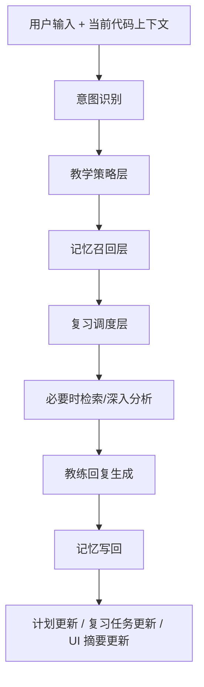
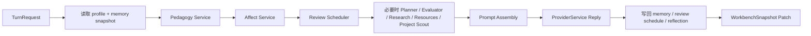

# Trainer 教学策略、复习调度与情绪支持实施方案

> 关联文档：  
> [Trainer Coach-First 产品定义总纲](/Users/Apple/Desktop/trainer/docs/plans/2026-04-30-trainer-coach-first-product-definition.md)  
> [Trainer Coach-First 界面与功能设计文档](/Users/Apple/Desktop/trainer/docs/plans/2026-04-30-trainer-coach-first-ui-and-feature-design.md)
>
> 状态：实施方案文档  
> 日期：2026-04-30  
> 目标：把 Trainer 的教学法能力、基于遗忘曲线的复习机制、以及情绪支持能力，落为可实现的数据模型、服务扩展点、编排流程、UI 承载方式和分阶段实施路线。

---

## 1. 文档目标

这份文档解决三个问题：

1. Trainer 怎么从“会回答代码问题”升级为“会教”的教练。
2. Trainer 怎么用接近艾宾浩斯遗忘曲线的机制，形成长期训练闭环。
3. Trainer 怎么在产品里提供稳定、可信、有分寸的情绪支持，而不是做成夸夸机器人。

这不是纯理论文档，而是面向当前代码库的实施方案。

---

## 2. 当前代码基础与可扩展面

当前项目已经具备足够好的扩展基础，不需要推倒重来。

### 2.1 已存在的关键落点

#### 教练回复生成

- `server/app/llm/provider_service.py`
- `server/app/llm/prompts.py`

这两处已经负责：

- 根据 `UserProfile` 生成系统 prompt
- 读取当前文件上下文
- 输出教练回复

它们是新增“教学策略层”和“情绪支持层”的第一落点。

#### 长期记忆与结构化记录

- `server/app/memory/service.py`
- `server/app/memory/models.py`
- `server/app/db/repository.py`
- `server/app/memory/semantic.py`

这几处已经具备：

- profile
- weaknesses
- reflections
- session rolling summary
- semantic memory / Qdrant 基础设施

它们是新增“复习调度层”和“更细粒度教学记忆”的主落点。

#### 计划生成与任务推荐

- `server/app/planner/service.py`

当前已经具备：

- 计划生成
- 下一个任务推荐
- 对弱点优先复习的雏形

它是把“遗忘曲线复习机制”接入任务推荐和计划视图的主落点。

#### 会话编排与 API 接入

- `server/app/api/routers.py`
- `server/app/core/models.py`

这里负责：

- turn 请求
- snapshot 拼装
- suggested actions
- 当前对话消息与 artifact 注入

它是新增教学策略结果、复习提醒、情绪状态摘要、计划补充信息的主要桥接层。

---

## 3. 总体架构建议

建议在现有 Trainer 后端之上增加三个横向能力层：

### 3.1 三个新增逻辑层

1. `Pedagogy Layer`
- 决定当前应该怎么教

2. `Spaced Review Layer`
- 决定当前应该复习什么、何时复习

3. `Affect Layer`
- 决定当前回复的语气强度、安定感和节奏

这三层都不应成为新的大型 UI 模块，而应成为教练 orchestrator 的一部分。

---

## 4. 教学策略层实施方案

Trainer 必须正式具备“教学策略层”，不能只依赖 prompt 里一句“be guided”。

### 4.1 目标

教学策略层要在每次回复前判断：

- 当前用户更适合哪种教学方式
- 现在是推进任务优先还是学习理解优先
- 应该提问、提示、讲解、出题，还是直接给解法

更重要的是，Trainer 不能只有一种“教法”，而要具备多种可切换、可编排的教学模式。

---

### 4.1.1 多种教学模式是必需项，而不是锦上添花

理想 Trainer 至少应具备以下几类正式教学模式：

1. `Idea Implementation Coaching`
- 用户提出一个 idea
- 教练帮助用户把 idea 变成可实现的代码路径
- 这是最核心、最高频的模式

2. `Project Idea Mining`
- 教练基于当前项目主动提炼值得实现的 idea
- 把真实项目里的机会转化为训练题、工程题或实现路线

3. `Completed Project Adaptation Guidance`
- 用户面对的是一个已经完成、已有雏形或已有历史包袱的项目
- 教练帮助用户按自己的目标渐进式改造现有项目
- 强调低风险切入、边界识别、连续验证，而不是推倒重来

4. `Planning Mode`
- 把目标拆成阶段、任务、约束和验收标准

5. `Concept Teaching Mode`
- 对某个概念进行结构化讲解
- 可以从直觉、原理、例子、反例几层展开

6. `Engineering Challenge Mode`
- 给用户更偏工程能力的题目
- 例如重构、边界条件、可维护性、测试设计、抽象设计

7. `Review and Reflection Mode`
- 对已有实现做评审
- 再把问题回收为学习反思

8. `Project Sourcing`
- 当当前工作区不适合某个训练目标时
- 教练可以检索、筛选、建议合适的公开项目、模板仓库或参考实现

9. `Principle Explanation`
- 当用户需要理解底层原理、设计取舍和最佳实践依据时
- 教练可以把修改建议和原理讲解绑定输出

这几个模式不是彼此孤立的，而应由教练在一条长期训练链里自由切换。

---

### 4.1.2 Idea -> 深度引导实现代码，是 Trainer 的第一核心模式

你最需要的模式，我认为应该被定义为 Trainer 的“主模式”：

`用户把一个想法告诉教练 -> 教练深度引导用户把它落为代码`

这和普通问答完全不同。

它要求教练具备以下能力：

1. 理解 idea 的目标与边界
2. 帮用户把 idea 拆成功能点、数据流、模块边界
3. 判断先做 MVP 还是先定架构
4. 把实现过程拆成多个可验证的小步
5. 在每一步里给出：
   - 现在先实现什么
   - 为什么先做这个
   - 最小代码改动是什么
   - 做完如何验证
6. 必要时主动查资料、查实践、查当前代码库
7. 最终不是替用户“一次性写完”，而是带着用户一步步把 idea 做出来

这应该成为 Trainer 的一号主工作流。

---

### 4.1.3 教练还需要能从现有项目里主动提炼 idea

这也是 Trainer 极其关键的能力。

很多时候用户并不是没有动力，而是：

- 不知道当前项目里什么最值得做
- 不知道什么改动既真实又适合训练
- 不知道应该做新功能、重构、补测试还是改善工程质量

理想 Trainer 应该能基于当前项目状态主动给出 idea，例如：

- 值得补的功能点
- 值得做的重构点
- 值得练的工程化题目
- 值得补的测试与边界条件
- 值得拆的模块与抽象

这样它就不只是“你有 idea 时帮你实现”，还可以“在你没想清楚时，帮你从项目里找出好 idea”。

### 4.1.4 教练还需要会带用户改造已经完成的项目

这是另一个必须补齐的主能力。

很多真实训练并不是从零做一个 demo，而是：

- 用户手里已经有一个完成项目
- 但想按自己的心意改界面、改交互、改架构、改数据流
- 又担心一动就把原来的项目改坏

理想 Trainer 必须能在这种情况下提供“改造型指导”：

1. 理解用户真正想改变的结果是什么
2. 识别当前项目里最相关的模块边界
3. 判断哪些地方可以先改，哪些地方暂时不要动
4. 把大改造拆成一连串最小可验证改动
5. 每一步都说明：
   - 为什么先改这里
   - 改完如何验证
   - 如何避免把已有功能带坏

这项能力本质上不是新的 UI 模式，而是教练底层 orchestrator 的一种高价值教学工作流。

### 4.2 新增数据模型建议

建议在 `server/app/core/models.py` 中新增：

#### `TeachingMode`

- `idea_implementation`
- `project_idea_mining`
- `project_adaptation`
- `planning`
- `concept_teaching`
- `engineering_challenge`
- `review_reflection`
- `project_sourcing`
- `principle_explanation`
- `guided`
- `scaffold`
- `balanced`
- `direct_rescue`
- `challenge`
- `reflection`

#### `LearnerState`

建议字段：

- `current_confidence: float`
- `frustration_level: float`
- `attempt_count_recent: int`
- `needs_rescue: bool`
- `needs_review: bool`
- `preferred_hint_depth: str`

#### `TeachingDecision`

建议字段：

- `mode: TeachingMode`
- `reason: str`
- `primary_goal: str`
- `should_end_with_question: bool`
- `should_generate_exercise: bool`
- `should_reveal_code: bool`
- `should_produce_plan_artifact: bool`
- `should_trigger_deep_analysis: bool`
- `should_focus_on_implementation_steps: bool`
- `tone_profile: str`

#### `ImplementationGuide`

建议字段：

- `idea_summary`
- `scope_boundary`
- `mvp_definition`
- `current_step`
- `next_steps`
- `validation_strategy`
- `open_questions`

这个结构专门服务于“idea implementation coaching”。

#### `ProjectAdaptationGuide`

建议字段：

- `target_outcome`
- `current_constraints`
- `affected_areas`
- `preserve_areas`
- `first_migration_step`
- `migration_sequence`
- `validation_checkpoints`
- `rollback_notes`

这个结构专门服务于“已有项目按意图改造”。

#### `ProjectIdea`

建议字段：

- `id`
- `title`
- `summary`
- `source_area`
- `idea_kind`
  - `feature`
  - `refactor`
  - `test`
  - `architecture`
  - `developer_experience`
- `learning_value`
- `engineering_value`
- `difficulty`
- `suggested_scope`
- `first_step`
- `acceptance_signals`
- `why_now`

#### `ProjectOpportunitySignal`

建议字段：

- `file_path`
- `signal_type`
  - `repetition`
  - `missing_test`
  - `diagnostic_cluster`
  - `coupling_hotspot`
  - `rough_edge`
  - `feature_gap`
- `evidence`
- `confidence`

### 4.3 新增服务建议

建议新增：

- `server/app/pedagogy/service.py`

其中核心职责：

- 根据 `UserProfile`
- 当前 `TurnRequest`
- 当前 `MemorySnapshot`
- 最近若干轮评审与失败情况
- 输出一个 `TeachingDecision`

同时建议新增：

- `server/app/pedagogy/implementation_coach.py`
- `server/app/pedagogy/project_idea_miner.py`
- `server/app/pedagogy/project_adaptation_coach.py`
- `server/app/pedagogy/principle_explainer.py`
- `server/app/pedagogy/project_source_scout.py`

职责：

- 把用户的 idea 转成实现引导结构
- 输出 `ImplementationGuide`
- 支持后续多轮继续推进，而不是每轮重新开始

以及：

- 从当前文件、最近修改文件、相关文件、diagnostics、评审结果中提炼 `ProjectIdea`
- 把项目中的真实机会转成适合训练的实现建议
- 把用户对已有项目的改造目标转成 `ProjectAdaptationGuide`
- 输出必要的原理解释骨架与外部资料建议
- 在需要时筛选适合训练的公开项目来源

---

### 4.3.1 Implementation Coach 的职责

这是 Trainer 最关键的新能力之一。

它应该回答的问题不是“这个 idea 是什么”，而是：

- 这个 idea 最小可实现版本是什么
- 当前代码里最适合从哪里插入
- 第一刀代码应该改哪里
- 哪些实现顺序能减少复杂度
- 哪些部分需要先查资料或对齐实践
- 用户现在最容易踩哪些坑

换句话说：

它不是产品经理，也不是单次代码生成器，而是实现陪练器。

### 4.3.2 Project Idea Miner 的职责

这是 Trainer 从“响应式教练”变成“主动型教练”的关键能力。

它应该回答的问题包括：

- 当前项目里最值得你练的东西是什么
- 哪个 idea 既真实又适合当前学习阶段
- 哪个改动能同时提升工程质量和训练价值
- 哪个问题最适合被设计成一道工程能力题

Project Idea Miner 的输入建议包括：

- `current_file`
- `recent_files`
- `recent_edited_files`
- `related_files`
- `diagnostics`
- 最近评审结果
- 当前计划阶段
- 当前弱点和待复习项

它的输出应是 1 到 3 个高质量 `ProjectIdea`，而不是一串泛泛而谈的 brainstorm 列表。

### 4.3.3 Project Adaptation Coach 的职责

这是面向“已有项目怎么按用户心意改”的核心能力。

它应该回答的问题包括：

- 用户真正想改变的体验和目标是什么
- 当前项目中哪些模块最受影响
- 改造应该从哪一层开始最稳
- 哪些区域应该暂时冻结，避免无关爆炸
- 这一轮最小可验证改造动作是什么

它的目标不是代替架构师出一份大改造 PPT，而是带着用户逐步改项目。

### 4.3.4 Principle Explainer 的职责

它负责把“怎么改”升级成“为什么这样改”：

- 当前建议背后的原理是什么
- 替代方案为什么不优先
- 这次修改能迁移到哪些相似问题

它应和 Implementation Coach、Project Adaptation Coach 配合，而不是单独漂浮。

### 4.3.5 Project Source Scout 的职责

它负责在需要时寻找适合训练的外部项目来源：

- 根据训练目标筛选项目复杂度
- 根据语言/框架偏好筛选技术栈
- 根据训练重点判断更适合读源码、做 feature 还是做改造

它优先复用现有 research/resource 脚手架，不另起一套独立的前台“项目市场”。

### 4.4 集成点

#### `ProviderService`

当前 `build_coaching_messages()` 只吃：

- `profile`
- `message`
- `current_file`
- `response_language`
- `answer_mode`

后续建议增加：

- `teaching_decision`
- `learner_state`
- `review_due_items`
- `implementation_guide`
- `project_ideas`
- `project_adaptation_guide`
- `principle_notes`
- `project_source_candidates`

让 prompt 真正根据教学策略变化。

#### `routers.py`

在 `execute_turn()` 里，在调用 `coaching_reply()` 之前插入：

1. 读取记忆快照
2. 计算 learner state
3. 计算 teaching decision
4. 如果是 idea implementation，生成 implementation guide
5. 如果是 project idea mining，生成 project ideas
6. 如果是 project adaptation，生成 project adaptation guide
7. 如果需要原理解释，生成 principle notes
8. 如果需要项目来源建议，生成 source candidates
9. 再交给 provider/prompt

### 4.5 UI 落点

教学策略层不应大面积显式展示。

只在必要时做轻量落点：

- 消息里出现“我先不给答案，先让你想一步”
- 出现“给我更小提示”
- 出现“直接告诉我”
- 出现“给我一题巩固”
- 出现“继续带我实现这个 idea”
- 出现“先帮我拆 MVP”
- 出现“下一步先改哪段代码”
- 出现“基于当前项目给我 3 个值得做的 idea”
- 出现“这个 idea 为什么适合当前项目”
- 出现“按这个目标继续带我改现有项目”
- 出现“先别重写，告诉我应该先动哪一层”
- 出现“解释一下这次改动背后的原理”
- 出现“如果当前项目不合适，给我找一个更适合练这个能力的项目”

也就是策略可见，但机制不可见。

---

## 5. 遗忘曲线复习调度层实施方案

Trainer 现在已有 weakness review 雏形，但还不是完整复习系统。

目标是把它升级为“知识点 + 错误模式 + 历史训练任务”的长期复习机制。

### 5.1 复习对象模型

建议在 `server/app/memory/models.py` 中新增：

#### `ReviewItem`

建议字段：

- `id`
- `workspace_id`
- `kind`
  - `concept`
  - `mistake_pattern`
  - `task_recap`
  - `project_pattern`
- `title`
- `source_task_id`
- `evidence`
- `mastery_score`
- `stability_score`
- `review_count`
- `last_reviewed_at`
- `next_review_at`
- `last_outcome`
  - `passed`
  - `partial`
  - `failed`

### 5.2 调度策略

Trainer 不一定需要一开始就实现严格学术版艾宾浩斯曲线，但至少应实现“近似的间隔复习策略”。

建议第一版使用简化调度：

- 首次学会后：1 天
- 第一次成功复习后：3 天
- 第二次成功复习后：7 天
- 第三次成功复习后：14 天
- 失败则回退到更短周期

也就是说，先做一个实用工程版 spaced repetition。

### 5.3 新增服务建议

建议新增：

- `server/app/memory/review_scheduler.py`

职责：

- 维护 review item 的下次复习时间
- 标记复习成功或失败
- 输出当前到期复习项
- 给 planner 返回“应该优先巩固什么”

### 5.4 现有服务扩展点

#### `MemoryService`

应扩展能力：

- `record_review_result(...)`
- `due_review_items(workspace_id)`
- `update_review_schedule(...)`

#### `PlannerService`

当前已有 `_pick_due_weakness()` 逻辑。

后续应升级为：

- 先看 `due review items`
- 再看 `weaknesses`
- 再看 `phase progression`

这样计划和任务推荐就真正接上复习闭环。

#### `repository.py`

建议增加新表：

- `review_items`

存放 review item 的 JSON payload 或结构字段。

### 5.5 UI 落点

复习机制最适合落在`计划视图`。

建议在计划视图增加三个小区域：

- `该复习`
- `本周巩固`
- `最近快遗忘`

消息流里只做轻量提示：

- 这个概念你前几天学过，今天适合回顾一次
- 我建议先做一道巩固题，再继续推进新内容

---

## 6. 情绪支持层实施方案

情绪支持不该单独做 UI 模块，而应成为教练回复生成时的语气策略层。

### 6.1 目标

Trainer 需要做到：

- 用户卡住时不显得冷
- 用户烦躁时不继续长篇说教
- 用户做对时给予可信认可
- 用户不会因为提基础问题而有羞耻感

### 6.2 新增数据模型建议

建议在 `server/app/core/models.py` 中新增：

#### `AffectState`

建议字段：

- `frustration_level: float`
- `confidence_level: float`
- `momentum_level: float`
- `needs_reassurance: bool`
- `urgency_level: str`

#### `ToneDecision`

建议字段：

- `tone: str`
  - `steady`
  - `encouraging`
  - `concise_rescue`
  - `reflective`
- `verbosity_bias: str`
  - `short`
  - `medium`
  - `expanded`
- `acknowledge_progress: bool`
- `avoid_overwhelm: bool`

### 6.3 新增服务建议

建议新增：

- `server/app/affect/service.py`

职责：

- 从用户消息措辞
- 近期失败次数
- 最近评审结果
- 近期反思
- 得出一个 affect state 与 tone decision

### 6.4 集成点

#### `ProviderService / prompts.py`

建议在 system prompt 或 tool-side prompt context 中加入：

- 当前语气策略
- 当前是否需要更短回复
- 当前是否要先稳定情绪再推进

### 6.5 UI 落点

情绪支持不应有显式面板。

它主要通过这些方面体现：

- 回复长度变化
- 下一步更小更明确
- 对正确部分的承认
- 少一点冷系统感

设置里最多只需要保留：

- 默认风格偏直接 / 偏引导 / 偏温和

不要把情绪支持设计成“安慰开关”。

---

## 7. 新的单次发送编排方案

基于以上三层能力，建议把 turn pipeline 升级为：

### 7.1 先后顺序建议

先判断“怎么教”，再判断“要不要检索更多资料”。

原因是：

- 有些问题不需要重型检索，只需要更好的教学策略
- 有些用户在焦虑状态下，不适合先收到一大坨分析
- 先判断 pedagogy/affect，能避免系统过度输出

如果用户输入更像一个 idea，而不是一个单点问题，则应优先走：

`idea_implementation -> implementation_guide -> stepwise coaching`

而不是立即走：

`普通问答 -> 一次性回答`

如果用户输入更像“帮我从当前项目找值得做的东西”，则应优先走：

`project_idea_mining -> project_ideas -> pick one -> implementation_guide -> stepwise coaching`

如果用户输入更像“按我的目标改这个现有项目”，则应优先走：

`project_adaptation -> adaptation_guide -> validation checkpoints -> stepwise coaching`

---

## 8. 需要扩展的现有模型与协议

### 8.1 `UserProfile`

建议扩展：

- `teaching_preferences`
- `emotional_support_preference`
- `review_preference`
- `challenge_preference`

### 8.2 `MemorySnapshot`

建议扩展：

- `due_reviews`
- `recent_patterns`
- `teaching_observations`
- `momentum_summary`

### 8.3 `WorkbenchSnapshot`

建议扩展：

- `coaching_state`
- `review_queue_summary`
- `next_review_due`

### 8.4 Webview types

建议在：

- `extension/webview/src/lib/types.ts`

中增加对应的前端投影类型，用于：

- 计划页显示复习项
- 消息流显示教学/分析结果块
- 设置页显示长期记忆与训练偏好

---

## 9. 计划视图新增设计建议

为了接住“教学 + 复习 + 陪练”三套能力，计划视图需要增强。

建议新增以下区块：

### 9.1 `当前训练节奏`

- 本周目标
- 当前阶段
- 本周建议投入

### 9.2 `该复习`

- 到期知识点
- 到期错误模式
- 复习优先级

### 9.3 `教练观察`

- 最近 1 到 3 条教学观察
- 例如：
  - 容易跳步
  - 更适合先例子后概念
  - 评审时容易漏边界条件

### 9.4 `最近进展`

- 最近做对了什么
- 哪个知识点正在稳定掌握

### 9.5 `Idea 实现轨迹`

如果当前用户正在实现一个想法，计划页还应能看到：

- 当前 idea 名称
- MVP 定义
- 当前实现步骤
- 已完成步骤
- 下一个建议实现动作

这样计划视图就不仅能承载训练结构，也能承接“idea 落地进度”。

### 9.6 `项目改造轨迹`

如果当前用户正在改造已有项目，计划页还应能看到：

- 当前改造目标
- 已识别的受影响区域
- 当前改造步骤
- 下一次验证检查点
- 暂时冻结不要动的区域

这样用户不会在复杂改造中失去方向。

### 9.7 `项目机会`

计划视图还可以轻量展示：

- 当前项目里值得做的 1 到 3 个训练机会
- 每个机会的训练价值
- 推荐先做哪一个

这样即使用户暂时没有明确方向，也能自然进入训练。

---

## 10. 设置视图新增设计建议

设置页建议增加一个新分组：

### 10.1 `训练偏好`

- 默认回答风格
- 更偏提示还是更偏直接
- 是否启用长期记忆
- 是否启用复习提醒
- 是否启用更温和教练风格

### 10.2 `学习档案`

- 当前长期目标
- 背景
- 每周时间预算
- 偏好库/技术方向
- 导入 / 导出档案

---

## 11. 分阶段实施建议

### Phase 1: 数据模型与后端骨架

- 新增 pedagogy / affect / review scheduler 数据结构
- 扩展 memory snapshot
- 扩展 repository 存储 review items

### Phase 2: 教练回复策略接入

- 在 `execute_turn()` 前加入 pedagogy + affect 判断
- 在 prompt 生成中接入 teaching/tone decision

### Phase 2.5: Implementation Coach 接入

- 新增 idea implementation 检测
- 为 idea 生成 implementation guide
- 支持多轮持续推进同一个 idea

### Phase 2.6: Project Idea Miner 接入

- 新增 project idea mining 检测
- 基于现有项目提炼 project ideas
- 支持从 idea suggestion 直接进入 implementation guide

### Phase 2.7: Project Adaptation Coach 接入

- 新增 project adaptation 检测
- 为改造型需求生成 project adaptation guide
- 支持多轮持续推进同一个改造目标

### Phase 2.8: Principle / Source 能力接入

- 在需要时生成原理解释骨架
- 复用 research/resource 脚手架做项目来源筛选
- 不新增独立研究 UI

### Phase 3: 复习调度接入

- review item 写入
- due review 检查
- planner 优先返回巩固任务

### Phase 4: 计划视图承接

- 计划页展示复习项、教练观察、最近进展

### Phase 5: 设置页承接

- 增加训练偏好与长期记忆控制

### Phase 6: UI 细化

- 对话流增加更自然的教学与分析结果块
- 让这些信息足够轻量，不破坏极简感

---

## 12. 对当前实现的最重要结论

当前 Trainer 距离理想状态，最缺的已经不是：

- provider 配置
- research 数据结构
- 单次对话能力

而是以下三件事的系统化落地：

1. `会教`
2. `会安排复习`
3. `会陪你长期练`

如果这三件事建立起来，Trainer 才会真正从“代码问答工具”升级成“长期陪练型代码教练”。

但还必须再补上两项决定性能力：

4. `会带你把 idea 做出来`
5. `会带你改造已有项目`

---

## 13. 最终结论

这三层能力的正确实现方式是：

- `教学策略层`决定现在怎么教
- `复习调度层`决定现在该巩固什么
- `情绪支持层`决定现在怎么说

而在所有教学模式中，最重要的主模式应当是：

`Idea Implementation Coaching`

也就是：

`用户提出 idea -> 教练深度引导实现 -> 一步步把代码做出来`

同时，Trainer 还必须具备另一项关键主动能力：

`Project Idea Mining`

也就是：

`基于现有项目主动提炼值得做的 idea -> 帮用户选一个 -> 再带着实现`

并且还必须补上一项同等级的重要能力：

`Completed Project Adaptation Guidance`

也就是：

`用户给出想要的改造方向 -> 教练识别改造边界与顺序 -> 带着用户低风险地逐步改现有项目`

这些能力都不应变成新的大模块，而应成为教练在每次发送时自动工作的后台能力。

最终效果应该是：

- 教练真的懂教学
- 教练真的会安排长期复习
- 教练真的有陪练感
- 教练真的能带你实现 idea 并改造已有项目
- 但界面依然简洁、克制、专业

这就是理想 Trainer 进入下一阶段实现时最重要的技术与产品路线。
