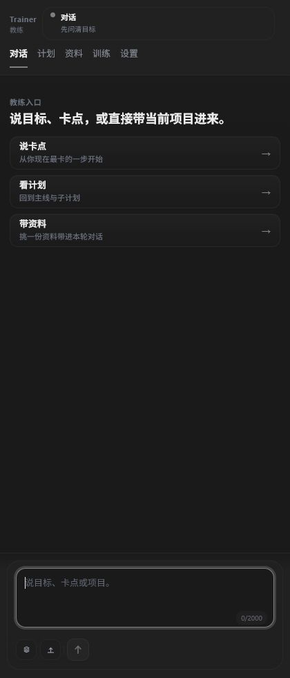
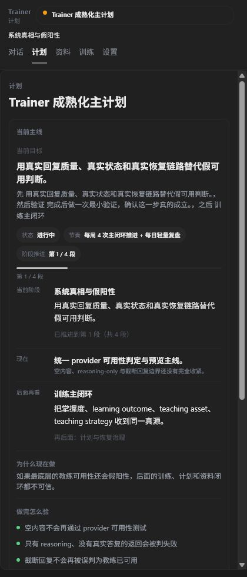
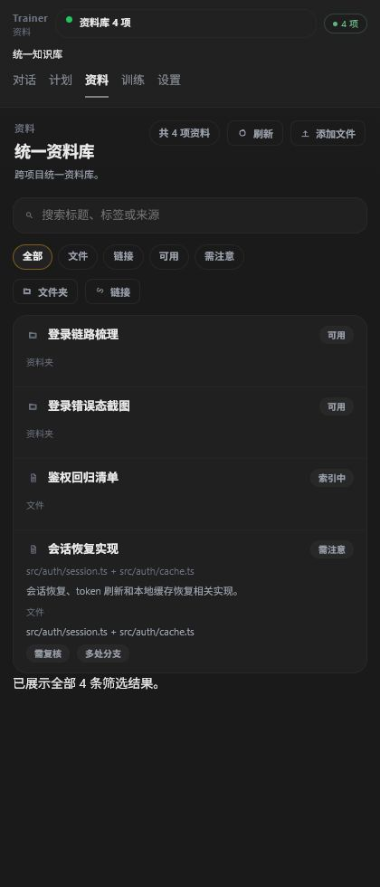
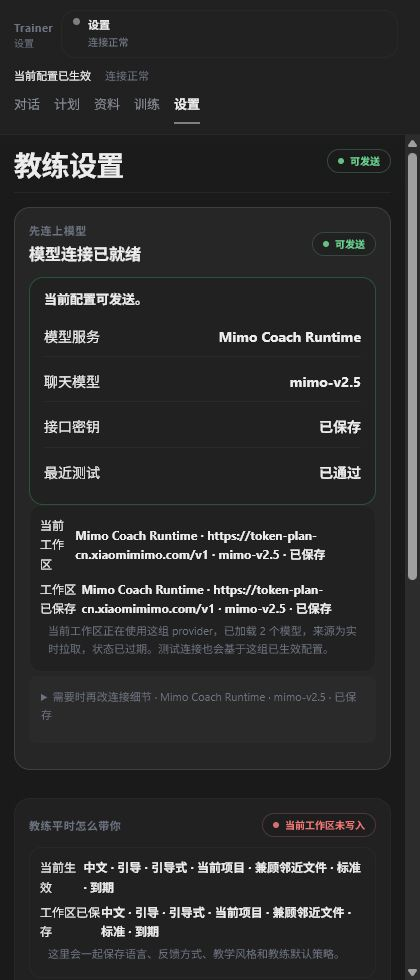
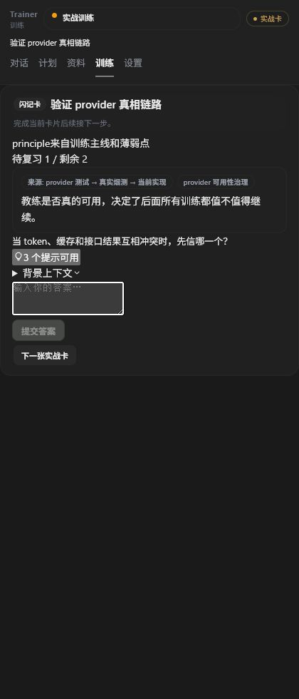
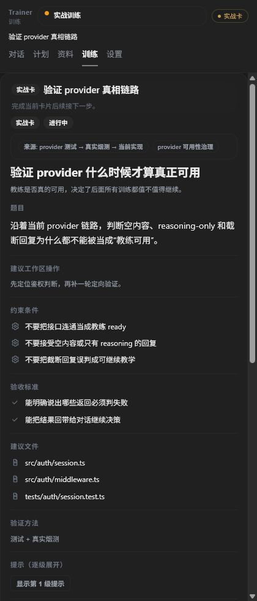

# Trainer 产品设计说明书

版本：理想态收敛版  
依据：`docs/plans/2026-05-07-trainer-teaching-quality-closure-checklist.md`  
校验参考：`docs/verification/2026-05-09-trainer-closure-status-matrix.md`  
适用范围：Trainer 前端、侧边栏交互、训练闭环、资料闭环、计划闭环、设置与运行时配置

## 1. 产品一句话定义

Trainer 是一个嵌入 VS Code 侧边栏的长期代码教练系统，不是普通聊天插件，也不是网页工作台的缩小版。

它的核心任务是：

- 让用户在同一个教练主体下持续学习、练习、复盘、迁移。
- 让对话、计划、资料、训练、设置五个视图各司其职。
- 让任何学习结果都能回流到计划、资料和下一次训练。
- 让 Trainer 只负责教练、解释、诊断、评估和编排，不替用户直接改代码。

## 2. 设计总原则

- 单主任务：每个视图都只服务自己的核心职责，不把所有能力堆到同一个页面。
- 状态诚实：界面必须诚实显示当前是否可用、是否受阻、是否在查资料、是否在编排训练。
- 轻量可见：在对话里可以看到教练动作，但不能把对话变成大工作台。
- 卡片优先：训练默认围绕一张卡片展开，而不是功能大页。
- 证据闭环：计划、资料、训练、掌握度都要有来源、回流和可追踪证据。
- 单一事实源：核心对象必须有明确权威写入方，前端不能自造状态。
- 八语言可用：中英文都要能工作，并且还必须支持另外六种常见语言，不能只有中文看起来正常。
- 跨平台必须一致：Windows、macOS、Linux 的沙箱、路径、权限、换行和能力语义必须一致，这不是优化项，是必须实现项。

## 3. 目标使用场景

- 用户只想问问题，不想切页。
- 用户正在做一个现有项目，需要教练帮他理解、拆解、验证和迁移。
- 用户打开的是空项目，需要先从最小场景开始训练。
- 用户打开的是算法或模型仓库，需要先理解方法，再转化成实战卡。
- 用户打开的是 idea 文件夹，需要把模糊想法一步步压缩成可执行计划。
- 用户想查资料、上传资料、下载网页资料、建立知识原子。
- 用户想做闪记、理论题、复盘题、场景题和实战卡。
- 用户希望不同项目的学习结果汇总到统一教练主体，而不是散落到多个 Trainer。

## 4. 五个一级视图

Trainer 的一级视图固定只有五个：

- 对话
- 计划
- 资料
- 训练
- 设置

任何设计如果想新增第六个一级视图，都应该先被拒绝，除非它能证明自己不是现有五类职责的重包装。

## 5. 一级视图详细规范

### 5.1 对话视图

对话视图是教练超级入口，也是 Trainer 最常用的起点。

它的理想状态是：

- 页面主角永远是消息流。
- 用户发出的东西必须像消息。
- Trainer 回复的主形态也必须像消息。
- 可以轻量显示“正在查资料”“正在对齐计划”“正在编排训练”“正在生成卡片”，但这些动作只能附着在消息上，不能吞没消息本身。
- 对话允许即时追问、即时澄清、即时小测、即时卡片建议、即时任务拆解。

它必须做到：

- 让用户一眼知道 Trainer 正在做什么。
- 让用户看到当前焦点、当前去向和下一步。
- 让用户明白对话里能继续讨论，但正式计划不会因为普通聊天自动改写。

它禁止做到：

- 把对话页变成完整工作台。
- 把计划、资料、训练的大块内容直接铺满消息流。
- 在没有明确计划动作的情况下静默修改正式计划。

关键状态包括：

- 空对话：给出可执行的起手建议，而不是空白页。
- 正在工作：显示轻量动作状态，但不遮蔽消息。
- 受阻：明确告诉用户卡在哪里、现在还能做什么。
- 结果回流：告诉用户当前回复已经沉淀为证据、卡片或下一步。

### 5.2 计划视图

计划视图是可随时查看的内容视图，不是聊天区。

它的理想状态是：

- 一打开就能看到当前主线，不需要用户先发消息。
- 顶层始终强调“当前在做什么、为什么现在做、下一步做什么、如何验证”。
- 子计划可以折叠展开，但不能把正式计划语义藏没。
- 训练结果可以作为证据显示，但不能被普通聊天悄悄改写成正式计划。

它必须做到：

- 支持项目子计划和总计划的同时存在。
- 支持查看阶段、进度、阻断、证据和回流关系。
- 支持看见训练结果如何影响计划判断，但要区分“证据”和“正式采纳”。

它禁止做到：

- 变成聊天页。
- 允许普通浏览或普通问答直接改正式计划。
- 以大量任务清单掩盖计划结构。

关键状态包括：

- 无正式计划：要清晰告诉用户下一步是先定义主线还是先生成第一个计划版本。
- 有阻断：要显示阻断原因、当前不建议推进的理由和替代动作。
- 有证据待采纳：要明确标出“待处理证据”和“已采纳决策”。
- 已冻结：要让用户一眼看出这是有意冻结，而不是系统失效。

### 5.3 资料视图

资料视图是 Trainer 的统一知识库，不是文件管理后台，也不是上传列表页。

它的理想状态是：

- 首屏优先是搜索和知识条目，不是后台配置。
- 每条资料都应该能追溯来源链、处理日志、新鲜度和可信度。
- 资料可以转成知识原子、卡片候选、计划证据和依赖掌握证据。
- 用户能感觉到自己进入的是“可检索、可追踪、可转化”的知识空间。
- 资料库必须允许用户选择“沙箱载体所在的文件夹路径”，并把这个路径作为可配置、可迁移、可校验的资源根，而不是写死在项目内部。
- 默认路径可以有推荐值，但最终载体目录必须由用户在可理解的范围内确认或修改。

它必须做到：

- 支持上传 html、pdf、md、代码文档等资料。
- 支持浏览网页并下载有用内容到资料库。
- 支持索引、重命名、整理、派生和再利用。
- 支持资料详情、沙箱预览和能力摘要，但这些都应是次级信息，不能压过知识条目本身。
- 支持在 Windows、macOS、Linux 上选择并验证同一语义的载体目录，不因平台差异改变资料库的基本行为。

它禁止做到：

- 退化成 CMS 或文件浏览器。
- 越权写用户工程代码。
- 把资料沙箱伪装成用户项目工作区。

关键状态包括：

- 空库：要告诉用户能导入什么、怎么开始、导入后会发生什么。
- 已索引：要能快速检索和定位。
- 来源不可信：要清楚提示风险，而不是用技术术语糊弄过去。
- 可转化：要能明确看出它能变成卡片、计划证据或依赖掌握证据。
- 载体路径已配置：要能显示当前沙箱载体目录、为何选它、如何更换、换了会影响什么。

### 5.4 训练视图

训练视图是计划的具体实施脚手架，是一张一张卡片的闭环，不是训练大页。

它的理想状态是：

- 默认一次只显示一张当前卡片。
- 用户一眼知道当前要做什么、为什么现在做、完成后怎么验证。
- 卡片与计划、资料、对话、掌握度之间有明确来源和去向。
- 用户完成后能立即回到对话、继续下一张卡或进入复盘。

它必须做到：

- 支持实战卡、闪记卡、复盘卡和场景卡。
- 支持题面、建议文件、验收方式、交付物、自检和回流去向。
- 支持实战中的文件操作建议，但不替用户直接改代码。
- 支持连续沉浸式练习，同时仍能从训练卡追踪到计划目标和资料来源。

它禁止做到：

- 变成多模块平铺的大网站。
- 把历史、复盘、依赖图、补充资料全部抢占当前卡片区域。
- 让用户看不到当前唯一任务。

关键状态包括：

- 当前卡：必须突出。
- 已完成：必须带结果回流。
- 跳过：必须说明为什么可以跳、跳去哪里。
- 复盘：必须把错误、弱点和下一张卡联系起来。

### 5.5 设置视图

设置视图是系统控制面，不是业务内容页。

它的理想状态是：

- 清楚显示 provider、模型、语言、训练偏好和运行状态。
- 诚实显示可用性、缺失项、测试结果和环境限制。
- 让用户知道哪些设置会立即生效，哪些要重启或刷新。

它必须做到：

- 支持模型与 provider 配置。
- 支持语言偏好、教练偏好和工作区级配置。
- 语言至少覆盖 `zh-CN`、`en-US`、`es-ES`、`fr-FR`、`de-DE`、`ja-JP`、`ko-KR`、`pt-BR`，并具备统一的 i18n 退化与回退策略。
- 支持测试连接、刷新和故障解释。

它禁止做到：

- 承载计划、资料、训练的业务正文。
- 伪装成后台管理台。
- 隐瞒当前不可用状态。

关键状态包括：

- 缺 key：要直说。
- provider 不可用：要直说。
- sidecar 未就绪：要直说。
- 当前配置生效：要直说生效范围。

## 6. 训练子视图

训练不是第六个一级视图，它只属于训练内部的子模式。

### 6.1 闪记

闪记负责压缩记忆负担，覆盖算法、数学、API、参数、返回值、误用、场景和理论点。

它的理想状态是：

- 问题短、目标清、答案标准。
- 一次只抓一个知识点或一个微能力。
- 题目和答案必须能回到来源。
- 错误后必须能进入复习队列或反向生成更小的卡片。

### 6.2 实战练习

实战练习负责把知识压到可执行动作里。

它的理想状态是：

- 给题面、建议文件、验证方式和交付物。
- 能指导新建文件、打开文件、补足依赖、完成最小实现。
- 能在空项目中生成最小场景，再迁移到真实工程。

### 6.3 复盘

复盘负责把错误、卡点和薄弱点回流为下一次训练素材。

它的理想状态是：

- 明确展示错因、证据和下一步。
- 不把复盘做成流水账。
- 把复盘结果回流到计划、资料和下一轮卡片。

### 6.4 场景实验

场景实验负责把具体项目场景和能力迁移联系起来。

它的理想状态是：

- 把“已知知识”放进真实情境。
- 把“场景判断”转化成训练任务。
- 把不同项目中的相似问题沉淀为统一能力。

## 7. 典型闭环

### 7.1 对话到计划

- 用户在对话里提出目标、问题或项目背景。
- Trainer 先澄清，再决定是否生成计划证据。
- 只有明确计划动作、明确回合或用户要求时，才改正式计划。

### 7.2 资料到训练

- 资料条目被解析、索引和抽取后，可以变成知识原子。
- 知识原子可以进一步变成闪记卡、实战卡或计划证据。
- 资料页必须能让用户看见这条转换链。

### 7.3 训练到掌握度

- 卡片完成结果要回流到事件账本。
- 掌握度评估不能只看完成数，要看理解、记忆、做出和迁移的证据组合。
- 训练结束后必须知道下一步是对话、继续下一张卡，还是进入复盘。

### 7.4 设置到运行时

- 设置决定 Trainer 能否正常工作。
- 设置改变要诚实显示作用范围。
- 设置不能偷偷修改业务语义。

## 8. 场景设计覆盖面

Trainer 必须同时覆盖以下场景：

- 纯对话答疑。
- 即时追问。
- 即时小测。
- 即时卡片建议。
- 打开新项目。
- 打开已有工程。
- 打开算法或模型仓库。
- 打开 idea 文件夹。
- 上传和浏览资料。
- 从网页抓取有用内容。
- 对依赖库和 API 进行学习。
- 现有项目的深度优化。
- 空项目的最小场景训练。
- 中英文切换。
- 八语言切换与语言偏好持久化。
- provider 不可用时的诚实降级。
- sidecar 未就绪时的诚实降级。
- 跨工作区恢复。

每个场景都应该能落到五个一级视图中的某一个主职责上，而不是额外创建一个“万能页”。

## 9. 视觉与交互细节

- 侧边栏形态必须保持窄而克制，不能像网页。
- 首屏必须优先显示最重要的任务，不能把所有能力平铺。
- 分区和标题要清楚，但不能制造后台感。
- 状态提示要像人话，不要像日志。
- 颜色、字体和层级要服务长时间使用，而不是短期炫技。

## 10. 文件夹设计与功能

这个唯一文档文件夹的职责是把 Trainer 的理想态收敛成可维护入口。

### 10.1 文件结构

- `README.md`：文件夹说明、使用规则和阅读顺序。
- `trainer-product-design-spec.md`：最终版产品设计说明书。
- `assets/`：当前视图截图和设计证据。

### 10.2 文件功能

- `README.md` 负责告诉后来的人为什么只看这个文件夹就够了。
- `trainer-product-design-spec.md` 负责回答 Trainer 是什么、五个视图是什么、所有场景怎么覆盖。
- `assets/` 负责把“理想态”与“当前截图”对齐，减少口头争论。

### 10.3 清理原则

- 保留最新真相来源，不保留早期冲突稿作为日常判断口径。
- 删除临时脚本、缓存、资源叉文件、测试残留和过渡输出。
- 只要文件不能帮助判断理想 Trainer，就不要继续留在主线里。

## 11. 结论

Trainer 的理想态不是一个更花哨的聊天框，而是一个五视图、卡片化、证据化、可恢复、可追踪、跨项目统一的长期教练系统。

如果只记一句话：

- 对话负责入口和轻量动作可见。
- 计划负责主线与证据。
- 资料负责知识沉淀与可转化。
- 训练负责卡片闭环与能力迁移。
- 设置负责系统可用性和配置控制。
