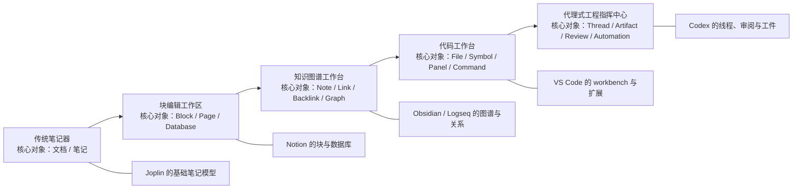

# 现代知识与代码工作台界面风格研究

## 执行摘要

把 Obsidian、Codex 这类界面简单称作“暗黑风”“极简生产力风”并不准确。它们真正共享的核心，不是颜色，而是**工作台式界面**：用稳定可折叠的侧边栏与面板承载导航、上下文和输出；用命令面板、快速切换和全局搜索缩短操作路径；用主题、插件、快捷键和布局重排把产品做成“可被使用者重新编程的工具”。从术语上说，更准确的叫法是**面板化信息架构**、**命令式交互**、**低装饰工作台**、**可扩展知识/代码工作台**；如果要专门描述 Codex 一类新产品，则可进一步命名为**代理式工程指挥中心**。citeturn28view2turn23view0turn16view14turn16view15turn18search0turn18search1turn25view3

从样本看，这一家族内部也存在清晰分化。Obsidian 更像“知识 IDE”，把双侧边栏、图谱、本地文件和主题生态结合起来；VS Code 是“代码工作台”的成熟范式，主副侧边栏、面板、命令面板和扩展市场已经高度制度化；Notion 更偏“块编辑与数据库工作区”；Joplin 是更保守但高控制度的 Markdown 笔记器；Logseq 把 outliner 与 graph 思维结合到一起；Codex 则把“线程、工件、审阅、终端、自动化、并行代理”叠加到传统 IDE/工作台之上。citeturn18search3turn17search0turn22view6turn16view10turn23view2turn25view0turn25view2turn21view1turn21view2

因此，如果你要在 PRD、设计评审或与开发沟通时用一句话描述这种风格，最有效的表达通常不是“做得像 Obsidian 一点”，而是：**“采用多面板、键盘优先、全局搜索/命令面板驱动的工作台式界面；视觉上使用低饱和中性色表面与单一高对比强调色；交互上强调快速切换、可折叠上下文侧栏与插件/主题可塑性。”** 同时必须注意，暗色模式只是高频搭配，并非本质；行业可用性研究反复提示，暗色模式不能以牺牲对比度、可读性和焦点可见性为代价。citeturn28view3turn28view4turn26search0turn16view12turn1search2turn23view3turn29view0turn29view1turn29view2

## 对象与范围

本报告以 **Obsidian** 与 **Codex** 为主样本，并辅以 Joplin、Logseq、Notion、VS Code 五个可比产品。这里的“Codex”按题设作方法学处理：**若未明确厂商与版本，则视为“通用 Codex 风格”**，也就是当前代理式代码工作台的一组界面特征；但为了避免概念漂移，本文仍以当前官方公开的 Codex app 与 IDE extension 文档界面作为可核验锚点。采样日期统一为 **2026-04-17**。citeturn16view7turn16view8turn25view3

| 样本 | 在本报告中的角色 | 采样来源 | 版本状态 |
|---|---|---|---|
| Obsidian | 知识工作台核心样本 | 官方帮助文档 + 桌面发布信息 | **1.12.7** |
| Codex | 代理式代码工作台核心样本 | 官方产品页 + 开发者文档 | **未指定（官方展示版）** |
| Joplin | 开源 Markdown 笔记对照样本 | 官方帮助文档 + 发布页 | **v3.6.8** |
| Logseq | 图谱/大纲型知识工作台对照样本 | GitHub README + 官网展示 + 官方侧边栏文章 | **未指定（展示版）；补充使用 0.9.14 文章作明确版式样本** |
| Notion | 块编辑/数据库工作区对照样本 | 官方帮助中心 | **未指定（官方展示版）** |
| VS Code | 代码工作台基准样本 | 官方文档 + 2026 年 2 月稳定通道 | **未单列 semver，以稳定通道文档为准** |

上表中的版本与来源，依据公开发布信息与官方文档页面整理：Obsidian 当前公共桌面版本可见为 1.12.7；Joplin 为 v3.6.8；Logseq 当前公开版本流中可见 0.10.15 Beta Testing，但由于稳定版标识不够清晰，本文将其总体样本记为“官网展示版”，并额外用 0.9.14 官方文章补充侧边栏细节；Notion 与 Codex 的帮助/开发者页面均未显式标注 semver，因此按“官方展示版/官方文档页”处理。citeturn27search10turn27search1turn27search0turn21view2turn16view10turn23view2turn16view7turn16view8

另需说明一点：Logseq 官方文档站点在本次抓取中可访问性有限，因此对 Logseq 的细颗粒界面判断，更多依赖其 GitHub README、官网 demo 入口和 0.9.14 官方博客中的侧边栏改版说明；这一限制会在后文涉及 Logseq 的地方明确标注为“基于展示页/官方博客判断”。citeturn21view1turn20search3turn21view2

## 风格本质与术语体系

从信息架构角度，必须先把两个常被混用的词拆开：**信息架构**不是屏幕上的菜单本身，而是信息如何被组织、分层、命名；**导航**则是用户在 UI 中抵达这些信息的可见通道。这一点很关键，因为 Obsidian/Codex 风格常让人误以为“多几个侧边栏”就是风格本体，实际上更本质的是：对象关系是否被显式建模、导航是否可压缩为搜索/命令、上下文是否持续可见。citeturn28view2

如果要形成一套可以复用的描述词库，建议采用下表中的术语。表中把“布局词”“交互词”“视觉词”“平台词”拆开，是为了让设计讨论不再停留在模糊的“像不像某产品”。

| 术语 | 定义 | 在此类产品中的典型表现 | 更可操作的中文表达 |
|---|---|---|---|
| 工作台式界面 | 以多个同时常驻的功能区协同工作，而非单页单任务流 | 主侧栏、主画布、右侧上下文区、底部面板并存 | “三段式或多面板工作台” |
| 侧边栏 | 承载一级导航与对象切换的窄区 | 文件树、页面树、项目列表、收藏、活动区 | “主导航侧栏”“上下文侧栏” |
| 面板 | 承载特定工具或反馈的局部区域 | 终端、问题、输出、审阅、反向链接 | “工具面板”“审阅面板” |
| 分栏 | 同页并置多个内容区以减少跳转 | 编辑器分组、数据库列、并行线程 | “并列工作区”“多列内容区” |
| 卡片 | 以单元块展示对象摘要与动作 | Notion gallery、任务卡、预览块 | “摘要卡片”“对象卡” |
| 模态 / 弹层 | 临时接管注意力的覆盖层 | 命令面板、设置弹层、确认对话框 | “非阻塞快输层”“阻塞确认框” |
| 命令面板 | 全局命令入口，通常支持模糊搜索 | 打开文件、执行命令、定位符号 | “命令式入口”“全局动作搜索” |
| 快速切换 | 以键盘优先的对象跳转器快速抵达内容 | Quick switcher、Go to Anything、Quick Open | “快速打开”“快速跳转” |
| 图谱 / 关系视图 | 用关系网络辅助发现与探索 | 全局图、本地图、引用网络 | “关系发现视图” |
| 低装饰工作台 | 弱化重阴影、强投影和厚边框，让结构靠分区与层级表达 | 中性表面、细分割线、轻 hover 反馈 | “低铬界面”“弱装饰密度界面” |
| 令牌化主题 | 以可配置的颜色、字体、间距变量驱动主题系统 | Accent color、CSS snippets、settings JSON | “主题变量化”“可编排样式令牌” |
| 代理式工程指挥中心 | 在线程、工件、审批、自动化之间切换的多任务中心 | 项目侧栏、线程、审阅区、工件栏、自动化 | “多线程代理工作台” |

上表中的“卡片”“对话框”“导航抽屉”等通用定义，参考了组件设计系统中的标准说法；其中卡片是围绕“单一对象”的内容与动作容器，对话框是为了让用户对重要信息采取动作的临时表层，而抽屉/侧边栏则是在较大设备上进行视图切换的导航区。命令面板、快速打开、上下文菜单与可见导航之间的关系，则主要由这些产品自己的帮助文档和复杂应用的可用性研究共同支撑。citeturn13search8turn13search2turn13search4turn23view0turn16view14turn16view15turn22view2turn19search0turn24view1turn28view0turn28view1

下列界面对照图有助于把握这类“工作台式”界面的共同骨架：稳定边栏、主工作区、次级上下文区，以及把复杂菜单折叠成单个入口的做法。更精确的功能判断仍以下文所引的官方文档为准。citeturn25view0turn25view3turn16view10turn23view2turn21view2

image_group{"layout":"carousel","aspect_ratio":"16:9","query":["Obsidian official interface screenshot sidebar", "Codex app official screenshot sidebar review pane", "Notion official workspace sidebar screenshot", "VS Code official command palette screenshot"],"num_per_query":1}

## 样本剖析

**布局与信息架构。** Obsidian 明确支持左、右侧边栏以及侧边栏中的多标签组；主编辑区和边栏标签之间可以形成明显的“导航—内容—上下文”三层结构。Joplin 更直接把桌面界面定义为三大区域：侧栏、笔记列表、主内容。Notion 的左侧栏负责工作区结构，正文靠列布局和块重排组织复杂内容。VS Code 则把这种工作台形态推向制度化：主侧栏、次侧栏、底部/侧向 panel、编辑器组、可拖拽视图位置。Codex app 在当前官方文档里同样以“项目侧栏—活动线程—审阅窗格”为视觉中轴，并把 worktree、terminal、browser、artifacts 都组织成工作台内的特定区块。Logseq 的 0.9.14 官方文章则明确把左、右侧边栏当成版面优化重点。换句话说，这一风格的本质不是“有侧边栏”，而是**把导航、工作对象、辅助上下文同时保留在视野中**。citeturn18search3turn18search7turn22view6turn19search5turn24view1turn23view2turn25view0turn25view3turn21view2

**色彩、主题与排版。** Obsidian 提供系统/浅色/深色三态、强调色以及界面字体/正文字体设置；Notion 提供 system/light/dark 与三种版式字体风格（Default、Serif、Mono）；VS Code 既支持内置 light/dark 主题也支持庞大的主题扩展；Joplin 允许通过插件、主题与 `userstyle.css` / `userchrome.css` 深度改造；Logseq 明确把 themes 作为产品生态的一部分；Codex 当前公开截图与产品页则展示出典型的深色中性表面配亮色强调。需要强调的是，暗色模式之所以与这类产品高频绑定，是因为它们常服务于**长时段、高频、低光环境下的重度使用**，但暗色并不天然等于更好读。可用性研究指出，暗色模式是“值得支持但不应凌驾于基本可用性之上”的特性；对正常视力用户而言，浅色模式在很多情况下仍有更稳定的阅读表现。因此，更稳妥的设计语言应表述为：**中性色层级 + 适度对比 + 单强调色 + 深浅双主题**，而不是“纯黑底 + 低对比灰字”。citeturn26search0turn26search2turn16view12turn24view0turn1search2turn1search3turn22view4turn22view3turn16view2turn20search20turn21view2turn25view3turn28view3turn28view4turn29view0

**交互模式、导航与发现。** 这一家族最有辨识度的交互，是把“菜单层级”压缩成“可搜索的命令入口”。Obsidian 以命令面板和 Quick switcher 为中心，一个负责动作，一个负责对象切换；Joplin 用 “Go to Anything” 和侧栏搜索解决查找问题；Notion 既提供 `cmd/ctrl + P` / `cmd/ctrl + K` 这一类全局搜索，也保留了 `/` 命令作为块级创建器；VS Code 的 Command Palette 与 Quick Open 几乎是现代桌面工作台的通用样板；Codex IDE extension 则继续沿用侧边栏 + 快捷键 + slash commands 的模式，只是对象从“文件/命令”进一步扩展到“线程/代理/云任务”。关系发现方面，Obsidian 的 Graph view 与 Local graph 明确把“关联探索”做成一类独立可视化导航；Logseq 官网 demo 直接以 graph 为入口；而 Notion 的面包屑更适合层级导航，VS Code 的搜索与符号导航更偏结构定位而不是知识发现。由此可以看出，这类产品的发现机制并非单一：**层级路径靠侧栏与面包屑，精确抵达靠搜索和快速切换，意外发现靠关系/引用视图。**citeturn16view14turn16view15turn17search0turn22view6turn19search0turn16view11turn24view1turn23view0turn25view2turn20search3turn19search1

**可定制性、插件生态、可访问性与响应式。** Obsidian 的主题、社区插件、CSS snippets 与可自定义 hotkeys 构成了高度可塑的“二次开发层”；Joplin 的插件页、推荐插件、主题、`userstyle.css` / `userchrome.css` 与明确的区域导航使其成为“控制欲友好”的开源替代；VS Code 的扩展模型更成熟，扩展可以直接贡献到 UI，并有用户/工作区两级设置、图形设置编辑器与 JSON 配置；Logseq 也把 plugin API 和 themes 作为核心生态；Codex app 当前还引入了 plugins、skills 与 IDE 扩展同步，把外部能力接到代理工作流中。可访问性上，VS Code 明确强调 high contrast、键盘-only navigation 和 screen reader 优化；Joplin 对桌面与移动都说明了焦点区域与导航快捷方式；WCAG 2.2 则要求文本至少达到 4.5:1 对比度、焦点必须可见且有足够可辨识度；对 hover/focus 弹出内容，还要求可感知、可悬停、可持久、可关闭。响应式上，这一类产品普遍是**桌面优先**：Obsidian 在移动端对 Quick switcher 入口做了折叠，Joplin 移动端默认隐藏侧栏，Notion 移动端取消 `/` 命令和 hover 控件，Codex app 目前也是桌面中心方案。citeturn18search0turn18search1turn18search2turn22view2turn22view3turn22view4turn22view6turn23view4turn23view5turn23view3turn21view1turn20search2turn25view0turn25view2turn29view0turn29view1turn29view2turn29view3turn24view1turn16view15

**视觉语言与情感语气。** 从官方截图与帮助页可以观察到，这一家族总体偏向扁平化、弱投影、细分割线、轮廓式小图标、有限半径和通过 hover 才出现的次级动作。它们追求的不是“炫技感”，而是**长时间停留时的视觉耐受度**。情感语气上，Obsidian 与 Logseq 更像“自主、黑客式、知识匠作”；Joplin 是“实用、克制、隐私优先”；Notion 是“温和、可协作、编辑友好”；VS Code 是“专业、工程化、系统可信”；Codex 则明显在朝“代理化、并行化、指挥中心化”前进。对于描述文案，最不容易误导的说法是：**专业、低装饰、高密度、可塑、键盘友好**；最容易误导的说法则是：**赛博朋克、全黑、很黑客**——后者只抓住了外观，而忽略了组织方式与交互范式。citeturn25view0turn25view3turn16view10turn23view2turn21view2turn28view3

## 可复用设计模式

下表不是对单一产品的复述，而是把样本中反复出现的结构抽象成可供产品、设计和前端复用的模式。每条短语都可以直接拿去当设计评审时的风格标签。

| 描述性短语 | 设计意图 | 优点 | 缺点 / 风险 | 适用场景 | 实现要点 |
|---|---|---|---|---|---|
| **暗色低饱和度 + 高对比强调色** | 降低视觉噪声，把注意力集中到内容与状态上 | 长时使用更耐看，状态更清楚 | 低对比容易牺牲可读性；“纯黑 + 灰字”最危险 | 高频、长会话、桌面工具 | 至少提供 system/light/dark 三态；正文与交互文字按 WCAG 校验 |
| **主侧栏 + 主画布 + 右侧上下文面板** | 同时保留导航、当前工作对象和辅助上下文 | 减少跳页与记忆负担 | 小屏拥挤；用户容易被功能密度劝退 | 知识管理、代码编辑、代理协作 | 两侧都应可折叠、可调宽、可记忆状态 |
| **命令面板 + 快速打开的双入口** | 把“动作”和“对象”分离，但都压缩为搜索式入口 | 专家用户效率极高 | 新手发现成本高 | 命令多、对象多的桌面工具 | 建议保留独立快捷键、模糊匹配、最近使用、别名 |
| **全局搜索即导航** | 让搜索不仅查内容，也查页面、文件、符号、命令 | 导航深度缩短 | 容易把搜索框做成万能但混乱 | 大型知识库、代码库、混合文档空间 | 明确搜索域：内容、标题、符号、命令、项目 |
| **关系发现视图** | 支持“探索”而不仅是“抵达” | 有助于发现隐式联系 | 容易变成漂亮但低频的“观赏功能” | 知识图谱、研究、引用密集产品 | 提供过滤、本地视图、层级深度控制 |
| **块/面板拖拽重排** | 让用户把产品改造成自己的流程 | 高适配性，降低“一刀切”布局痛感 | 拖拽若无明确落点就会很难用 | 工作台、数据库、卡片/块编辑器 | 必须有清晰落点指示、重置布局、键盘替代方案 |
| **插件 + 主题 + 样式覆写三层扩展** | 让生态承接长尾需求 | 产品寿命更长，社区参与度更高 | 安全、兼容性、升级稳定性成本高 | 面向专业用户、工作流差异大 | 明确权限、版本兼容、推荐插件机制、可回滚 |
| **右键菜单只做上下文动作** | 让右键成为快捷入口，而不是隐藏主导航 | 高效、贴近对象 | 若主菜单无等价入口，发现性很差 | 桌面应用、编辑器、文件管理 | 右键项必须与当前对象强相关；同步暴露到命令面板或主菜单 |
| **非阻塞叠层优先于重模态流程** | 尽量不打断用户手头任务 | 上下文不断裂 | 状态管理复杂 | 设置、快速输入、预览、局部编辑 | 支持 Esc 关闭、外部点击关闭、焦点回退 |
| **工件栏 + 审阅窗格 + 终端并置** | 把“做事、看结果、审变化”放到同一工作台 | 适合代理/工程协作 | 信息过载，学习门槛上升 | 代码代理、CI/CD、复杂内容生产 | 工件应可筛选、审阅区应支持 diff/状态、终端要可复用命令 |

这些模式综合自样本产品的布局、命令系统、插件机制和可访问性规范。尤其值得注意的是，快捷键和加速器可以显著提高专家用户效率，但上下文菜单的默认视图是隐藏的，因此所有隐藏入口都应配备显式替代通道；暗色主题则应服从对比度、焦点可见性和 hover/focus 行为的可达性要求。citeturn28view0turn28view1turn29view0turn29view1turn29view2turn29view3turn18search0turn22view2turn23view2turn25view0

## 设计规范与 PRD 可操作表达

下面这些句子可以直接放进 PRD、设计规范或前端实现说明中。它们是把上文抽象模式翻译成更接近可执行语言的版本。

1. **产品采用桌面优先的三段式工作台布局：左侧主导航宽度默认 240–280px，中间主工作区自适应，右侧上下文面板默认 300–360px；左右两侧必须支持折叠、拖拽调宽与状态记忆。**

2. **一级信息架构采用“对象树 + 搜索直达”双机制：用户既可以沿侧栏层级浏览，也可以用全局搜索/快速打开直接抵达对象；搜索结果必须清晰区分“命令、页面、文件、符号、最近项”等不同域。**

3. **所有高频动作都必须能通过命令面板访问，命令面板支持模糊搜索、最近使用、别名匹配与键盘全程操作；当 `Cmd/Ctrl + P` 已被占用为快速打开时，命令面板应改用 `Cmd/Ctrl + Shift + P` 或 `Cmd/Ctrl + K`。** citeturn16view14turn16view15turn23view0turn19search0turn25view2turn28view0

4. **视觉系统以 3–4 级中性色表面构成层级，不使用大面积强阴影；状态差异主要依赖层级背景、边界线、图标和强调色，而不是依赖大面积彩色底。**

5. **主题系统至少暴露以下样式令牌：`--bg-0`、`--bg-1`、`--bg-2`、`--fg-0`、`--fg-1`、`--line`、`--accent`、`--success`、`--warning`、`--danger`、`--radius-s`、`--radius-m`、`--space-1` 到 `--space-6`；所有组件禁止直接写死业务色值。**

6. **默认正文排版应以 14–16px 为基线字号，正文行高建议 1.5–1.65，界面控件文字与正文文字分离管理；至少提供“默认正文 / 等宽 / 衬线或替代阅读风格”中的两类可选字体模式。** citeturn26search2turn24view1turn23view5

7. **右键菜单仅承载与当前选择对象强相关的动作，例如重命名、复制链接、固定、折叠、审阅或删除；右键菜单内的动作必须在主菜单或命令面板中存在同名入口，避免把关键能力藏成“专家彩蛋”。** citeturn28view1

8. **所有拖拽操作都必须提供可见落点指示、拖拽预览和撤销能力；对于不能使用指针的用户，应提供等价的“移动视图/移动块/重排顺序”键盘命令。** citeturn23view2turn24view1turn28view5

9. **移动端不应机械复制桌面工作台，而应把侧栏、hover 控件和 `/` 类命令折叠为更少层级的工具入口；当产品提供桌面与移动双端时，应优先保证“搜索、查看、快速新建、基础编辑、基础导航”的连续性。** citeturn22view6turn24view1turn16view15

10. **可访问性要求写入验收标准：普通文本对比度不低于 4.5:1，大号文本不低于 3:1；键盘焦点必须始终可见，焦点指示器需具备足够面积与可辨识度；所有 hover/focus 触发的浮层必须可关闭、可悬停、可持久。** citeturn29view0turn29view1turn29view2turn29view3

下面这组样式令牌可以作为该风格的一个安全起点。它不是对任何单一产品的复制，而是对“中性深色工作台 + 清晰层级 + 单强调色”这一家族的实现化表达。

```css
:root {
  --bg-0: #111418;
  --bg-1: #171b20;
  --bg-2: #20262d;
  --fg-0: #e7ebf0;
  --fg-1: #b6bec9;
  --line: #2a313a;

  --accent: #7aa2ff;
  --success: #46c08a;
  --warning: #ffb454;
  --danger: #ff6b81;

  --radius-s: 6px;
  --radius-m: 10px;

  --space-1: 4px;
  --space-2: 8px;
  --space-3: 12px;
  --space-4: 16px;
  --space-5: 24px;
  --space-6: 32px;
}
```

如果要把这套风格写成更适合协作的设计口令，建议使用以下两句，而不是笼统地说“像 Obsidian 一点”：**“做成多面板、键盘优先的低装饰工作台”**，以及 **“用命令面板和快速切换替代深菜单，用右侧上下文区替代频繁跳页。”** 这两句既保留了风格感，也把实现方向说清楚了。citeturn23view0turn23view2turn16view14turn16view15turn25view0

## 对比矩阵与演进

下表为本报告基于官方帮助页、展示截图与产品说明做出的**归纳性评分**，5 分表示该特征在该产品中最强、最中心，而不是“最好”。它的用途不是做绝对优劣判断，而是帮助你快速判断：某个产品更接近“知识 IDE”、还是“块编辑工作区”、还是“代理指挥中心”。citeturn18search3turn17search0turn22view6turn16view10turn23view2turn25view0turn25view2turn21view1turn21view2

| 样本 | 核心对象 | 布局工作台化 | 键盘优先 | 搜索/快速切换 | 关系发现 | 可定制性 | 插件生态 | 可访问性显式度 | 移动适配 | 风格一句话 |
|---|---|---:|---:|---:|---:|---:|---:|---:|---:|---|
| Obsidian | note / vault / link | 5 | 5 | 5 | 5 | 5 | 5 | 3 | 4 | 知识 IDE |
| Codex | thread / artifact / review | 5 | 4 | 4 | 1 | 4 | 4 | 3 | 2 | 代理式工程指挥中心 |
| Joplin | note / notebook | 3 | 3 | 4 | 1 | 4 | 4 | 4 | 4 | 实用主义 Markdown 工作台 |
| Logseq | block / page / graph | 4 | 4 | 3 | 5 | 4 | 4 | 2 | 3 | 大纲化知识图谱工作台 |
| Notion | block / page / database | 3 | 3 | 4 | 2 | 2 | 1 | 2 | 4 | 块编辑协作工作区 |
| VS Code | file / symbol / workspace | 5 | 5 | 5 | 2 | 5 | 5 | 5 | 1 | 代码工作台基准 |

如果把这张表压缩成一句结论，可以这样读：**Obsidian 与 Logseq 把“知识关系”做强，VS Code 把“工作台与扩展”做强，Notion 把“内容编排”做强，Joplin 把“透明与控制”做稳，Codex 则把这些传统工作台能力往“线程化、代理化、审阅化”继续推进。** 这也是为什么“Codex 风格”不应只被理解成“AI 聊天框 + 代码窗口”，而应理解成**围绕任务线程和工件追踪重新组织的工作台**。citeturn17search0turn21view1turn16view10turn23view2turn25view0turn25view2

从演进上看，这类风格并不是突然出现的“新潮 UI”，而是从传统笔记、块编辑器、知识图谱工具、IDE、再到代理式代码工作台连续演化出来的。下面这张图展示了这种演进的结构要点。它不是年代学的精确断代，而是基于样本界面类型归纳出的形态变化。citeturn22view6turn24view1turn17search0turn23view2turn25view3



这条演进链最重要的启示有三点。第一，**中心对象在变化**：从“文档”变成“块”，再变成“链接/关系”，然后变成“文件/符号”，最后变成“线程/工件/自动化”。第二，**导航机制在压缩**：从可见菜单与列表，转向 searchable 的 quick input，再转向线程化上下文。第三，**界面不再只是显示内容，而是在持续维持上下文**：你在左边保留结构，在中间工作，在右边查看引用、差异、工件、审阅或代理状态。citeturn24view1turn17search0turn23view0turn23view2turn25view0turn25view3

## 参考来源

以下来源按“官方优先、原始页面优先、规范与研究补充”的原则选择；其中大部分是帮助文档、官方展示页与标准文档，可直接用于继续核对细节。

1. **Obsidian 帮助文档**：Appearance、Settings、Sidebar、Tabs、Command palette、Quick switcher、Graph、Themes、CSS snippets、Hotkeys。用于核对 Obsidian 的边栏、图谱、主题与键盘交互。citeturn16view14turn16view15turn17search0turn18search0turn18search1turn18search2turn18search3turn18search7turn26search2

2. **Codex 官方产品页与开发者文档**：Codex 产品页、Codex app、Codex IDE extension，以及 “Introducing the Codex app”。用于核对项目侧栏、线程、审阅区、工件、插件与 IDE 集成。citeturn25view3turn16view7turn25view0turn16view8turn25view2turn16view9

3. **Joplin 帮助文档与发布页**：Plugins、Custom CSS、Screen reader accessibility、What is Joplin?、Releases。用于核对三区域布局、插件安装、CSS 覆写和辅助功能。citeturn22view2turn22view3turn22view4turn22view6turn16view2turn27search1

4. **Logseq 官方 README、展示入口与博客文章**：GitHub README、官网 demo graph、0.9.14 侧边栏更新文章。用于核对 graph、plugins/themes 生态与左右边栏样式变化。citeturn21view1turn20search3turn21view2turn27search0

5. **Notion 帮助中心**：Navigate with the sidebar、Search in your workspace、Keyboard shortcuts、Intro to writing & editing、Edit & customize your Notion Sites。用于核对侧栏、命令搜索、`/` 菜单、排版风格、拖拽和面包屑。citeturn16view10turn16view11turn24view0turn24view1turn19search1turn19search5

6. **VS Code 官方文档**：User interface、Custom Layout、Accessibility、Extension Marketplace、User and workspace settings。用于核对工作台结构、命令面板、扩展模型、焦点与高对比支持。citeturn23view0turn23view2turn23view3turn23view4turn23view5turn27search3

7. **组件设计系统文档**：Cards、Dialogs、Navigation drawer。用于给“卡片、对话框、侧边栏/抽屉”这些术语提供相对标准化定义。citeturn13search8turn13search2turn13search4

8. **复杂应用可用性研究**：关于 IA 与 navigation 区分、shortcut/accelerator、contextual menu、dark mode、keyboard-only navigation 的研究文章。用于把产品观察提升为一般性设计原则。citeturn28view2turn28view0turn28view1turn28view3turn28view4turn28view5

9. **WCAG 2.2 说明文档**：Contrast (Minimum)、Focus Appearance、Focus Visible、Content on Hover or Focus。用于给对比度、键盘焦点与弹层行为设定验收底线。citeturn29view0turn29view1turn29view2turn29view3

10. **样本版本与发布信息页**：Obsidian 桌面发布 JSON、Joplin releases、Logseq releases。用于说明采样版本与“未指定/官方展示版”的边界。citeturn27search10turn27search1turn27search0